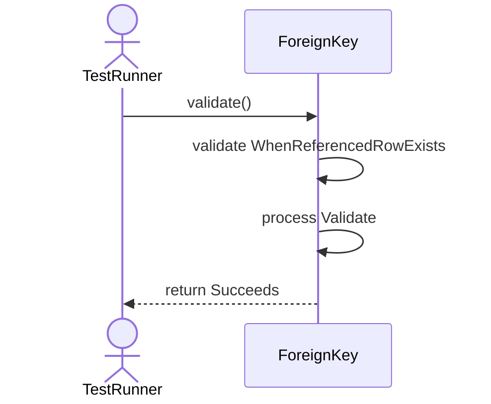
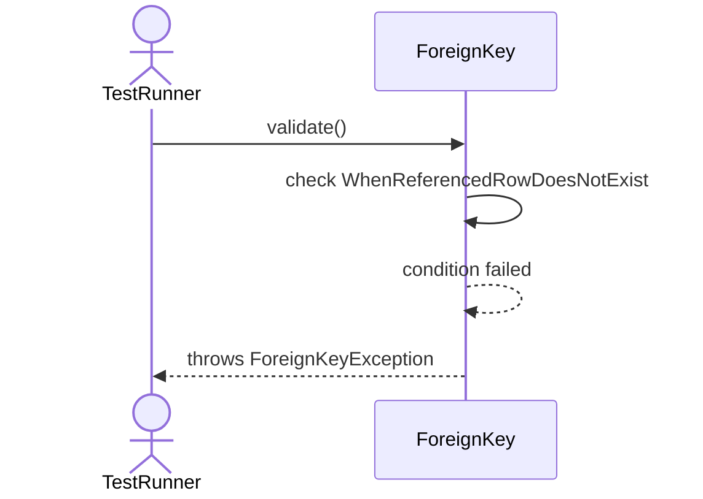
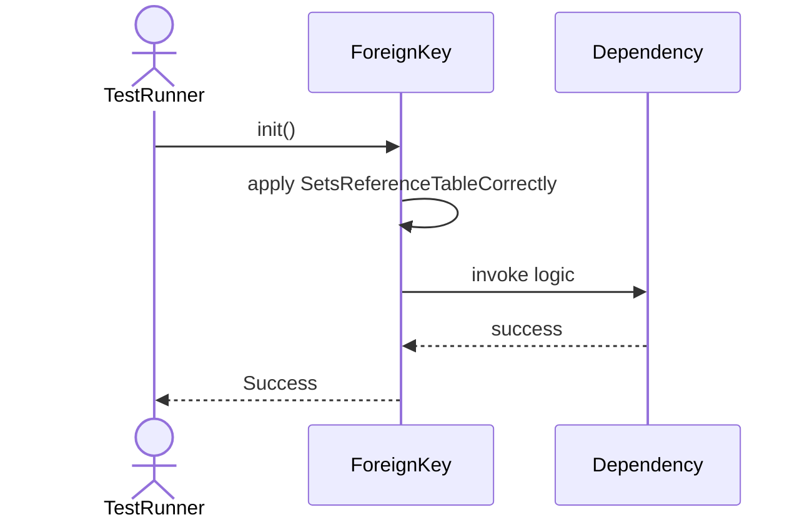
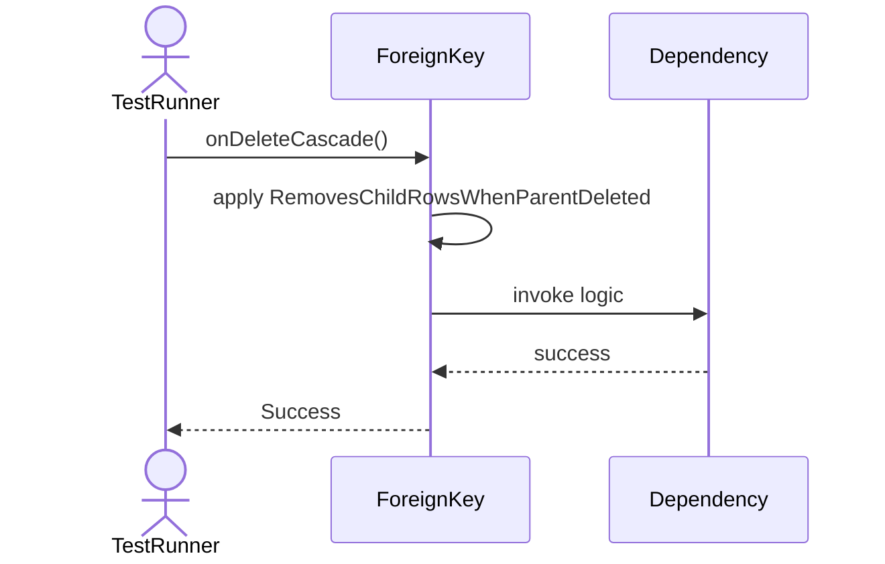
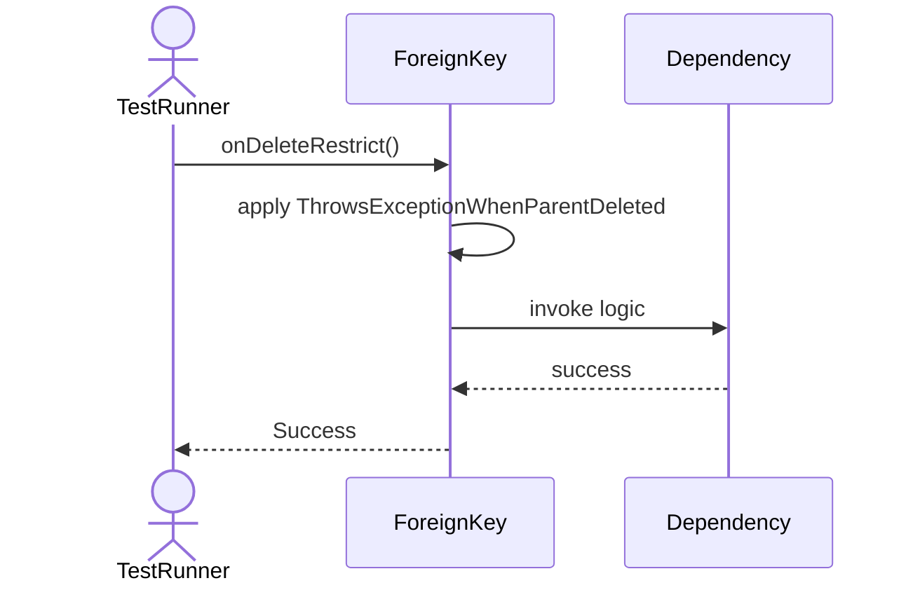
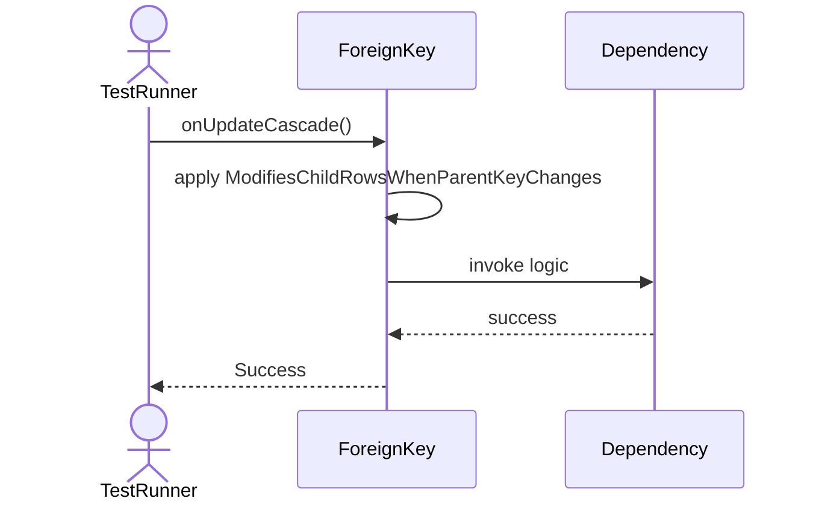

# Sequence Diagrams: ForeignKey

## 🆕 Added Properties & Methods for `ForeignKey`
To support the detailed sequence logic for unit testing, please update the `ForeignKey` class in your Class Diagram with the following properties and methods:

- **Property** added to `ForeignKey`: `referenceTable`
- **Property** added to `ForeignKey`: `referenceColumn`
- **Property** added to `ForeignKey`: `onDeleteAction`
- **Method** added to `ForeignKey`: `onDeleteCascade()`
- **Method** added to `ForeignKey`: `onDeleteRestrict()`
- **Method** added to `ForeignKey`: `onUpdateCascade()`
- **Method** added to `ForeignKey`: `validate()`

---

This file contains the detailed sequence diagrams for all 6 unit tests of the **ForeignKey** class.

## 1. Validate_WhenReferencedRowExists_Succeeds

## 2. Validate_WhenReferencedRowDoesNotExist_ThrowsForeignKeyException

## 3. Init_SetsReferenceTableCorrectly

## 4. OnDeleteCascade_RemovesChildRowsWhenParentDeleted

## 5. OnDeleteRestrict_ThrowsExceptionWhenParentDeleted

## 6. OnUpdateCascade_ModifiesChildRowsWhenParentKeyChanges

