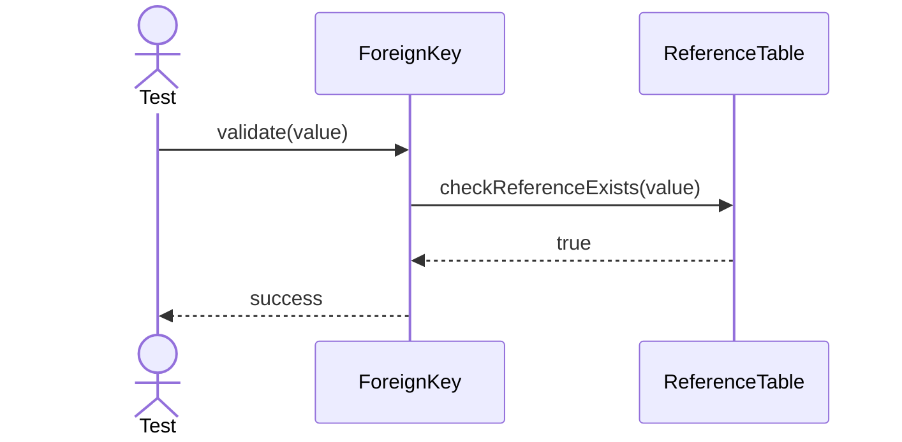
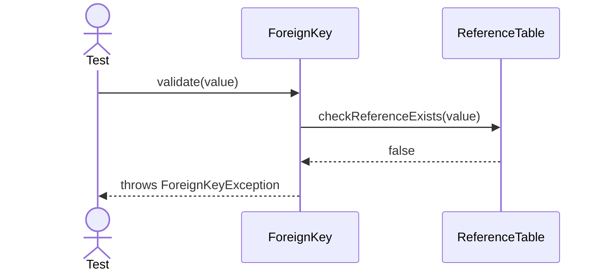
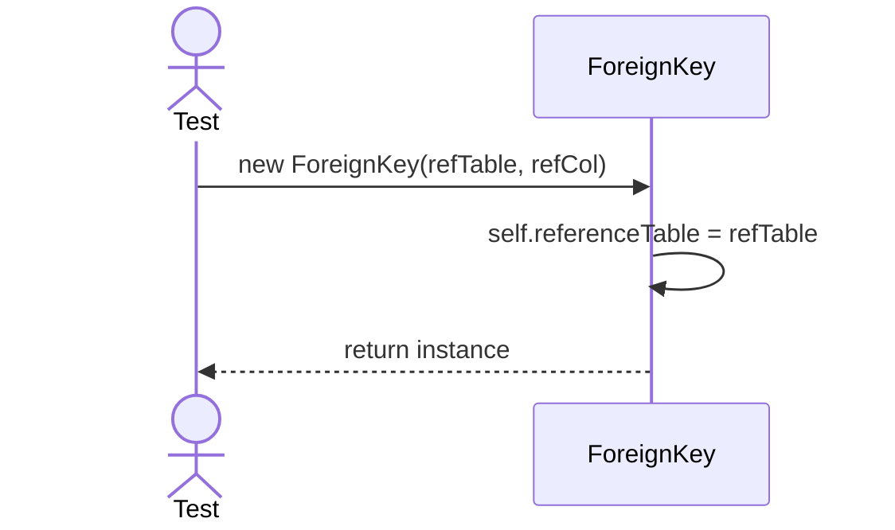

# Sequence Diagrams: ForeignKey

## 🆕 Added Properties & Methods for `ForeignKey`
To support the detailed sequence logic for unit testing, the following missing properties/methods have been introduced. **Please update the `ForeignKey` class in your Class Diagram with these:**

- **Property** added to `ForeignKey`: `referenceTable`, `referenceColumn`
- **Method** added to `ForeignKey`: `checkReferenceExists(value)` (Looks up reference table)

---

This file contains the detailed sequence diagrams for all unit tests of the **ForeignKey** class in the Database Object Management subsystem.

## 1. Validate_WhenReferencedRowExists_Succeeds

## 2. Validate_WhenReferencedRowDoesNotExist_ThrowsForeignKeyException

## 3. Init_SetsReferenceTableCorrectly

