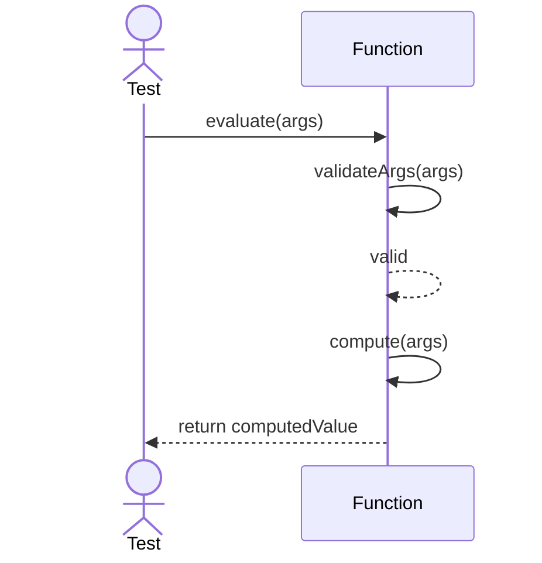
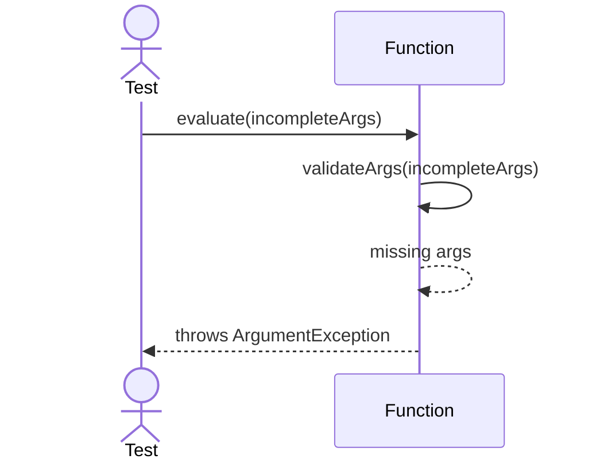

# Sequence Diagrams: Function

## 🆕 Added Properties & Methods for `Function`
To support the detailed sequence logic for unit testing, the following missing properties/methods have been introduced. **Please update the `Function` class in your Class Diagram with these:**

- **Property** added to `Function`: `arguments` (List of expected function arguments)
- **Method** added to `Function`: `validateArgs(args)` (Checks if all required arguments are present)

---

This file contains the detailed sequence diagrams for all unit tests of the **Function** class in the Database Object Management subsystem.

## 1. Evaluate_WhenValidArguments_ReturnsComputedValue

## 2. Evaluate_WhenMissingArguments_ThrowsArgumentException

