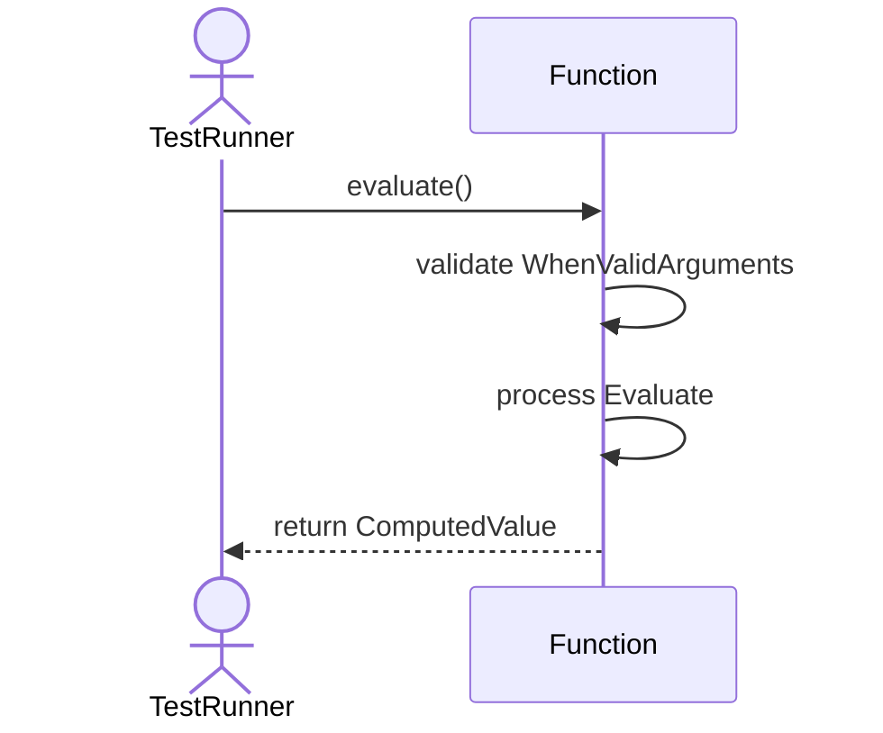
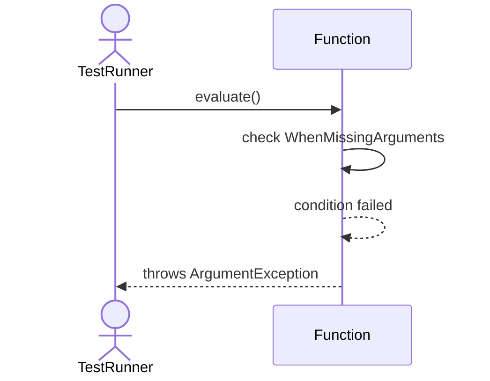
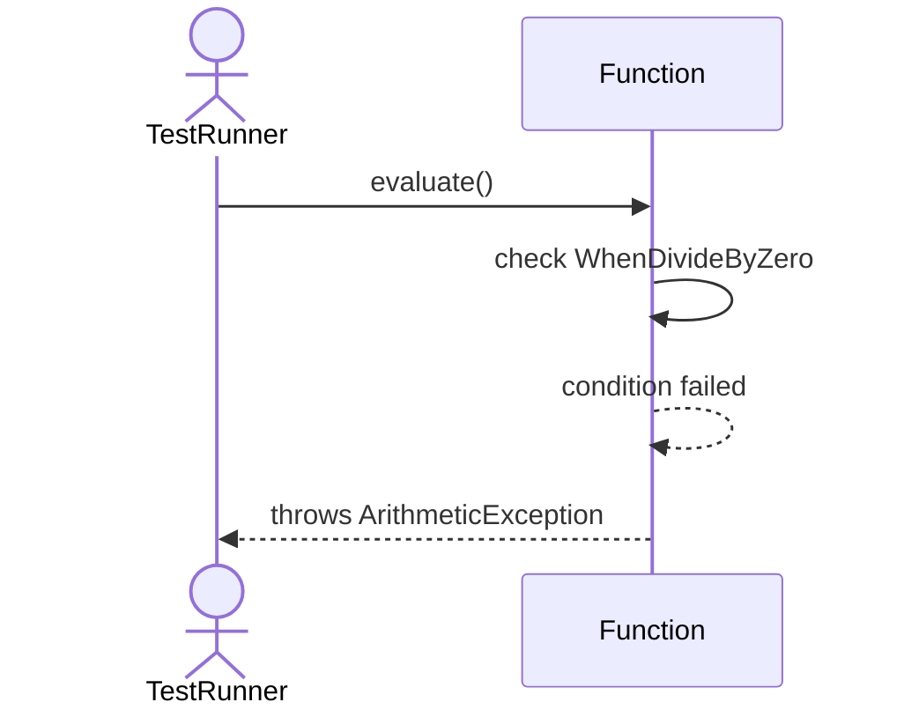
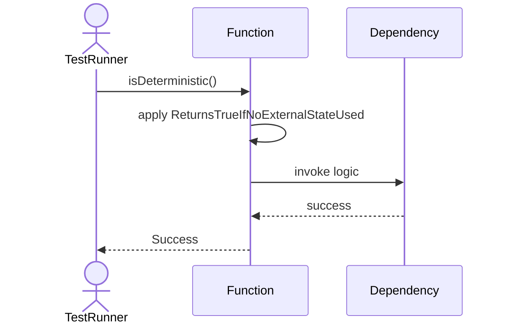
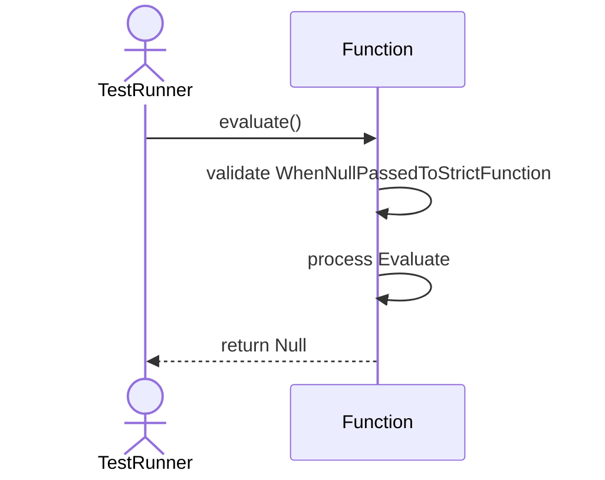

# Sequence Diagrams: Function

## 🆕 Added Properties & Methods for `Function`
To support the detailed sequence logic for unit testing, please update the `Function` class in your Class Diagram with the following properties and methods:

- **Property** added to `Function`: `arguments (List)`
- **Method** added to `Function`: `evaluate()`
- **Method** added to `Function`: `isDeterministic()`

---

This file contains the detailed sequence diagrams for all 5 unit tests of the **Function** class.

## 1. Evaluate_WhenValidArguments_ReturnsComputedValue

## 2. Evaluate_WhenMissingArguments_ThrowsArgumentException

## 3. Evaluate_WhenDivideByZero_ThrowsArithmeticException

## 4. IsDeterministic_ReturnsTrueIfNoExternalStateUsed

## 5. Evaluate_WhenNullPassedToStrictFunction_ReturnsNull

