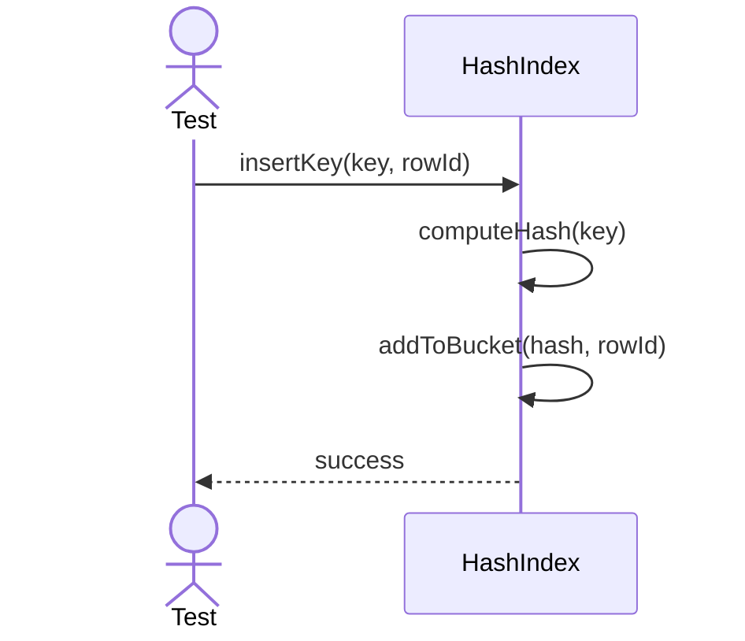
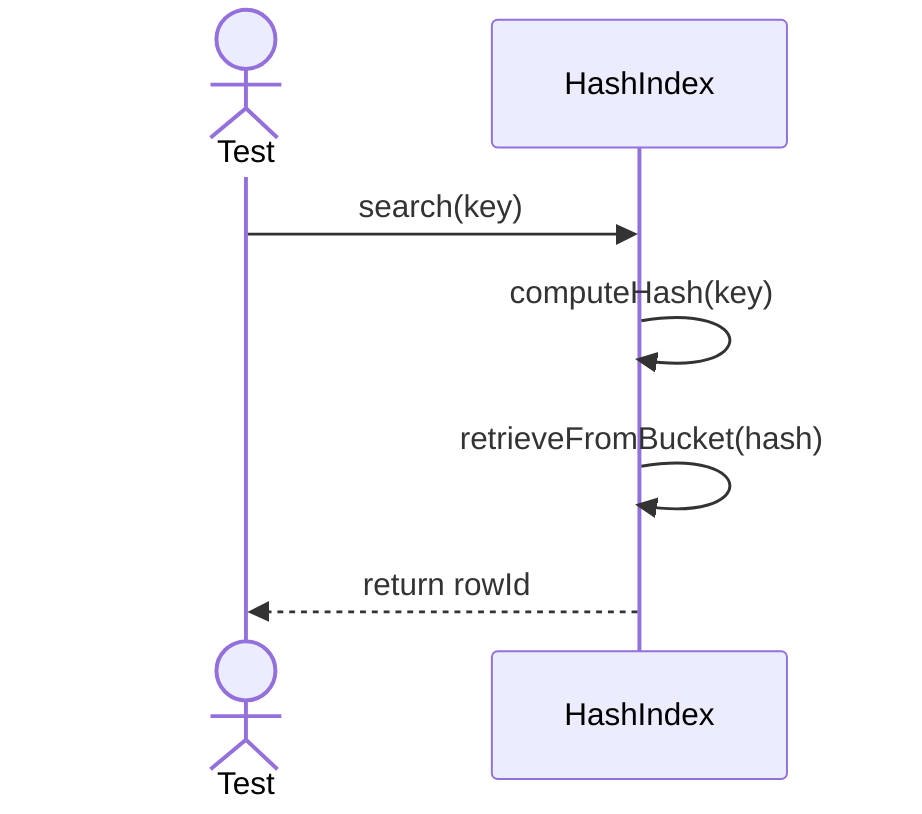
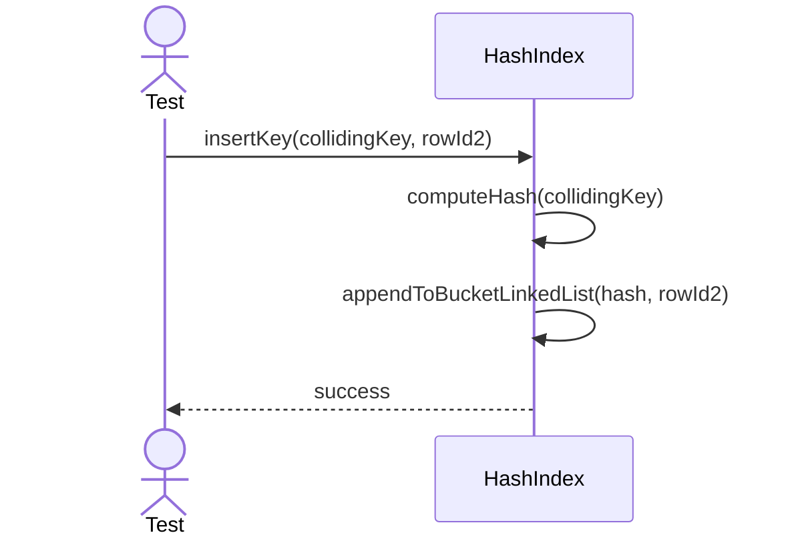

# Sequence Diagrams: HashIndex

## 🆕 Added Properties & Methods for `HashIndex`
To support the detailed sequence logic for unit testing, the following missing properties/methods have been introduced. **Please update the `HashIndex` class in your Class Diagram with these:**

- **Property** added to `HashIndex`: `hashTable` (Buckets for hashes)
- **Method** added to `HashIndex`: `computeHash(key)` (Hashing algorithm)

---

This file contains the detailed sequence diagrams for all unit tests of the **HashIndex** class in the Database Object Management subsystem.

## 1. InsertKey_ComputesHashAndAddsToBucket

## 2. Search_WhenKeyExists_ResolvesHashToRowID

## 3. HandleCollision_CreatesLinkedListInBucket

