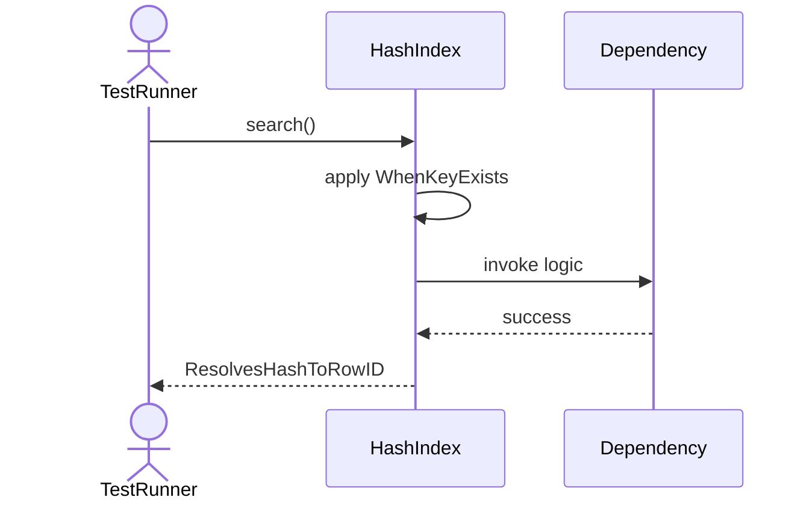
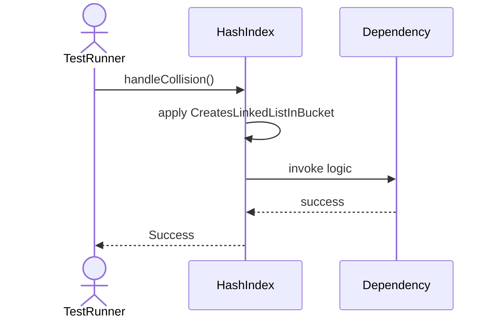
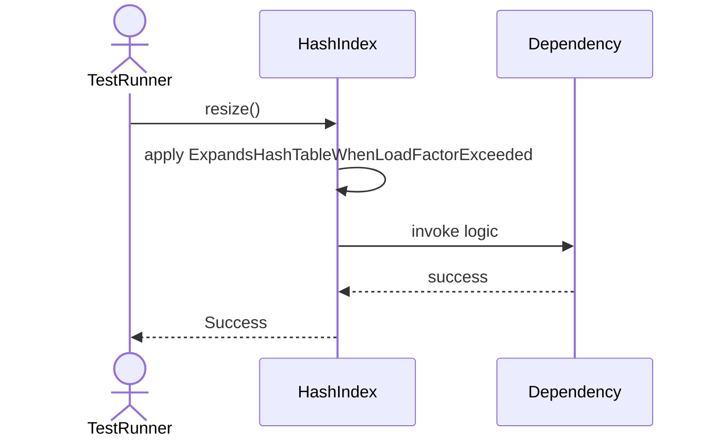
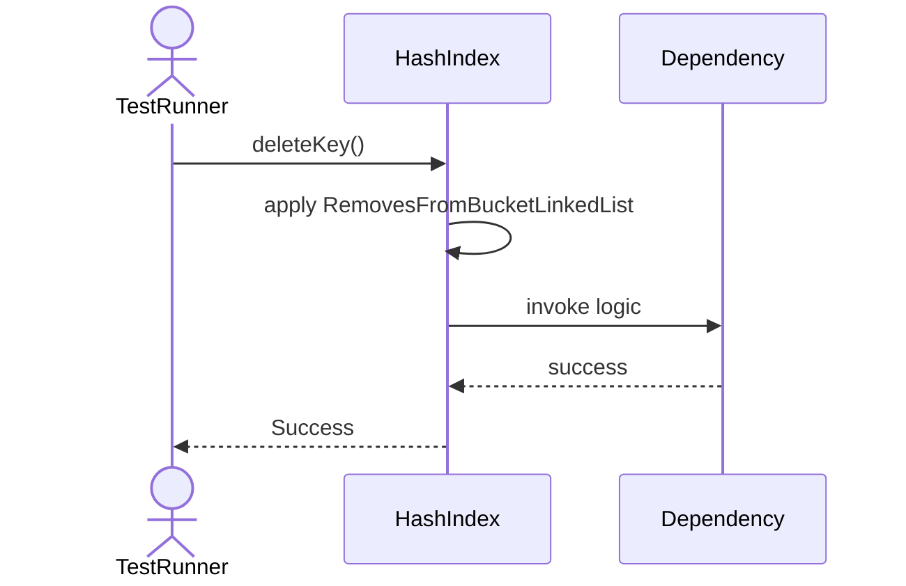
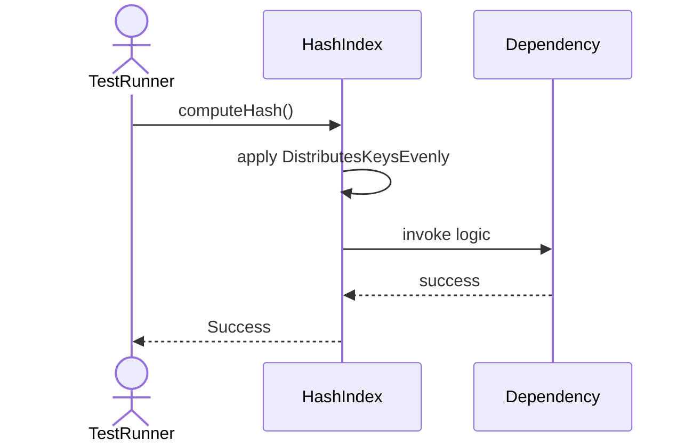

# Sequence Diagrams: HashIndex

## 🆕 Added Properties & Methods for `HashIndex`
To support the detailed sequence logic for unit testing, please update the `HashIndex` class in your Class Diagram with the following properties and methods:

- **Property** added to `HashIndex`: `hashTable (Dict)`
- **Method** added to `HashIndex`: `computeHash()`
- **Method** added to `HashIndex`: `deleteKey()`
- **Method** added to `HashIndex`: `handleCollision()`
- **Method** added to `HashIndex`: `insertKey()`
- **Method** added to `HashIndex`: `resize()`
- **Method** added to `HashIndex`: `search()`

---

This file contains the detailed sequence diagrams for all 6 unit tests of the **HashIndex** class.

## 1. InsertKey_ComputesHashAndAddsToBucket

## 2. Search_WhenKeyExists_ResolvesHashToRowID

## 3. HandleCollision_CreatesLinkedListInBucket

## 4. Resize_ExpandsHashTableWhenLoadFactorExceeded

## 5. DeleteKey_RemovesFromBucketLinkedList

## 6. ComputeHash_DistributesKeysEvenly

