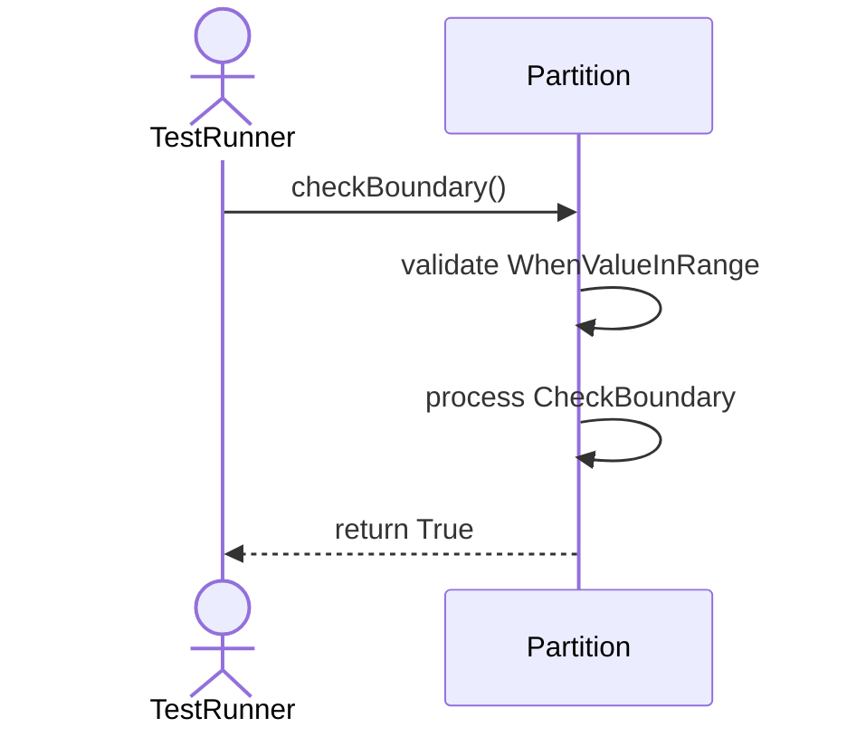
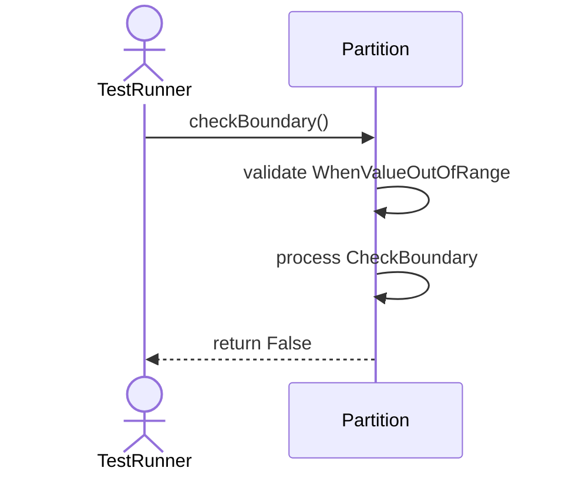
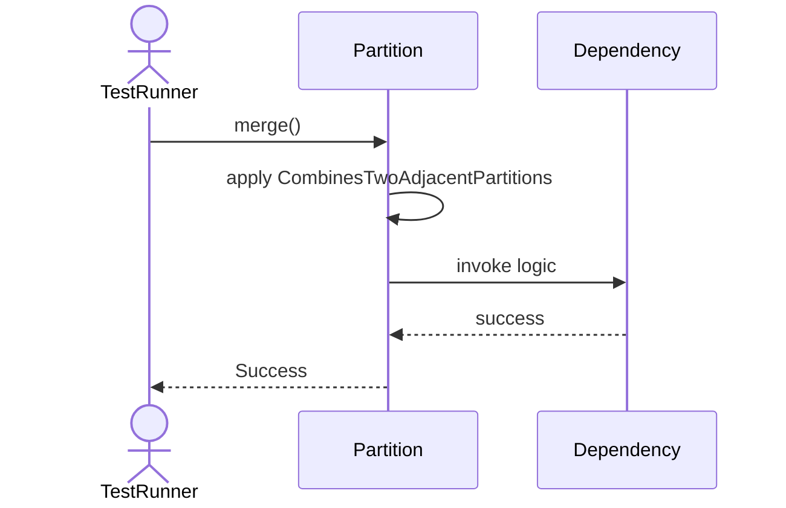
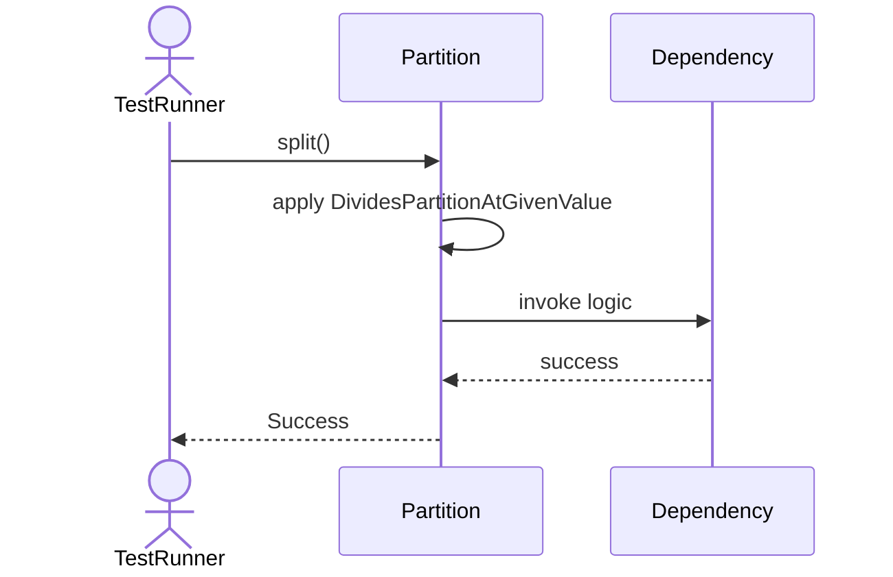

# Sequence Diagrams: Partition

## 🆕 Added Properties & Methods for `Partition`
To support the detailed sequence logic for unit testing, please update the `Partition` class in your Class Diagram with the following properties and methods:

- **Property** added to `Partition`: `partitionKey`
- **Property** added to `Partition`: `minValue`
- **Property** added to `Partition`: `maxValue`
- **Method** added to `Partition`: `checkBoundary()`
- **Method** added to `Partition`: `merge()`
- **Method** added to `Partition`: `split()`

---

This file contains the detailed sequence diagrams for all 5 unit tests of the **Partition** class.

## 1. Init_SetsPartitionKeyCorrectly

## 2. CheckBoundary_WhenValueInRange_ReturnsTrue

## 3. CheckBoundary_WhenValueOutOfRange_ReturnsFalse

## 4. Merge_CombinesTwoAdjacentPartitions

## 5. Split_DividesPartitionAtGivenValue

