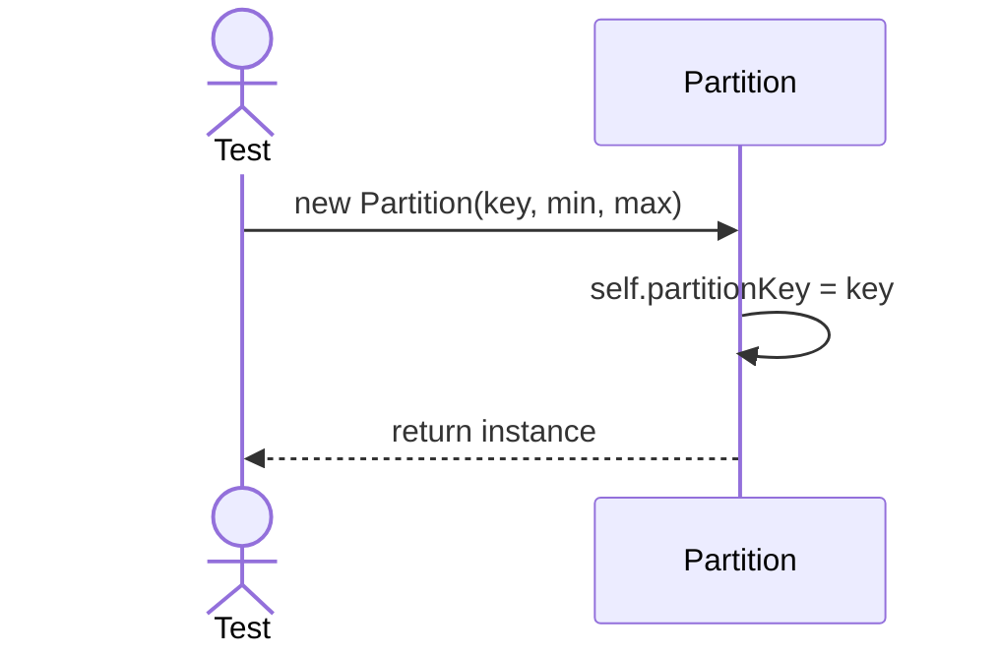
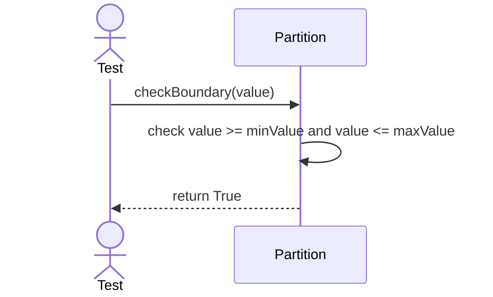

# Sequence Diagrams: Partition

## 🆕 Added Properties & Methods for `Partition`
To support the detailed sequence logic for unit testing, the following missing properties/methods have been introduced. **Please update the `Partition` class in your Class Diagram with these:**

- **Property** added to `Partition`: `partitionKey`, `minValue`, `maxValue` (Boundary definitions)

---

This file contains the detailed sequence diagrams for all unit tests of the **Partition** class in the Database Object Management subsystem.

## 1. Init_SetsPartitionKeyCorrectly

## 2. CheckBoundary_WhenValueInRange_ReturnsTrue

