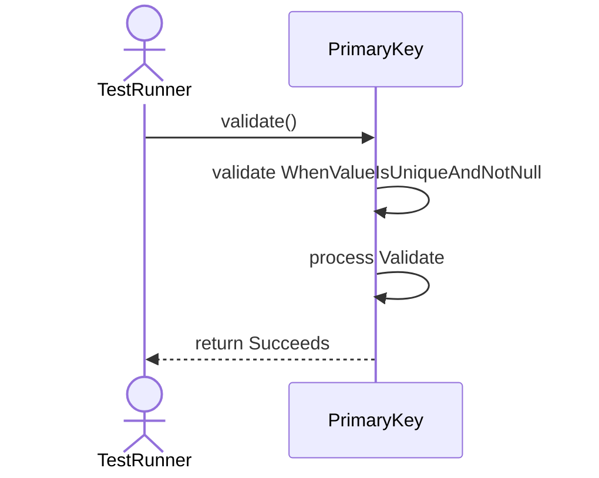
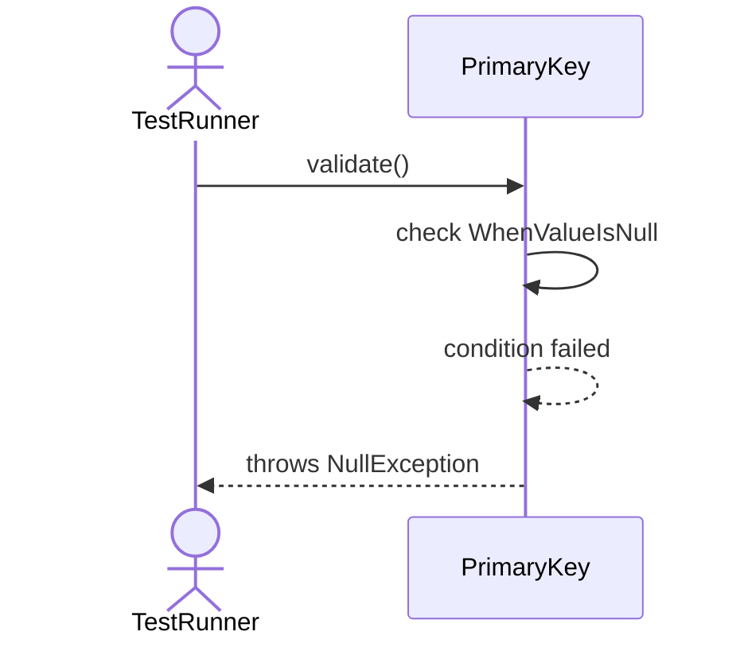
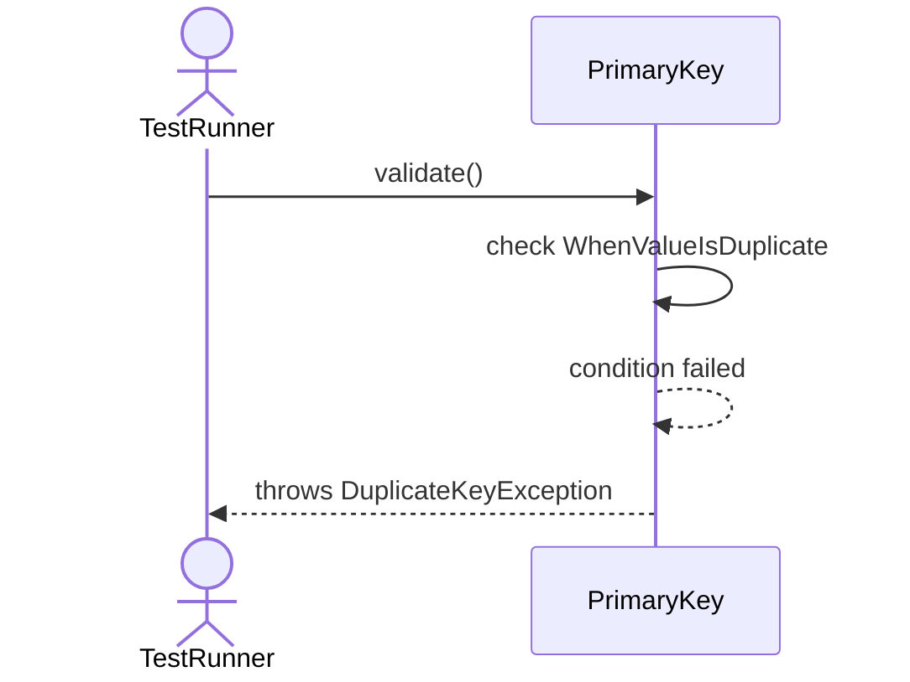
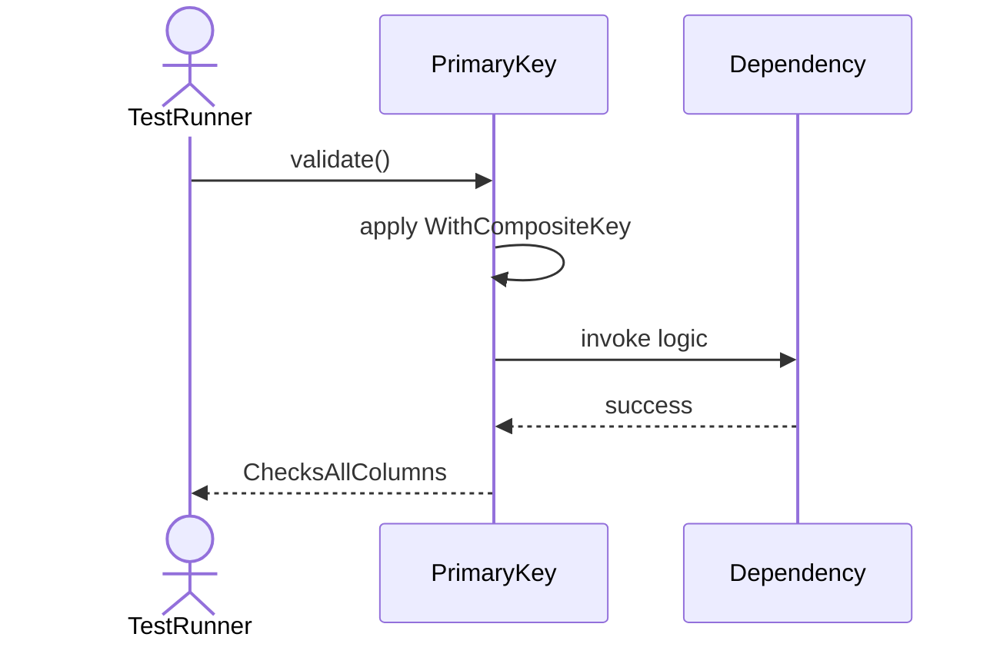
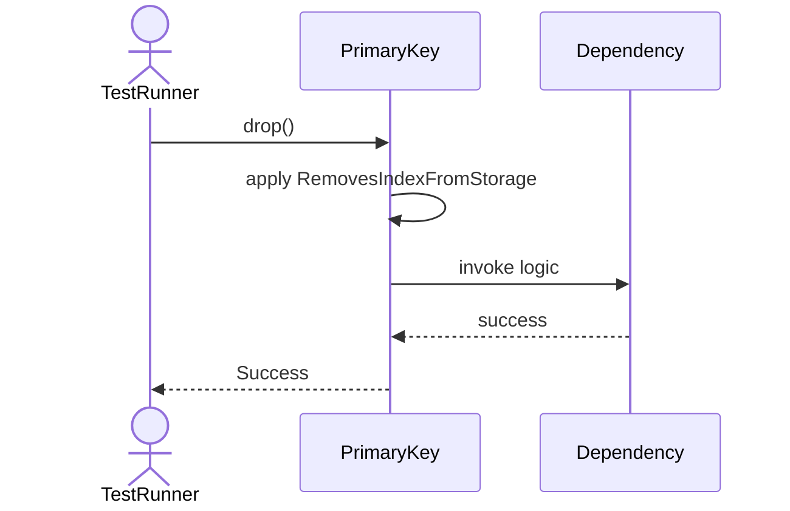

# Sequence Diagrams: PrimaryKey

## 🆕 Added Properties & Methods for `PrimaryKey`
To support the detailed sequence logic for unit testing, please update the `PrimaryKey` class in your Class Diagram with the following properties and methods:

- **Property** added to `PrimaryKey`: `columns (List)`
- **Method** added to `PrimaryKey`: `drop()`
- **Method** added to `PrimaryKey`: `validate()`

---

This file contains the detailed sequence diagrams for all 5 unit tests of the **PrimaryKey** class.

## 1. Validate_WhenValueIsUniqueAndNotNull_Succeeds

## 2. Validate_WhenValueIsNull_ThrowsNullException

## 3. Validate_WhenValueIsDuplicate_ThrowsDuplicateKeyException

## 4. Validate_WithCompositeKey_ChecksAllColumns

## 5. Drop_RemovesIndexFromStorage

