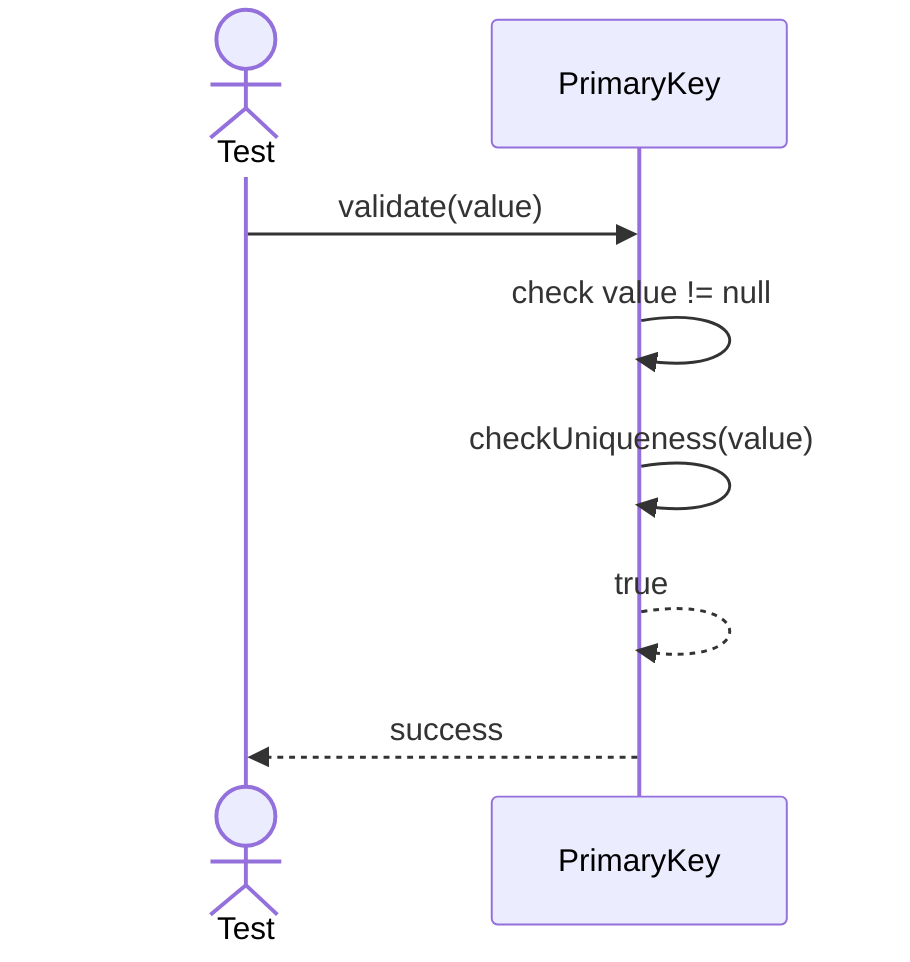
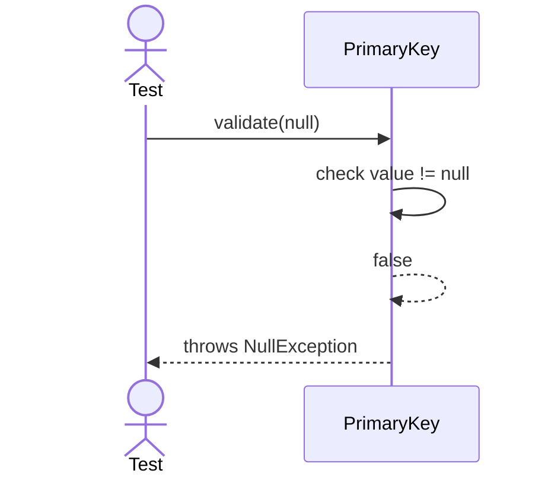
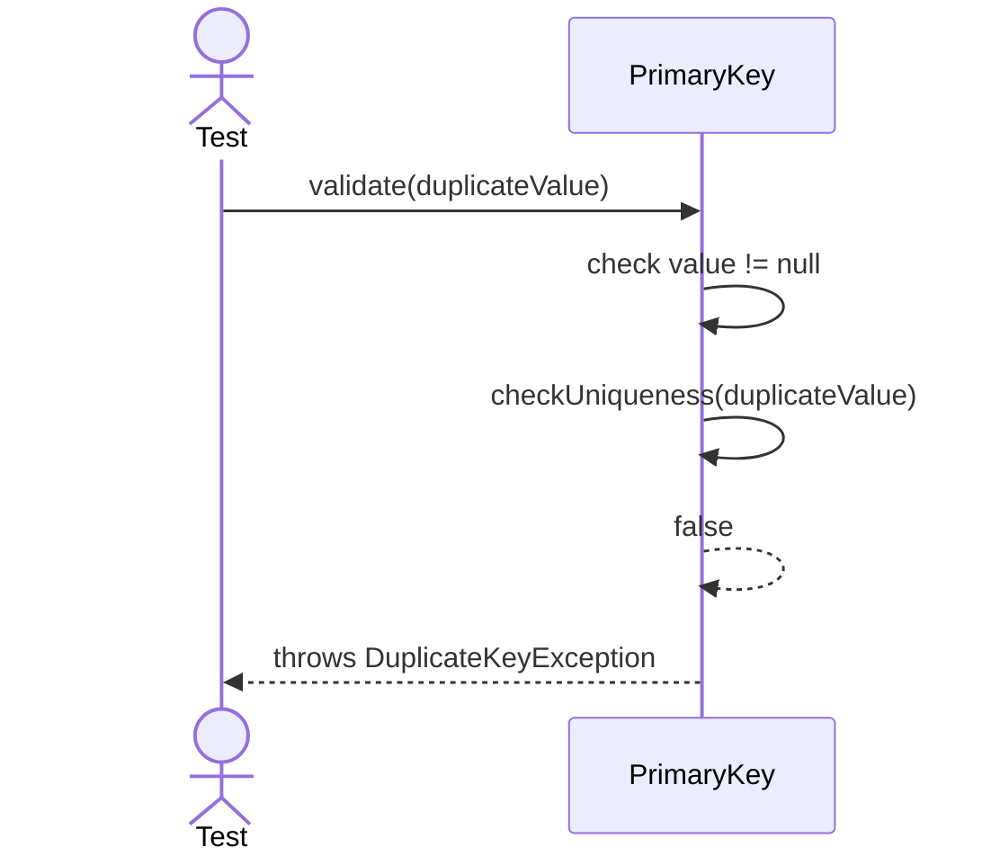

# Sequence Diagrams: PrimaryKey

## 🆕 Added Properties & Methods for `PrimaryKey`
To support the detailed sequence logic for unit testing, the following missing properties/methods have been introduced. **Please update the `PrimaryKey` class in your Class Diagram with these:**

- **Property** added to `PrimaryKey`: `columns` (List of columns participating in PK)
- **Method** added to `PrimaryKey`: `checkUniqueness(value)` (Validates global uniqueness in Table)

---

This file contains the detailed sequence diagrams for all unit tests of the **PrimaryKey** class in the Database Object Management subsystem.

## 1. Validate_WhenValueIsUniqueAndNotNull_Succeeds

## 2. Validate_WhenValueIsNull_ThrowsNullException

## 3. Validate_WhenValueIsDuplicate_ThrowsDuplicateKeyException

