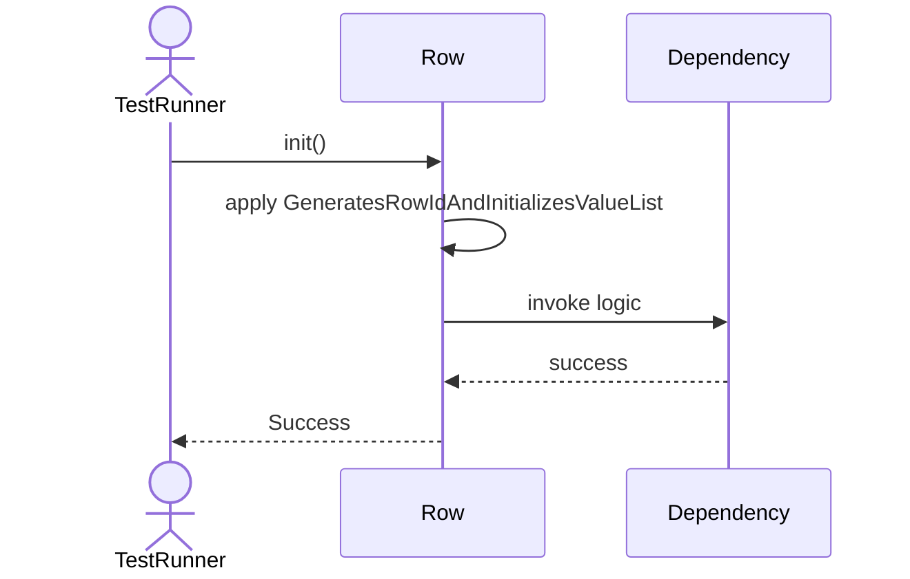
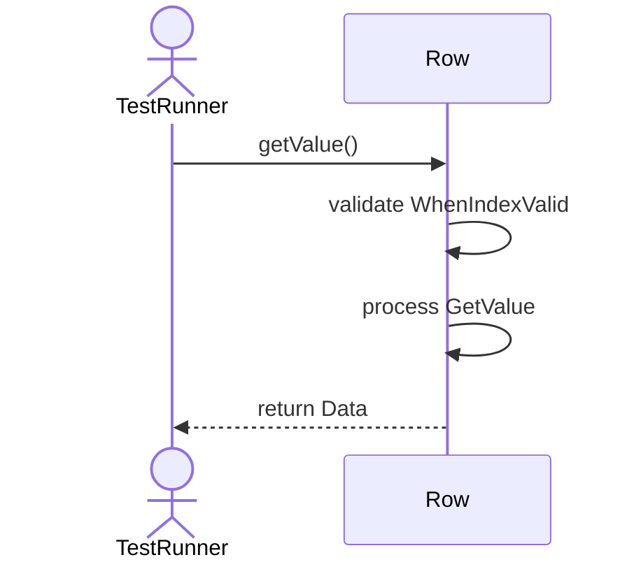
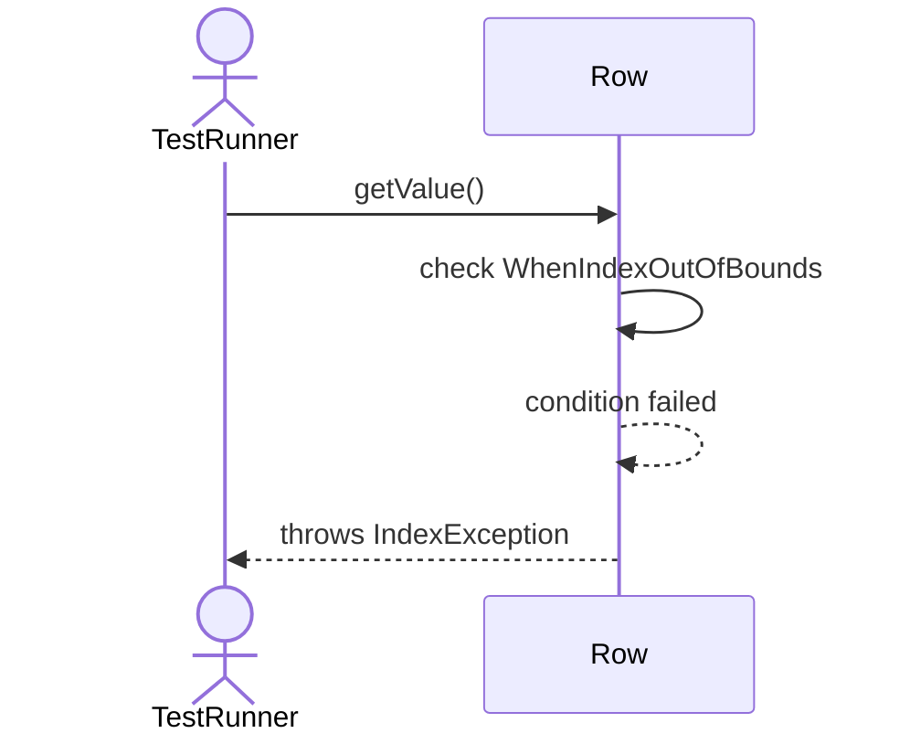
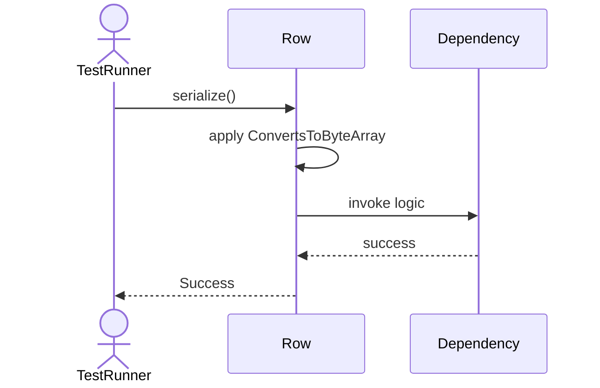
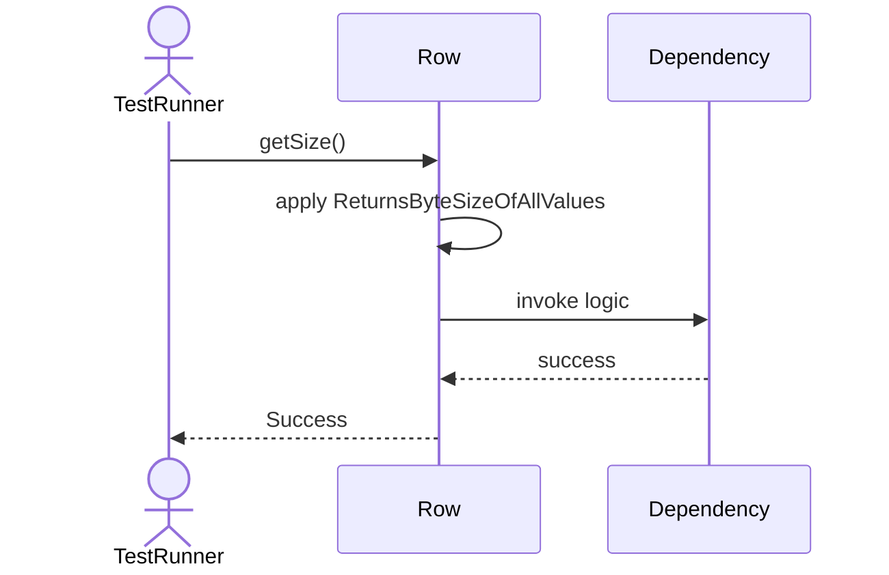

# Sequence Diagrams: Row

## 🆕 Added Properties & Methods for `Row`
To support the detailed sequence logic for unit testing, please update the `Row` class in your Class Diagram with the following properties and methods:

- **Property** added to `Row`: `rowId (UUID)`
- **Property** added to `Row`: `values (List)`
- **Method** added to `Row`: `deserialize()`
- **Method** added to `Row`: `getSize()`
- **Method** added to `Row`: `getValue()`
- **Method** added to `Row`: `serialize()`
- **Method** added to `Row`: `setValue()`

---

This file contains the detailed sequence diagrams for all 7 unit tests of the **Row** class.

## 1. Init_GeneratesRowIdAndInitializesValueList

## 2. GetValue_WhenIndexValid_ReturnsData

## 3. GetValue_WhenIndexOutOfBounds_ThrowsIndexException

## 4. SetValue_UpdatesDataAtIndex

## 5. Serialize_ConvertsToByteArray

## 6. Deserialize_ReadsFromByteArray

## 7. GetSize_ReturnsByteSizeOfAllValues

