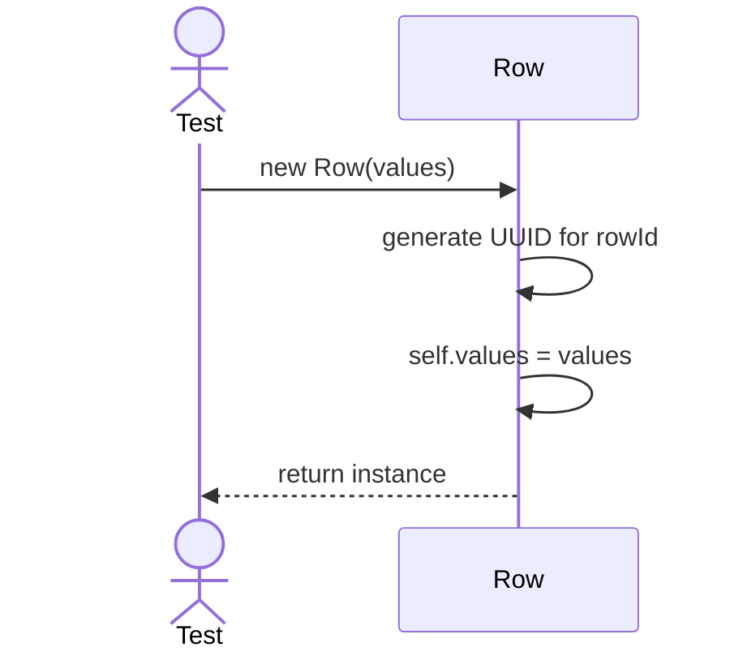
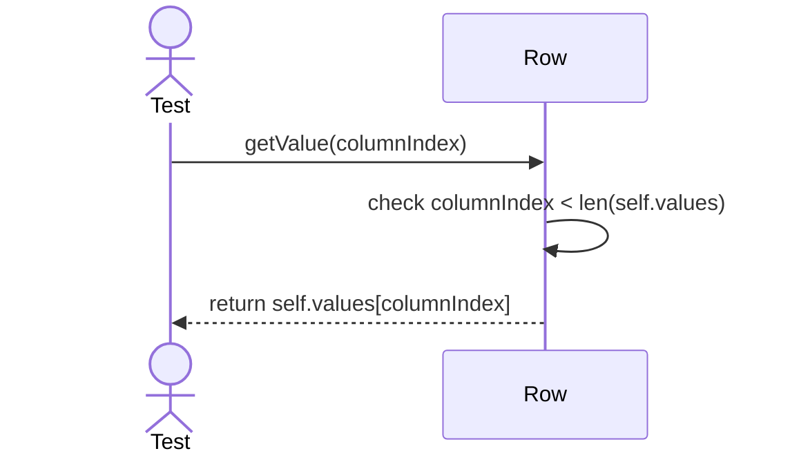

# Sequence Diagrams: Row

## 🆕 Added Properties & Methods for `Row`
To support the detailed sequence logic for unit testing, the following missing properties/methods have been introduced. **Please update the `Row` class in your Class Diagram with these:**

- **Property** added to `Row`: `rowId` (Unique identifier), `values` (Dictionary mapping col to value)

---

This file contains the detailed sequence diagrams for all unit tests of the **Row** class in the Database Object Management subsystem.

## 1. Init_GeneratesRowIdAndInitializesValueList

## 2. GetValue_WhenIndexValid_ReturnsData

