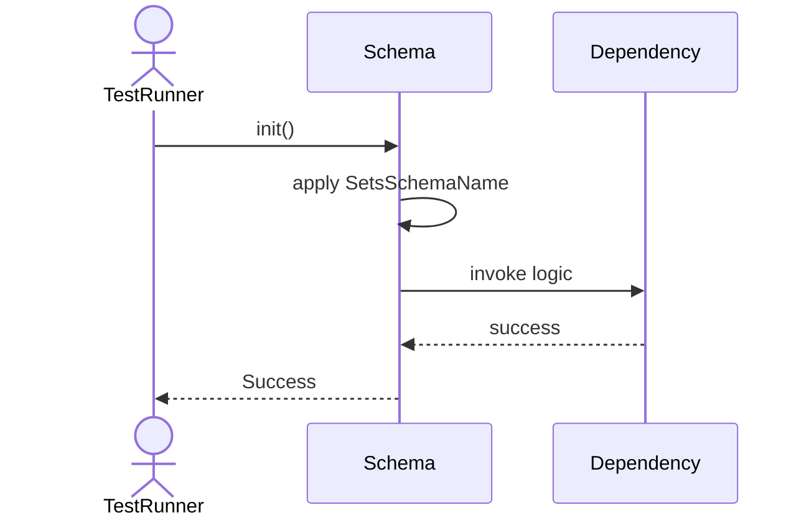
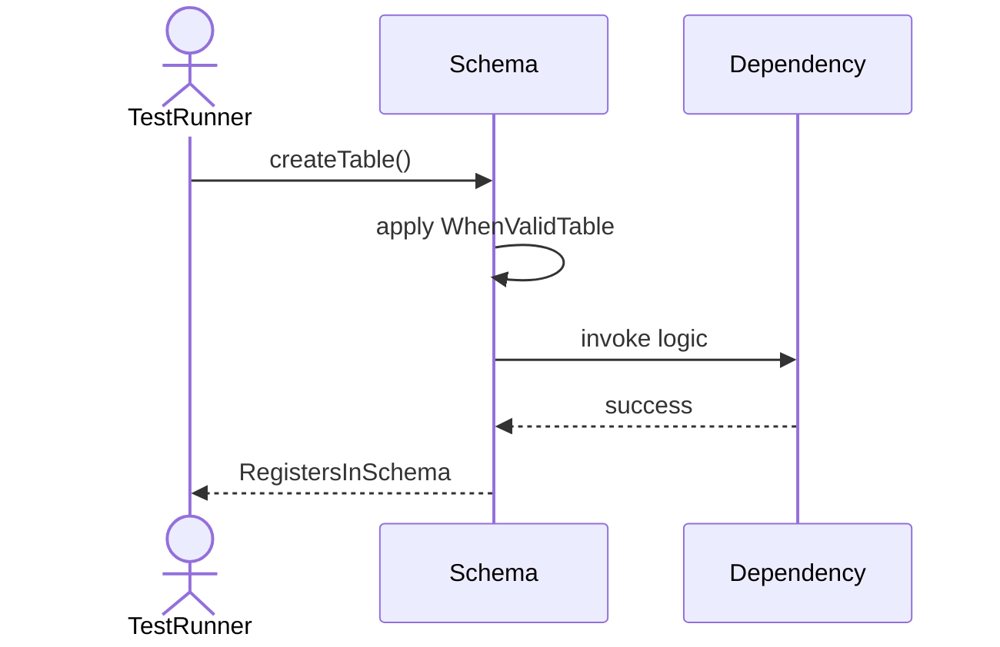
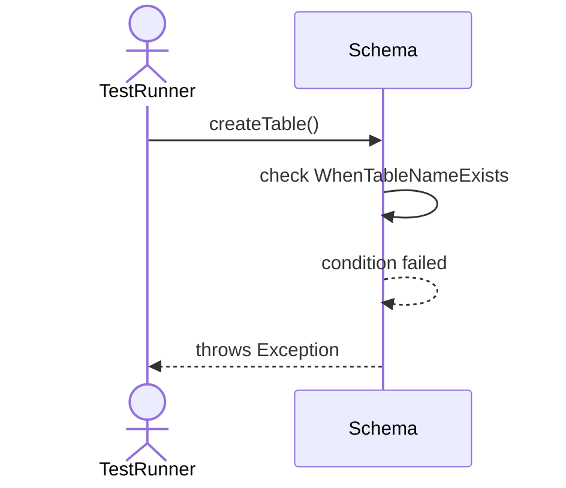
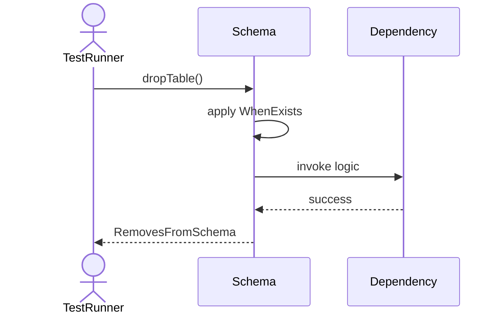
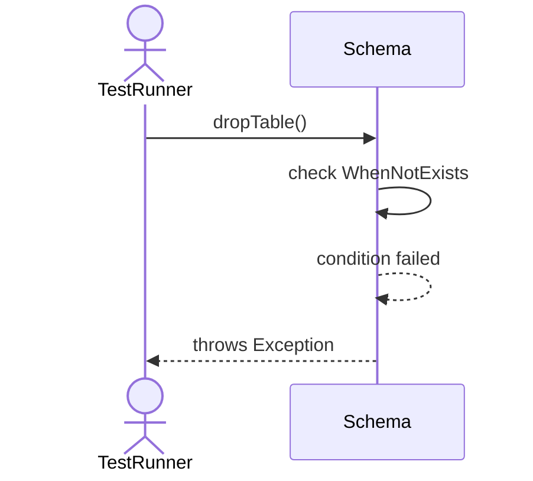
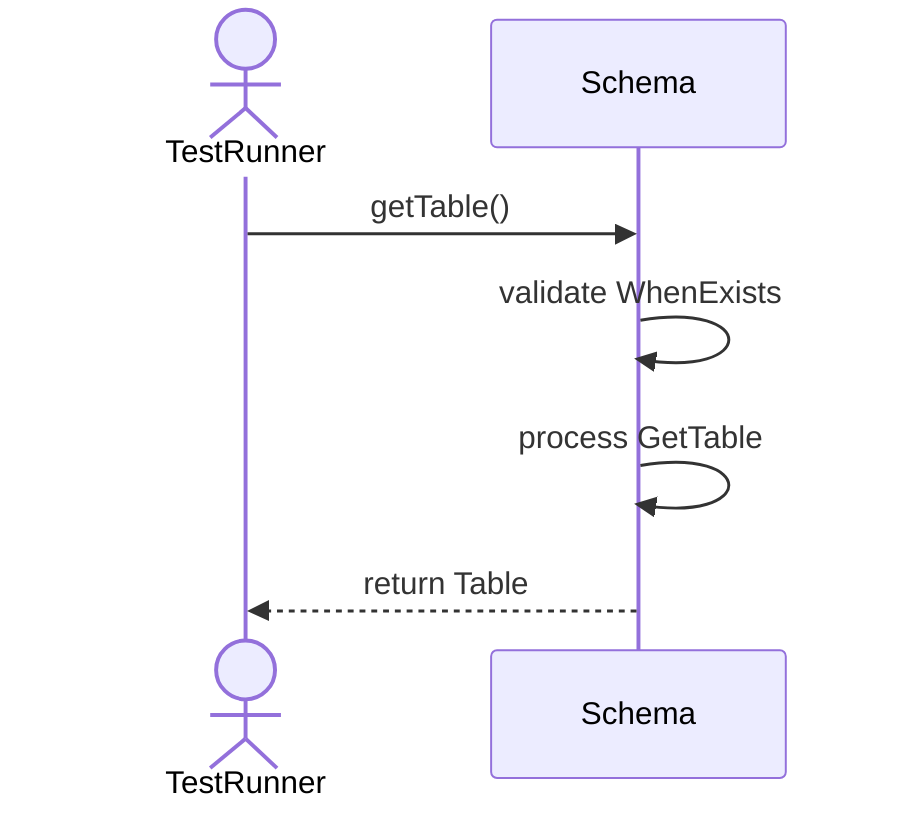
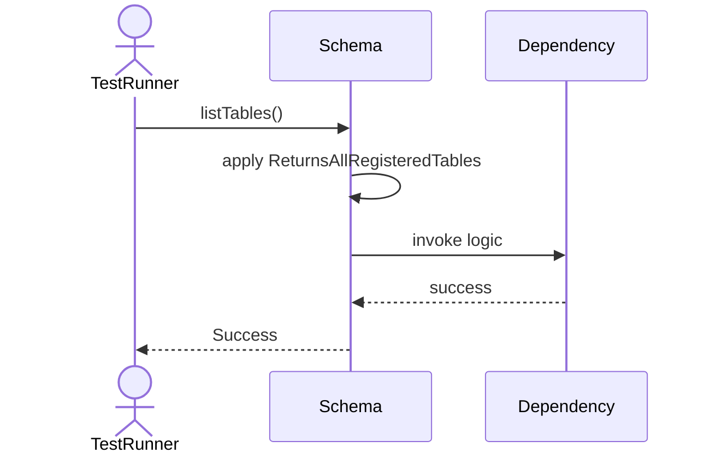

# Sequence Diagrams: Schema

## 🆕 Added Properties & Methods for `Schema`
To support the detailed sequence logic for unit testing, please update the `Schema` class in your Class Diagram with the following properties and methods:

- **Property** added to `Schema`: `tables (Dict)`
- **Method** added to `Schema`: `createTable()`
- **Method** added to `Schema`: `dropTable()`
- **Method** added to `Schema`: `getTable()`
- **Method** added to `Schema`: `listTables()`
- **Method** added to `Schema`: `validate()`

---

This file contains the detailed sequence diagrams for all 8 unit tests of the **Schema** class.

## 1. Init_SetsSchemaName

## 2. CreateTable_WhenValidTable_RegistersInSchema

## 3. CreateTable_WhenTableNameExists_ThrowsException

## 4. DropTable_WhenExists_RemovesFromSchema

## 5. DropTable_WhenNotExists_ThrowsException

## 6. GetTable_WhenExists_ReturnsTable

## 7. ListTables_ReturnsAllRegisteredTables

## 8. Validate_EnsuresSchemaNameIsAlphanumeric

