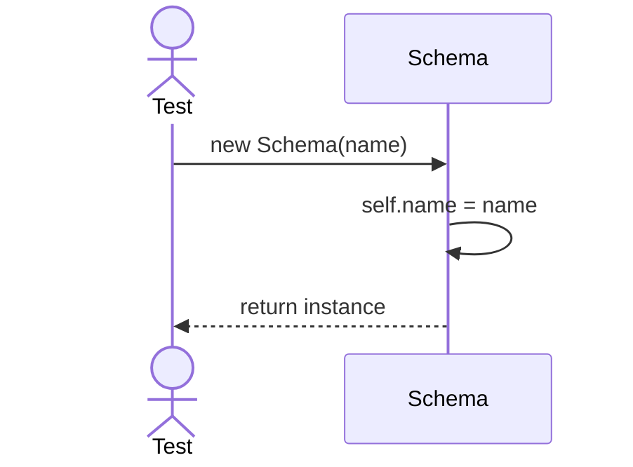
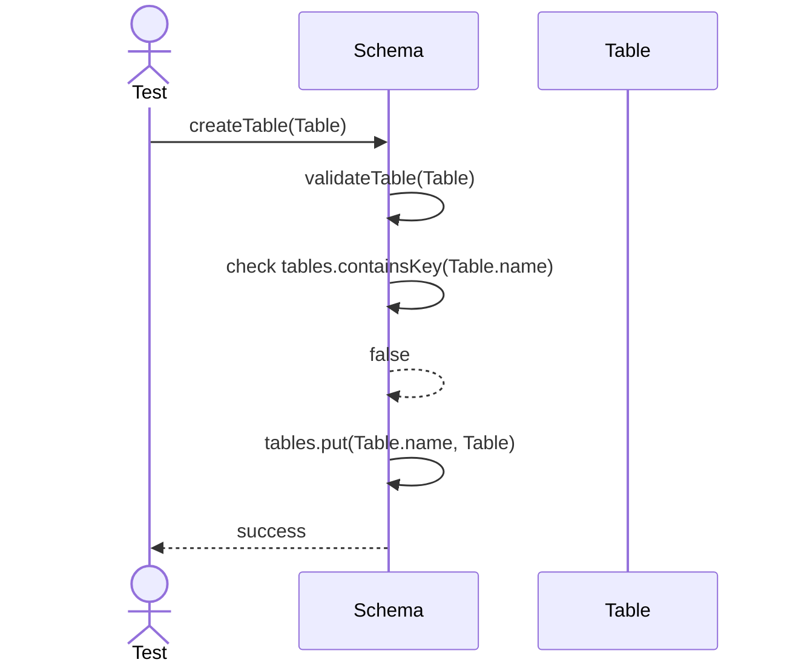
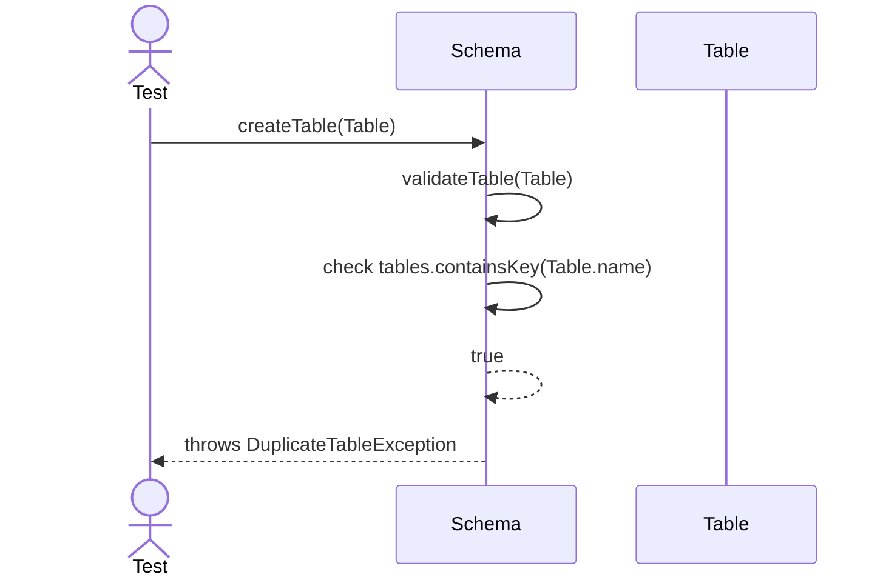
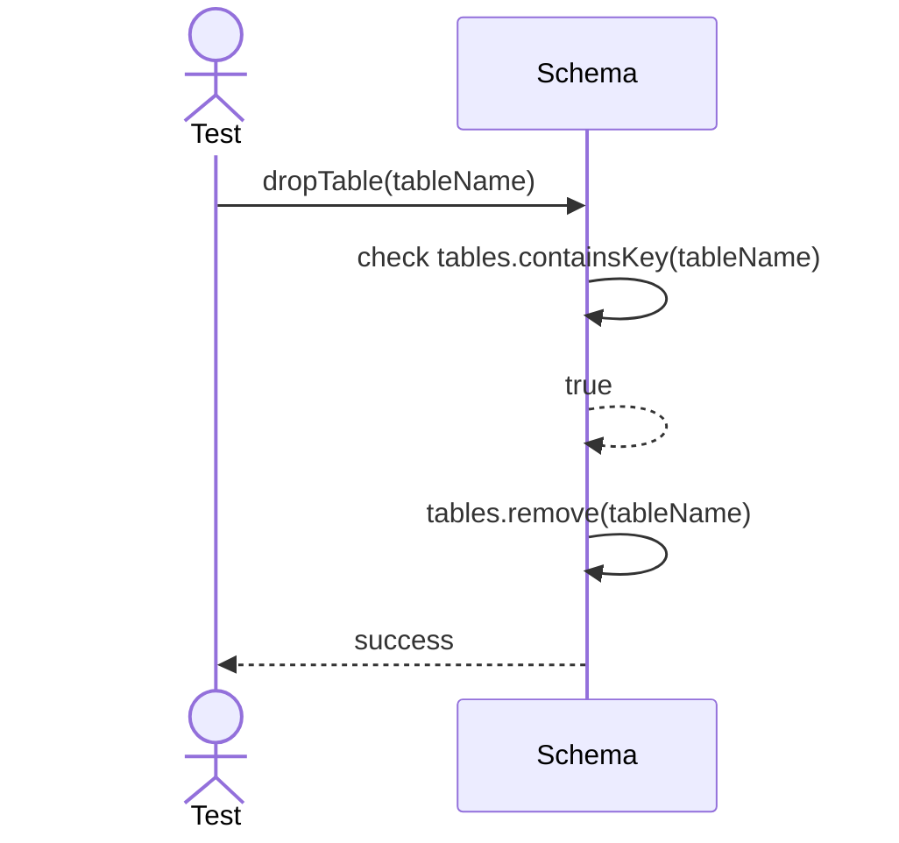

# Sequence Diagrams: Schema

## 🆕 Added Properties & Methods for `Schema`
To support the detailed sequence logic for unit testing, the following missing properties/methods have been introduced. **Please update the `Schema` class in your Class Diagram with these:**

- **Property** added to `Schema`: `tables` (Dictionary holding registered Table objects)
- **Method** added to `Schema`: `validateTable(table)` (Validates table name and structure before adding)

---

This file contains the detailed sequence diagrams for all unit tests of the **Schema** class in the Database Object Management subsystem.

## 1. Init_SetsSchemaName

## 2. CreateTable_WhenValidTable_RegistersInSchema

## 3. CreateTable_WhenTableNameExists_ThrowsException

## 4. DropTable_WhenExists_RemovesFromSchema

