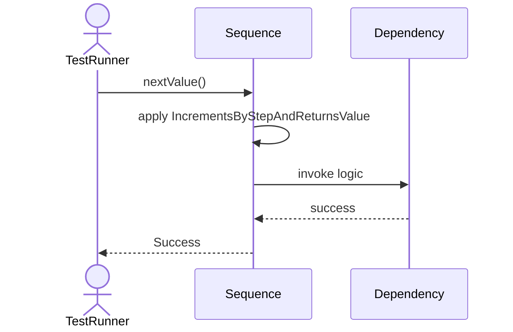
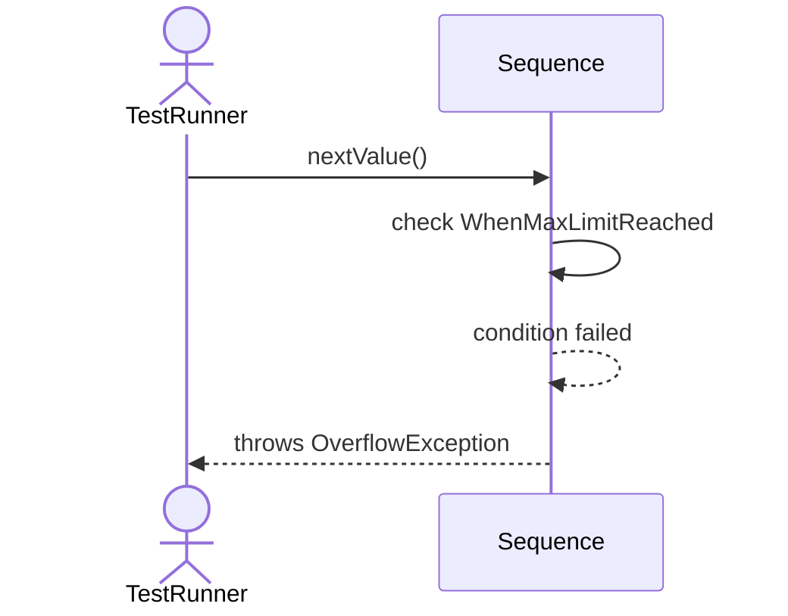
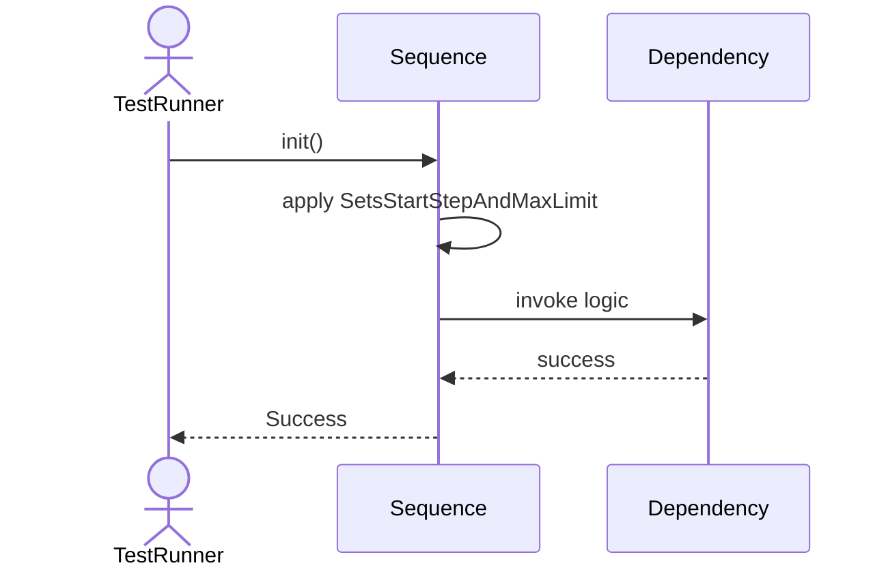
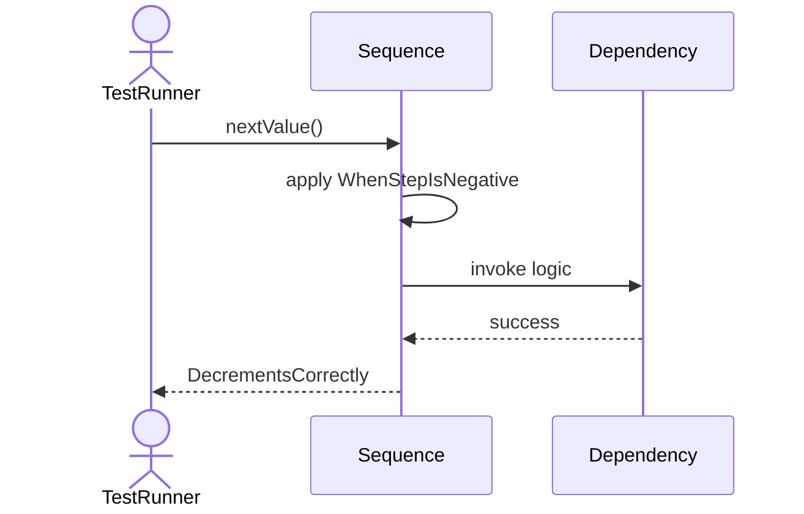

# Sequence Diagrams: Sequence

## 🆕 Added Properties & Methods for `Sequence`
To support the detailed sequence logic for unit testing, please update the `Sequence` class in your Class Diagram with the following properties and methods:

- **Property** added to `Sequence`: `currentValue (Int)`
- **Property** added to `Sequence`: `step (Int)`
- **Property** added to `Sequence`: `maxValue (Int)`
- **Method** added to `Sequence`: `currentValue()`
- **Method** added to `Sequence`: `nextValue()`
- **Method** added to `Sequence`: `reset()`

---

This file contains the detailed sequence diagrams for all 6 unit tests of the **Sequence** class.

## 1. NextValue_IncrementsByStepAndReturnsValue

## 2. NextValue_WhenMaxLimitReached_ThrowsOverflowException

## 3. Reset_SetsValueBackToStart

## 4. Init_SetsStartStepAndMaxLimit

## 5. CurrentValue_ReturnsCurrentWithoutIncrementing

## 6. NextValue_WhenStepIsNegative_DecrementsCorrectly

