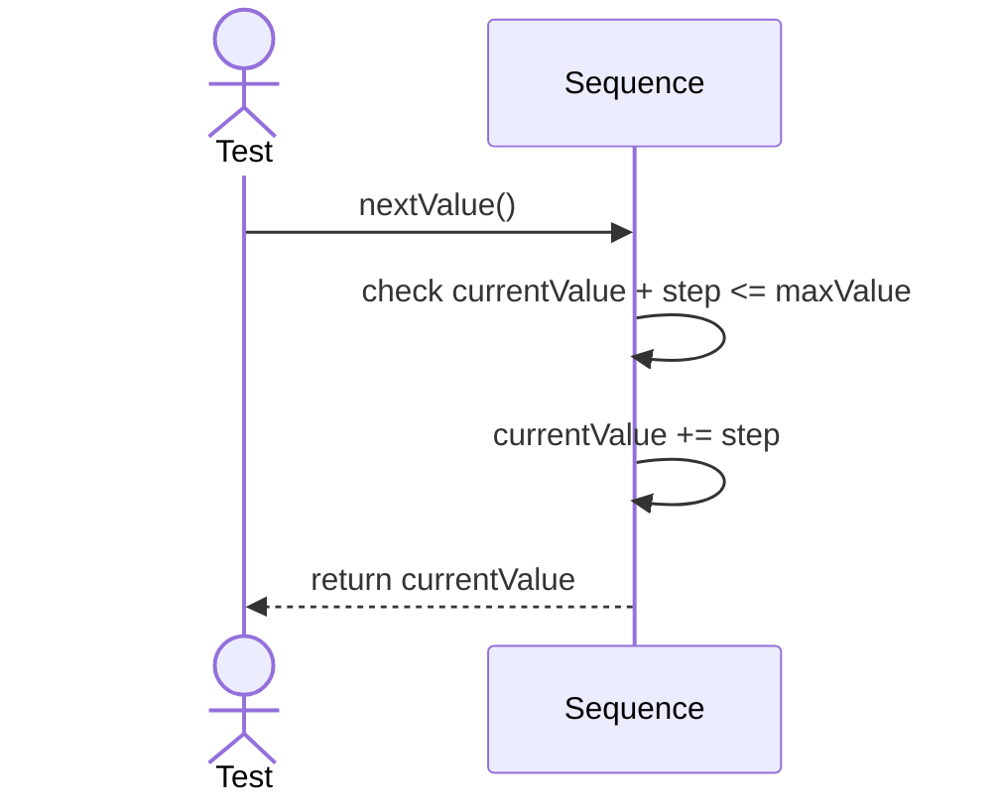
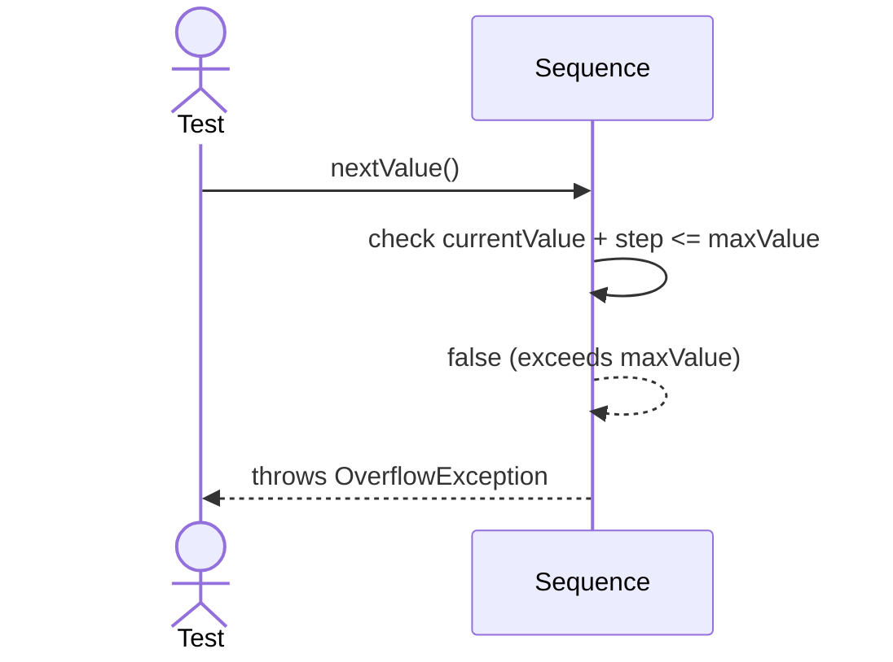

# Sequence Diagrams: Sequence

## 🆕 Added Properties & Methods for `Sequence`
To support the detailed sequence logic for unit testing, the following missing properties/methods have been introduced. **Please update the `Sequence` class in your Class Diagram with these:**

- **Property** added to `Sequence`: `currentValue`, `step`, `maxValue` (Internal state tracking)

---

This file contains the detailed sequence diagrams for all unit tests of the **Sequence** class in the Database Object Management subsystem.

## 1. NextValue_IncrementsByStepAndReturnsValue

## 2. NextValue_WhenMaxLimitReached_ThrowsOverflowException

