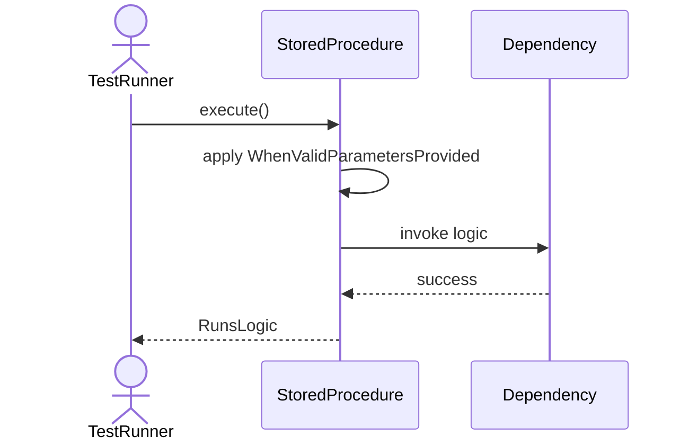
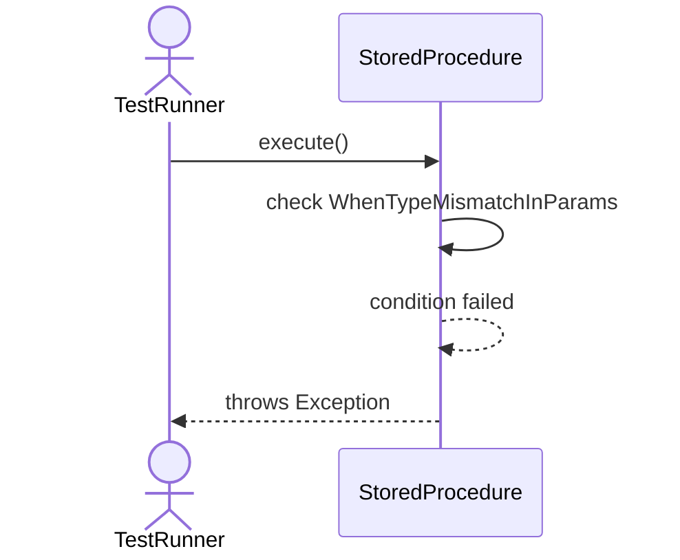
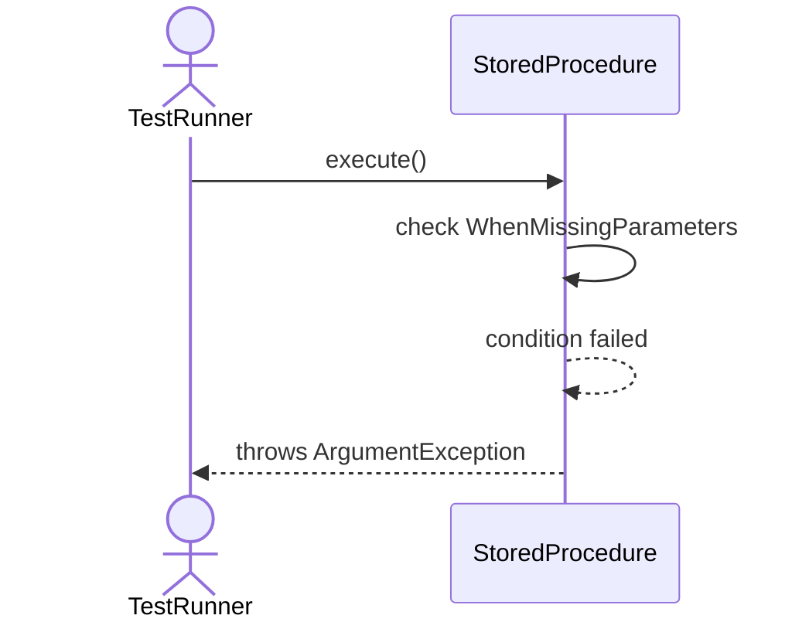
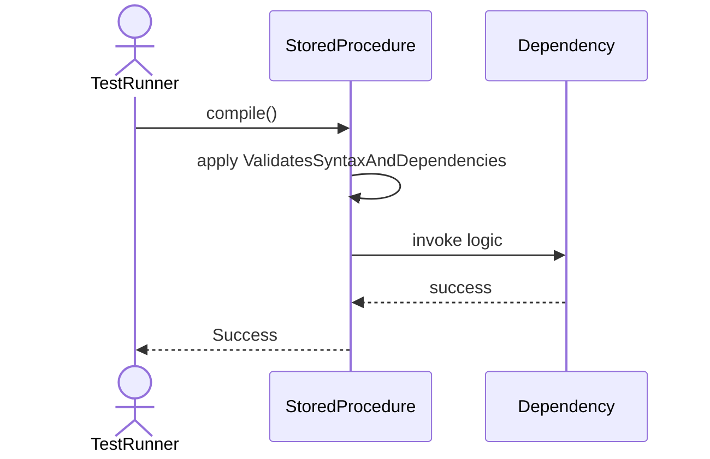
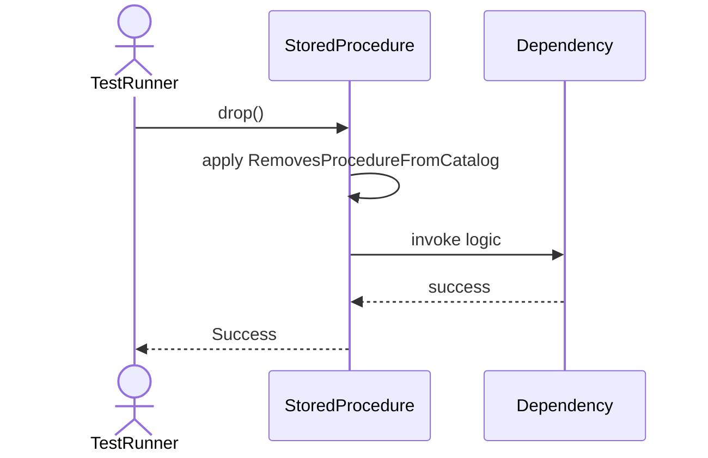

# Sequence Diagrams: StoredProcedure

## 🆕 Added Properties & Methods for `StoredProcedure`
To support the detailed sequence logic for unit testing, please update the `StoredProcedure` class in your Class Diagram with the following properties and methods:

- **Property** added to `StoredProcedure`: `parameters (List)`
- **Method** added to `StoredProcedure`: `compile()`
- **Method** added to `StoredProcedure`: `drop()`
- **Method** added to `StoredProcedure`: `execute()`

---

This file contains the detailed sequence diagrams for all 6 unit tests of the **StoredProcedure** class.

## 1. Execute_WhenValidParametersProvided_RunsLogic

## 2. Execute_WhenTypeMismatchInParams_ThrowsException

## 3. Execute_WhenMissingParameters_ThrowsArgumentException

## 4. Compile_ValidatesSyntaxAndDependencies

## 5. Drop_RemovesProcedureFromCatalog

## 6. Execute_WhenProcedureTimesOut_KillsExecution

