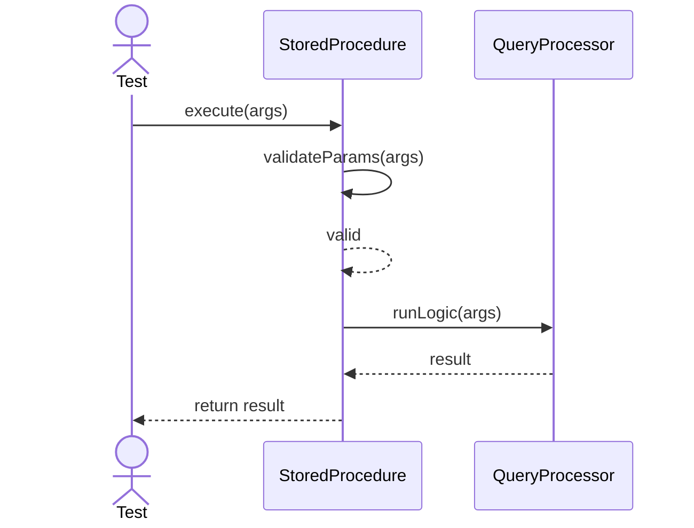
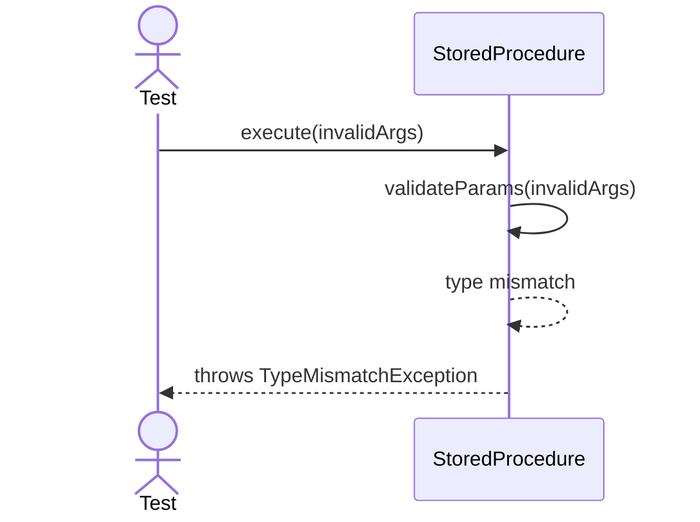

# Sequence Diagrams: StoredProcedure

## 🆕 Added Properties & Methods for `StoredProcedure`
To support the detailed sequence logic for unit testing, the following missing properties/methods have been introduced. **Please update the `StoredProcedure` class in your Class Diagram with these:**

- **Property** added to `StoredProcedure`: `parameters` (List of expected parameter types)
- **Method** added to `StoredProcedure`: `validateParams(args)` (Validates types before execution)

---

This file contains the detailed sequence diagrams for all unit tests of the **StoredProcedure** class in the Database Object Management subsystem.

## 1. Execute_WhenValidParametersProvided_RunsLogic

## 2. Execute_WhenTypeMismatchInParams_ThrowsException

