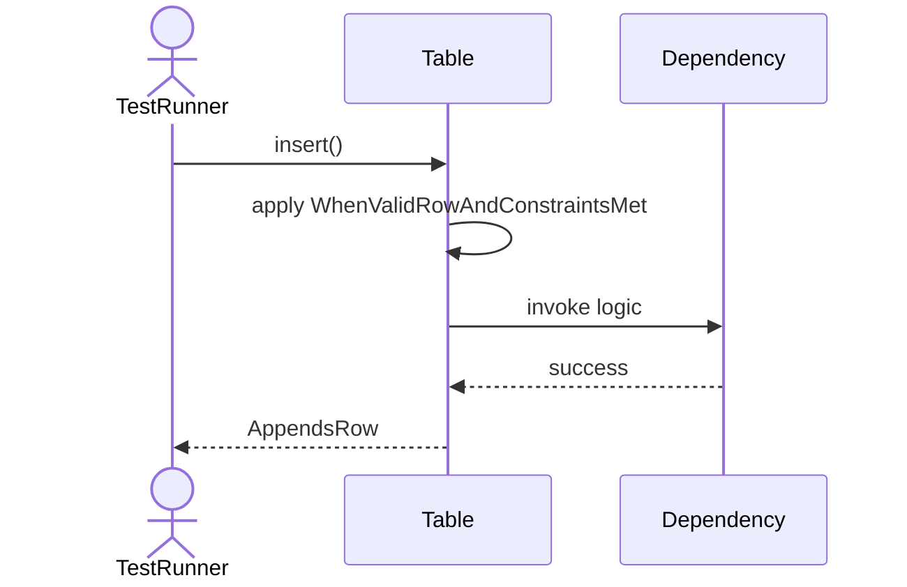
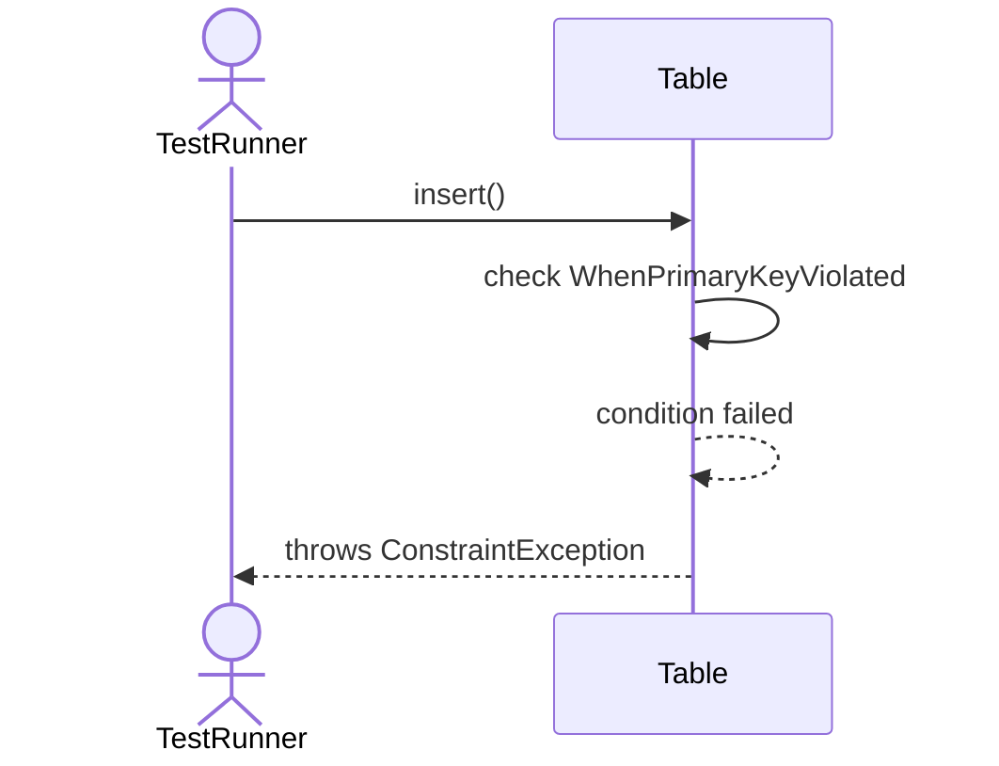
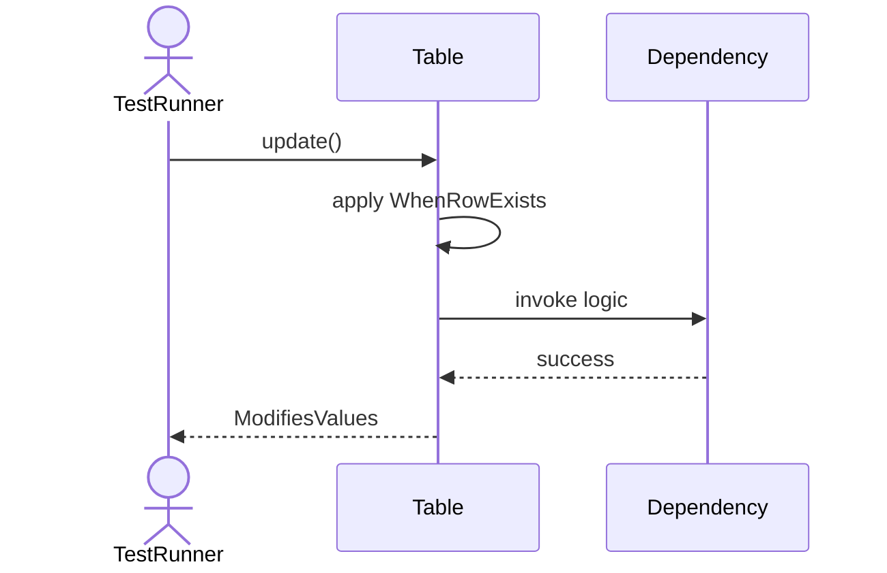
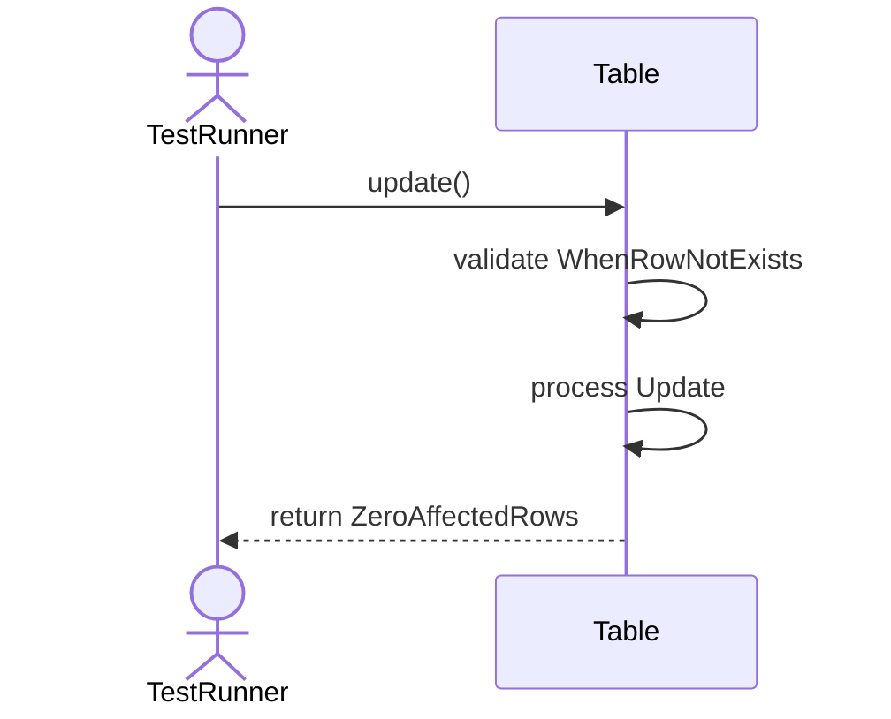
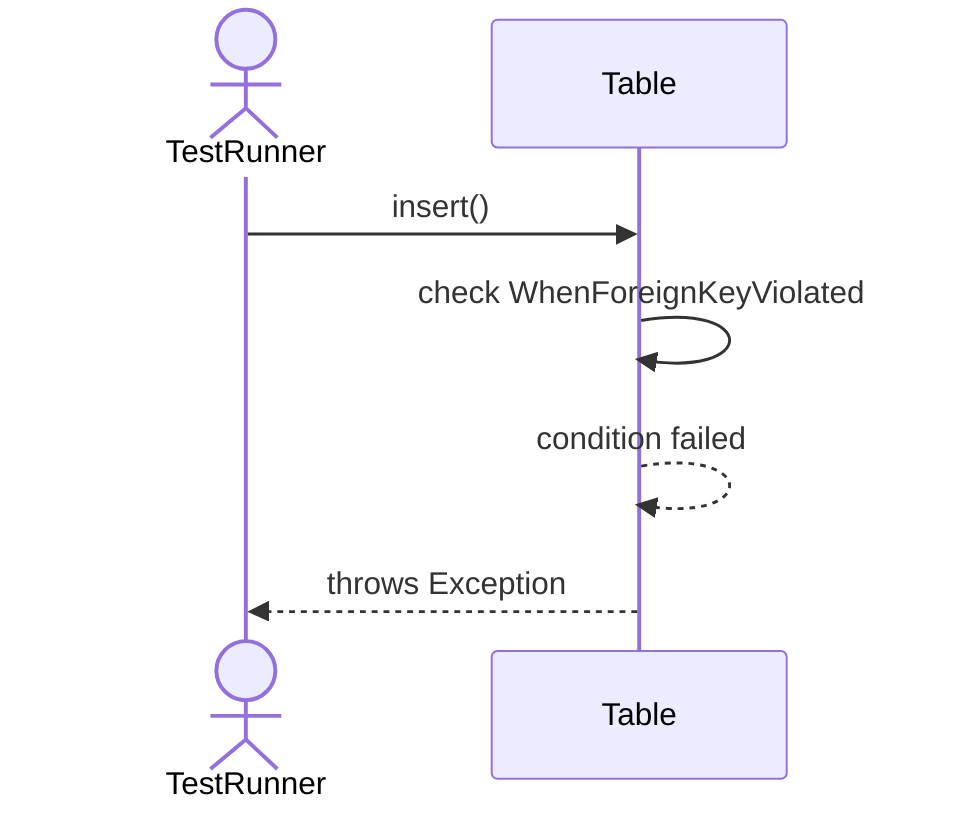
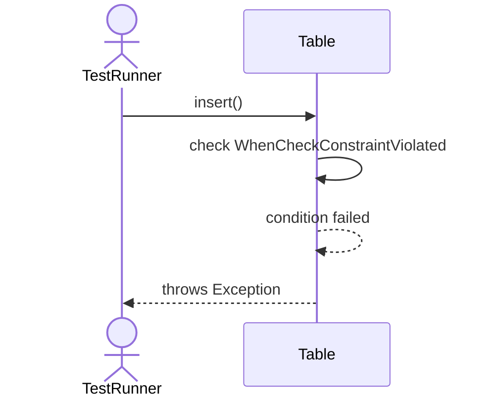
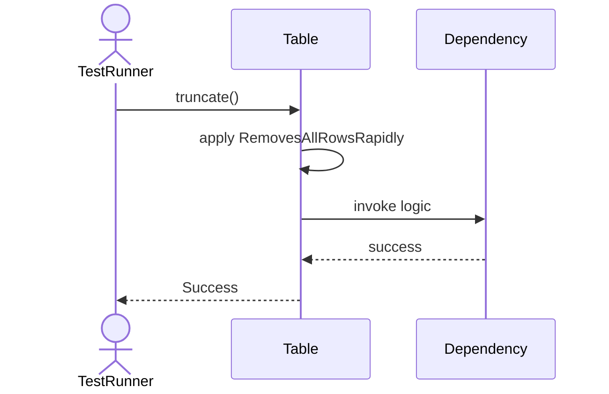
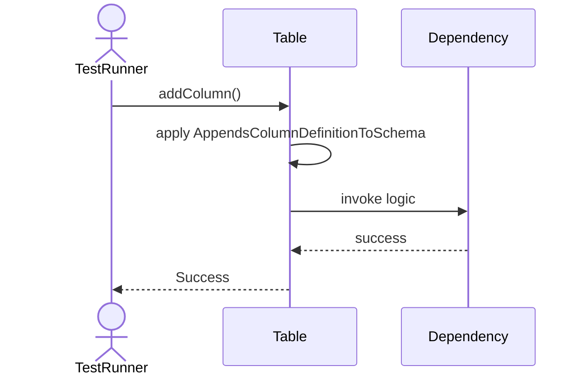
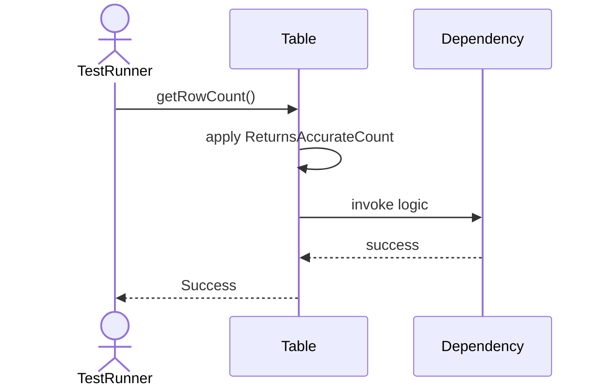
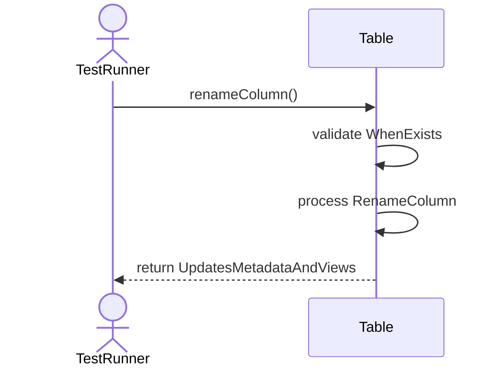

# Sequence Diagrams: Table

## 🆕 Added Properties & Methods for `Table`
To support the detailed sequence logic for unit testing, please update the `Table` class in your Class Diagram with the following properties and methods:

- **Property** added to `Table`: `rows (List)`
- **Property** added to `Table`: `columns (List)`
- **Method** added to `Table`: `addColumn()`
- **Method** added to `Table`: `delete()`
- **Method** added to `Table`: `dropColumn()`
- **Method** added to `Table`: `getRowCount()`
- **Method** added to `Table`: `insert()`
- **Method** added to `Table`: `renameColumn()`
- **Method** added to `Table`: `truncate()`
- **Method** added to `Table`: `update()`

---

This file contains the detailed sequence diagrams for all 12 unit tests of the **Table** class.

## 1. Insert_WhenValidRowAndConstraintsMet_AppendsRow

## 2. Insert_WhenPrimaryKeyViolated_ThrowsConstraintException

## 3. Update_WhenRowExists_ModifiesValues

## 4. Update_WhenRowNotExists_ReturnsZeroAffectedRows

## 5. Delete_WhenRowExists_RemovesRow

## 6. Insert_WhenForeignKeyViolated_ThrowsException

## 7. Insert_WhenCheckConstraintViolated_ThrowsException

## 8. Truncate_RemovesAllRowsRapidly

## 9. AddColumn_AppendsColumnDefinitionToSchema

## 10. DropColumn_RemovesColumnAndData

## 11. GetRowCount_ReturnsAccurateCount

## 12. RenameColumn_WhenExists_UpdatesMetadataAndViews

