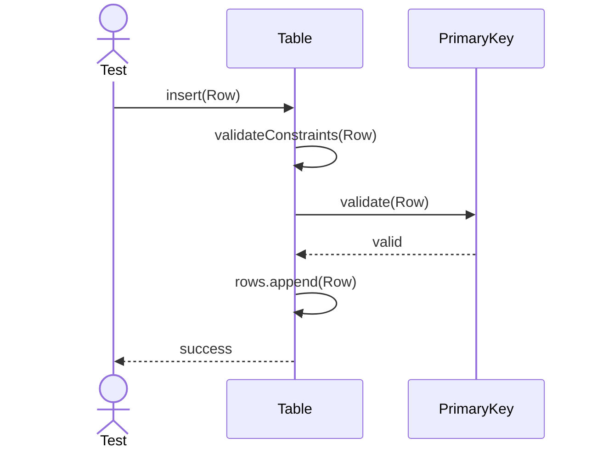
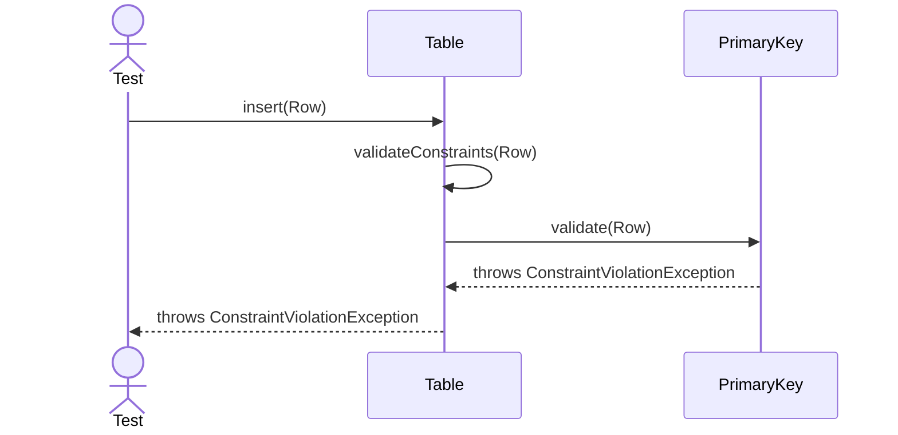
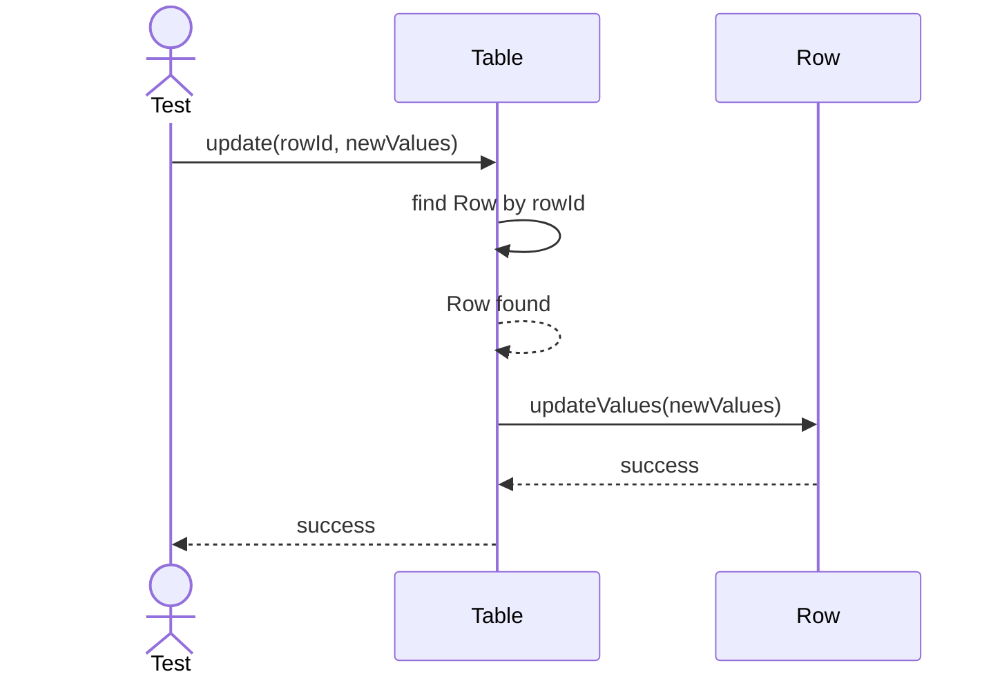
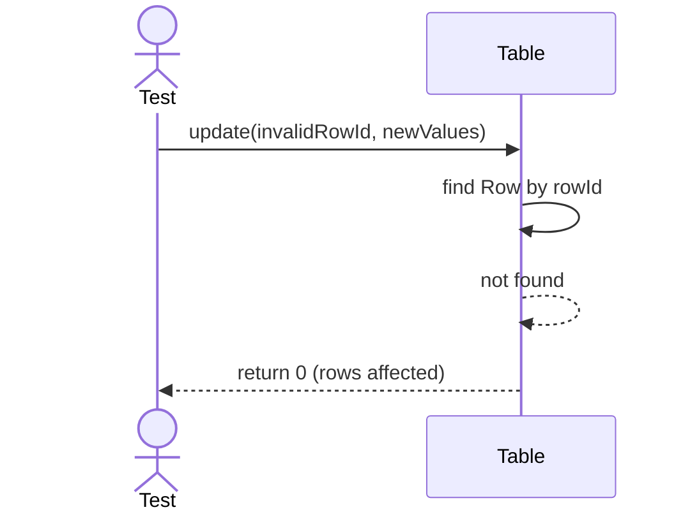
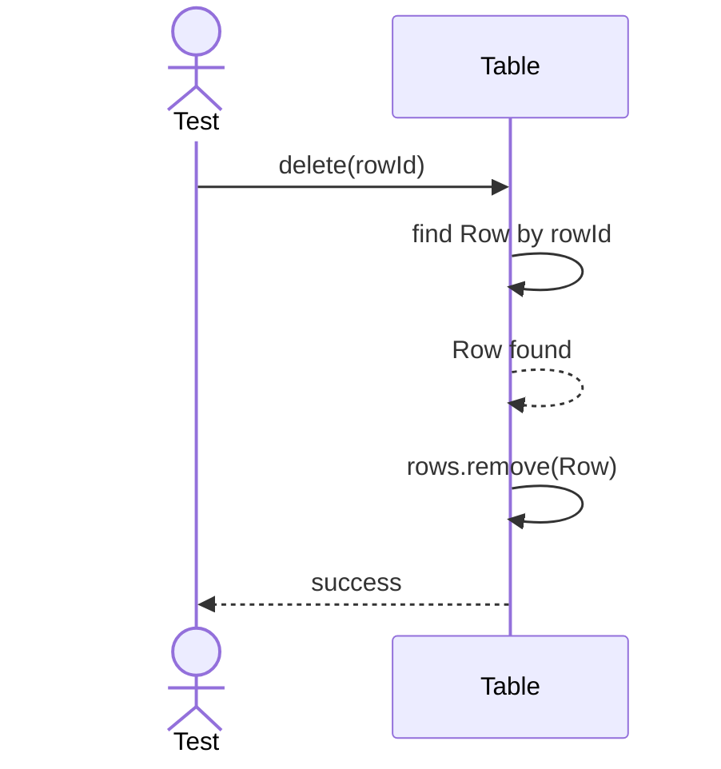

# Sequence Diagrams: Table

## 🆕 Added Properties & Methods for `Table`
To support the detailed sequence logic for unit testing, the following missing properties/methods have been introduced. **Please update the `Table` class in your Class Diagram with these:**

- **Property** added to `Table`: `rows` (List or collection of Row objects)
- **Property** added to `Table`: `columns` (List of Column definitions)
- **Method** added to `Table`: `validateConstraints(row)` (Checks constraints like Primary Key before insert)

---

This file contains the detailed sequence diagrams for all unit tests of the **Table** class in the Database Object Management subsystem.

## 1. Insert_WhenValidRowAndConstraintsMet_AppendsRow

## 2. Insert_WhenPrimaryKeyViolated_ThrowsConstraintException

## 3. Update_WhenRowExists_ModifiesValues

## 4. Update_WhenRowNotExists_ReturnsZeroAffectedRows

## 5. Delete_WhenRowExists_RemovesRow

