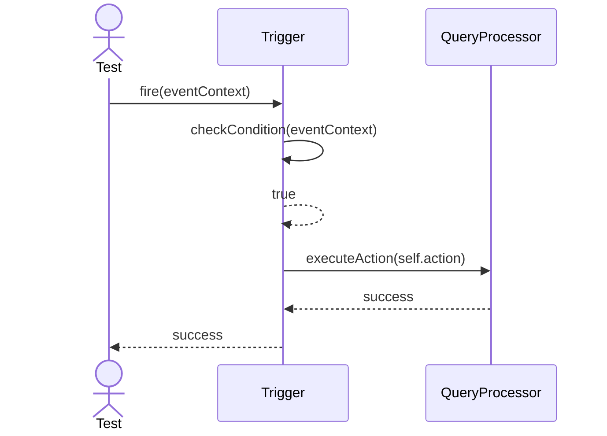
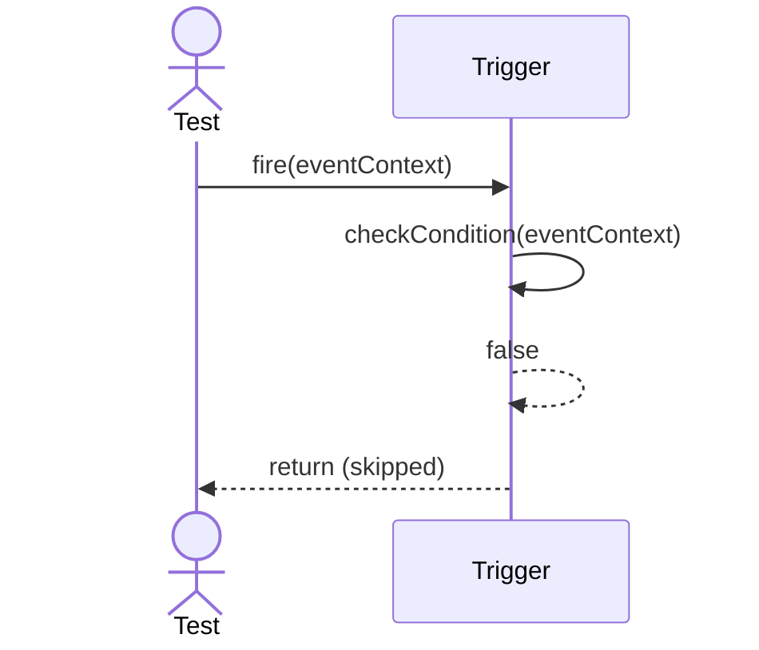

# Sequence Diagrams: Trigger

## 🆕 Added Properties & Methods for `Trigger`
To support the detailed sequence logic for unit testing, the following missing properties/methods have been introduced. **Please update the `Trigger` class in your Class Diagram with these:**

- **Property** added to `Trigger`: `eventCondition`, `action` (Triggers logic)
- **Method** added to `Trigger`: `checkCondition(event)` (Evaluates if trigger should fire)

---

This file contains the detailed sequence diagrams for all unit tests of the **Trigger** class in the Database Object Management subsystem.

## 1. Fire_OnEventConditionMet_ExecutesTriggerAction

## 2. Fire_OnEventConditionNotMet_SkipsExecution

