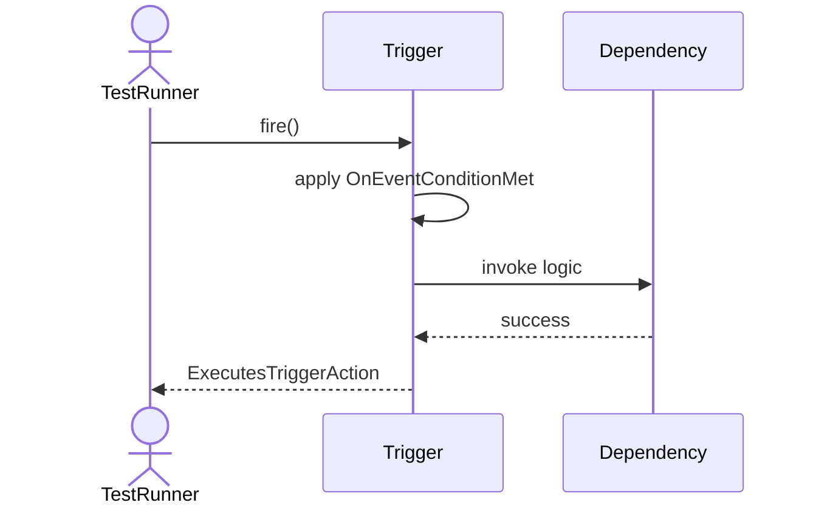
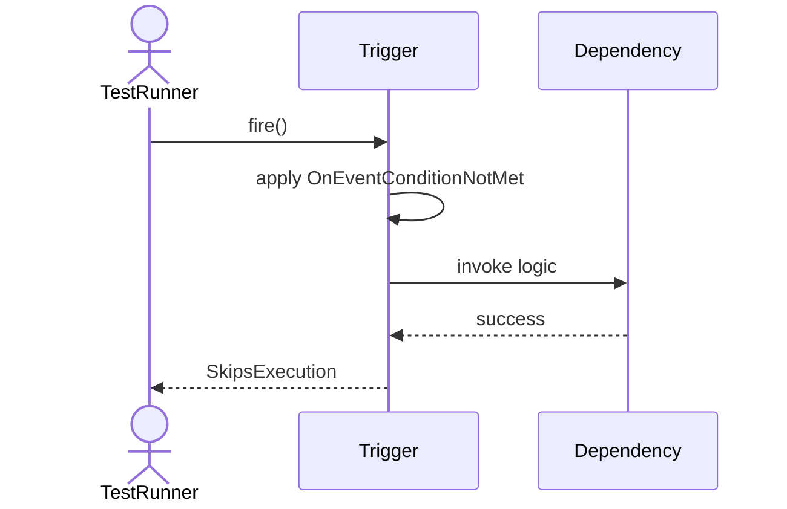
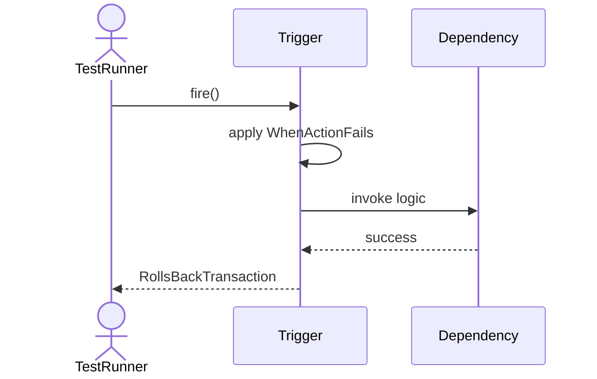
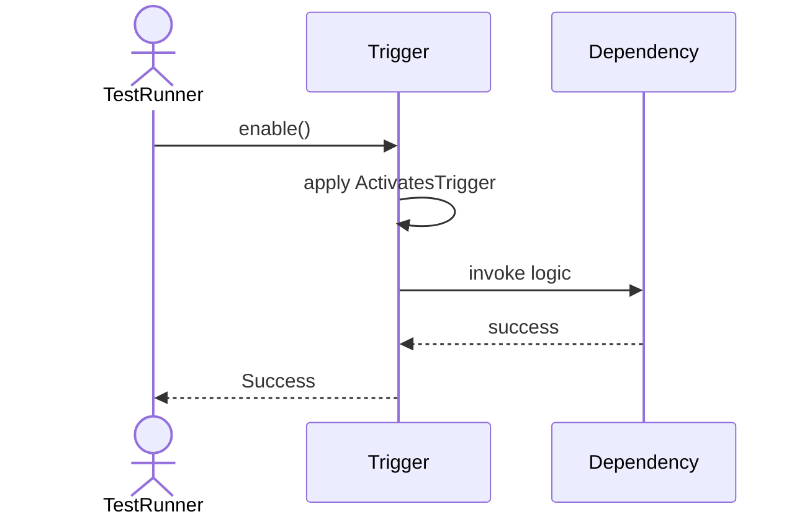
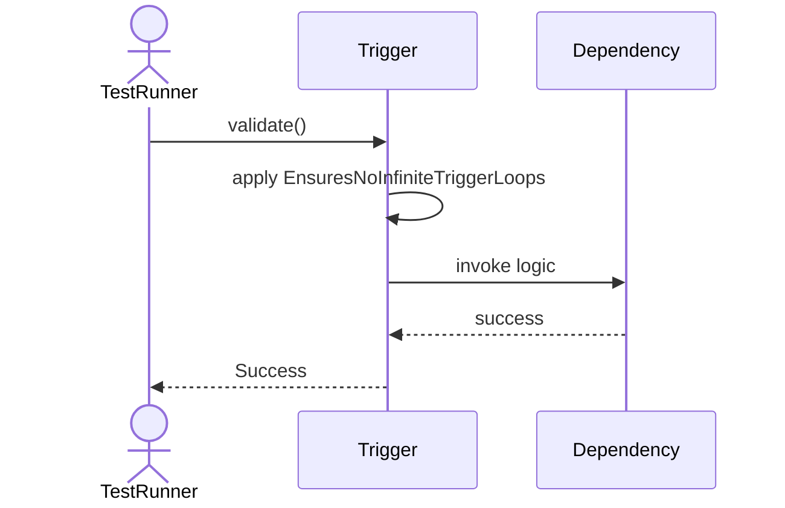

# Sequence Diagrams: Trigger

## 🆕 Added Properties & Methods for `Trigger`
To support the detailed sequence logic for unit testing, please update the `Trigger` class in your Class Diagram with the following properties and methods:

- **Property** added to `Trigger`: `eventCondition`
- **Property** added to `Trigger`: `action`
- **Property** added to `Trigger`: `isActive (Bool)`
- **Method** added to `Trigger`: `disable()`
- **Method** added to `Trigger`: `enable()`
- **Method** added to `Trigger`: `fire()`
- **Method** added to `Trigger`: `validate()`

---

This file contains the detailed sequence diagrams for all 6 unit tests of the **Trigger** class.

## 1. Fire_OnEventConditionMet_ExecutesTriggerAction

## 2. Fire_OnEventConditionNotMet_SkipsExecution

## 3. Fire_WhenActionFails_RollsBackTransaction

## 4. Enable_ActivatesTrigger

## 5. Disable_DeactivatesTrigger

## 6. Validate_EnsuresNoInfiniteTriggerLoops

