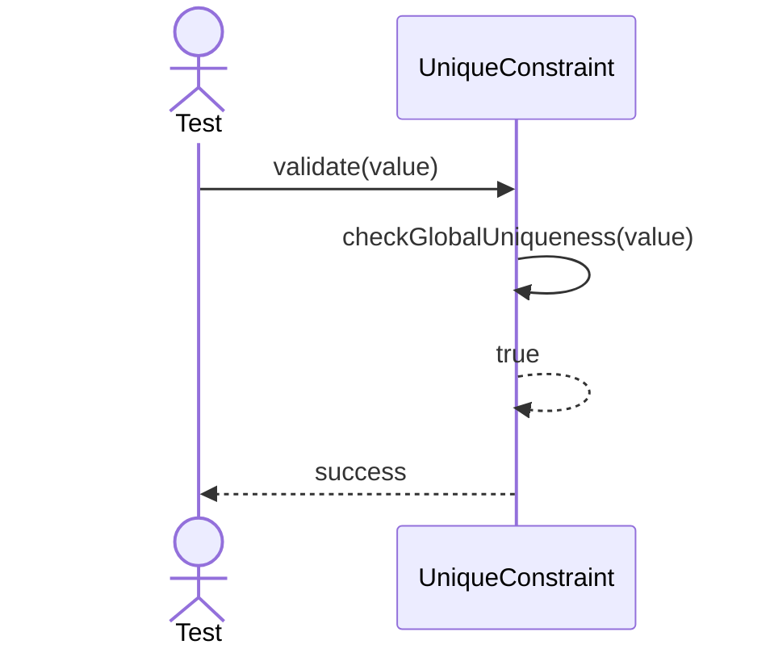
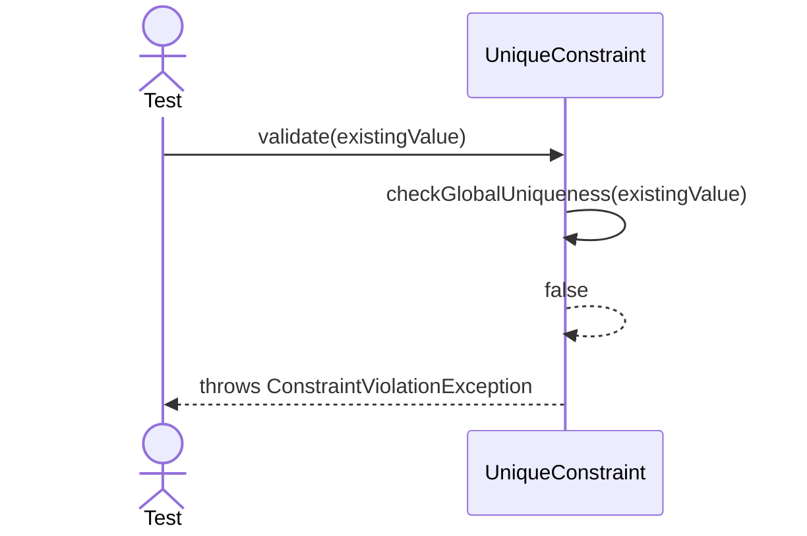

# Sequence Diagrams: UniqueConstraint

## 🆕 Added Properties & Methods for `UniqueConstraint`
To support the detailed sequence logic for unit testing, the following missing properties/methods have been introduced. **Please update the `UniqueConstraint` class in your Class Diagram with these:**

- **Method** added to `UniqueConstraint`: `checkGlobalUniqueness(value)` (Scans table for duplicate)

---

This file contains the detailed sequence diagrams for all unit tests of the **UniqueConstraint** class in the Database Object Management subsystem.

## 1. Validate_WhenValueIsGloballyUnique_Succeeds

## 2. Validate_WhenValueExistsInAnotherRow_ThrowsException

