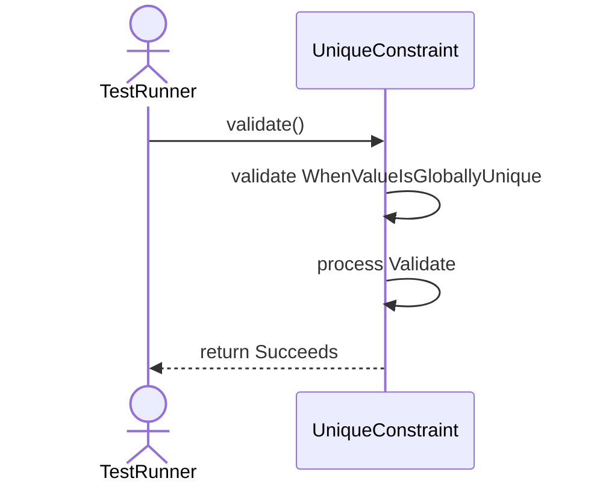
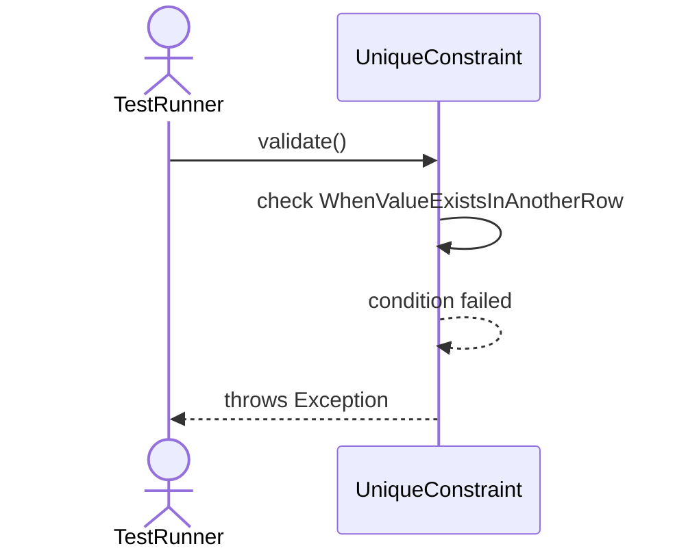
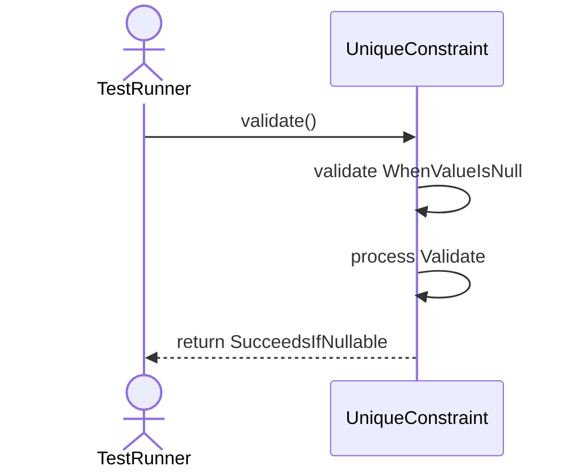

# Sequence Diagrams: UniqueConstraint

## 🆕 Added Properties & Methods for `UniqueConstraint`
To support the detailed sequence logic for unit testing, please update the `UniqueConstraint` class in your Class Diagram with the following properties and methods:

- **Method** added to `UniqueConstraint`: `validate()`

---

This file contains the detailed sequence diagrams for all 3 unit tests of the **UniqueConstraint** class.

## 1. Validate_WhenValueIsGloballyUnique_Succeeds

## 2. Validate_WhenValueExistsInAnotherRow_ThrowsException

## 3. Validate_WhenValueIsNull_SucceedsIfNullable

