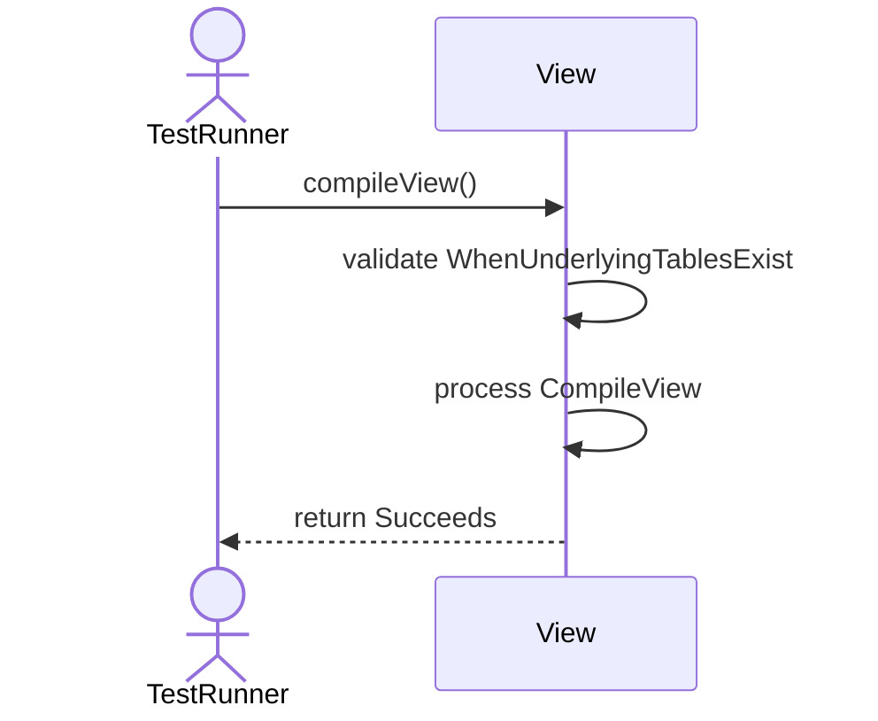
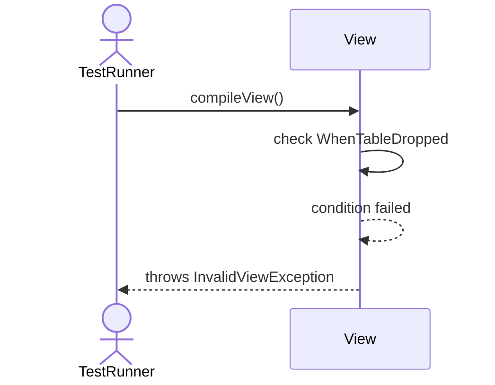
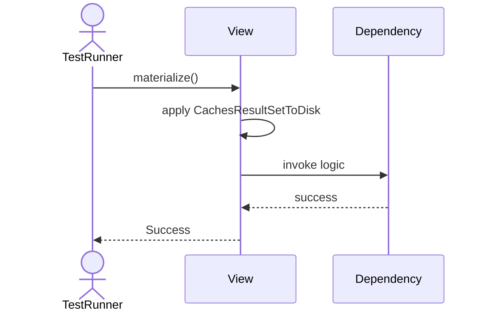
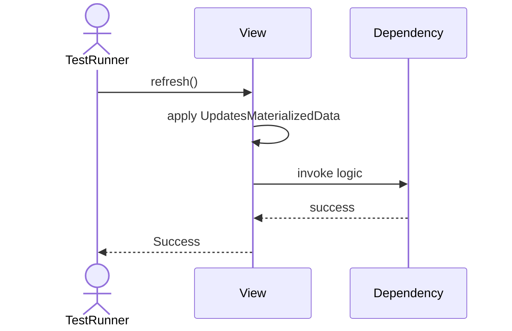
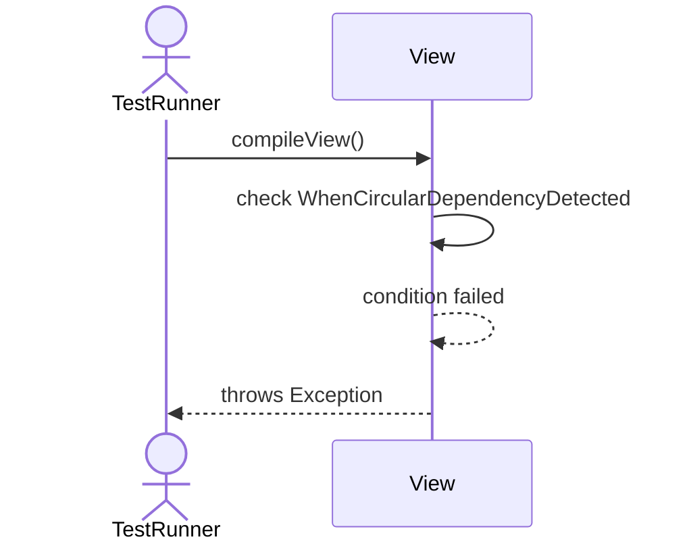

# Sequence Diagrams: View

## 🆕 Added Properties & Methods for `View`
To support the detailed sequence logic for unit testing, please update the `View` class in your Class Diagram with the following properties and methods:

- **Property** added to `View`: `queryDefinition (String)`
- **Property** added to `View`: `materializedData (Cache)`
- **Method** added to `View`: `compileView()`
- **Method** added to `View`: `materialize()`
- **Method** added to `View`: `refresh()`

---

This file contains the detailed sequence diagrams for all 6 unit tests of the **View** class.

## 1. Init_SetsQueryDefinition

## 2. CompileView_WhenUnderlyingTablesExist_Succeeds

## 3. CompileView_WhenTableDropped_ThrowsInvalidViewException

## 4. Materialize_CachesResultSetToDisk

## 5. Refresh_UpdatesMaterializedData

## 6. CompileView_WhenCircularDependencyDetected_ThrowsException

