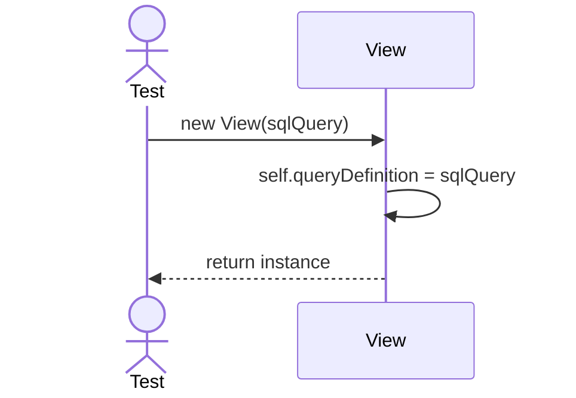
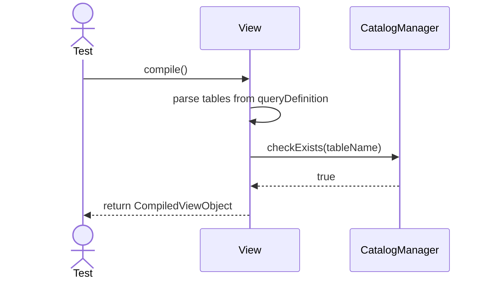

# Sequence Diagrams: View

## 🆕 Added Properties & Methods for `View`
To support the detailed sequence logic for unit testing, the following missing properties/methods have been introduced. **Please update the `View` class in your Class Diagram with these:**

- **Property** added to `View`: `queryDefinition` (The raw SQL query string of the view)
- **Method** added to `View`: `validateUnderlyingTables()` (Checks with Catalog if base tables exist)

---

This file contains the detailed sequence diagrams for all unit tests of the **View** class in the Database Object Management subsystem.

## 1. Init_SetsQueryDefinition

## 2. CompileView_WhenUnderlyingTablesExist_Succeeds

