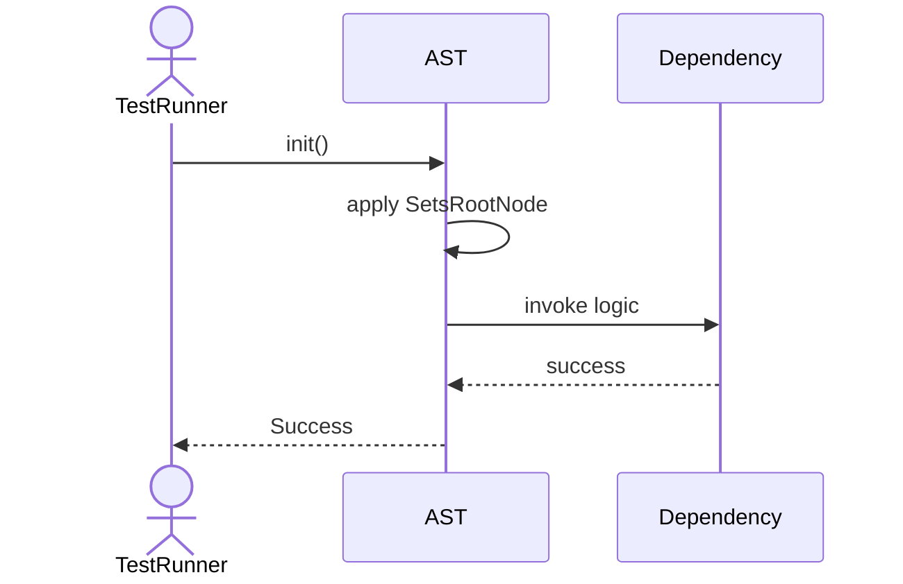
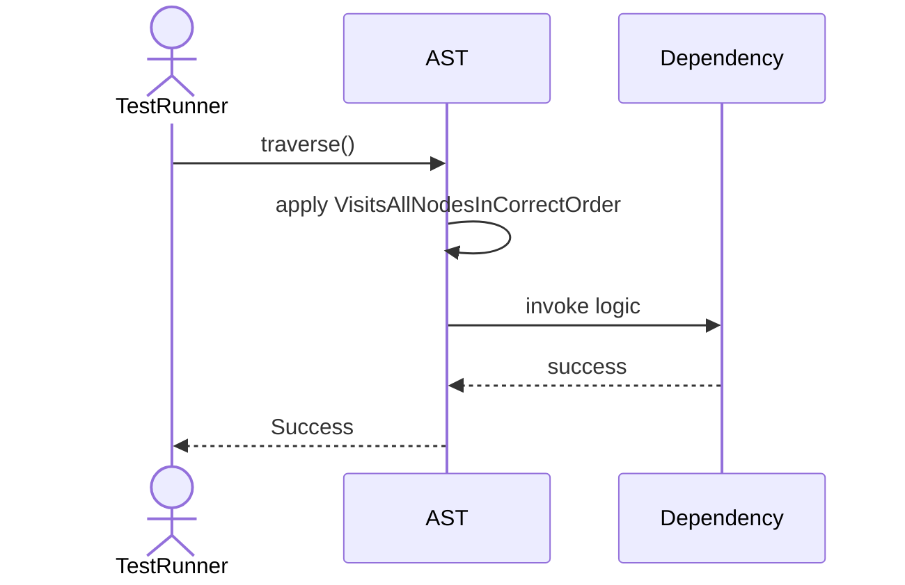
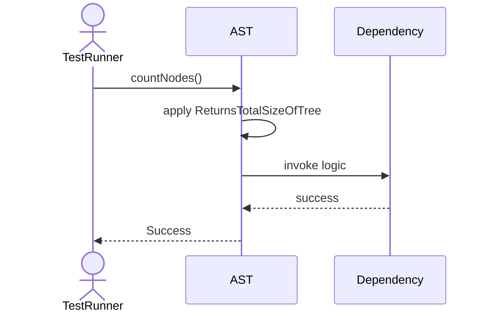

# Sequence Diagrams: AST

## 🆕 Added Properties & Methods for `AST`
To support the detailed sequence logic for unit testing, please update the `AST` class in your Class Diagram with the following properties and methods:

- **Property** added to `AST`: `rootNode`
- **Method** added to `AST`: `clone()`
- **Method** added to `AST`: `countNodes()`
- **Method** added to `AST`: `toSQL()`
- **Method** added to `AST`: `traverse()`

---

This file contains the detailed sequence diagrams for all 5 unit tests of the **AST** class.

## 1. Init_SetsRootNode

## 2. Traverse_VisitsAllNodesInCorrectOrder

## 3. ToSQL_ReconstructsSQLStringFromTree

## 4. Clone_CreatesDeepCopyOfTree

## 5. CountNodes_ReturnsTotalSizeOfTree

