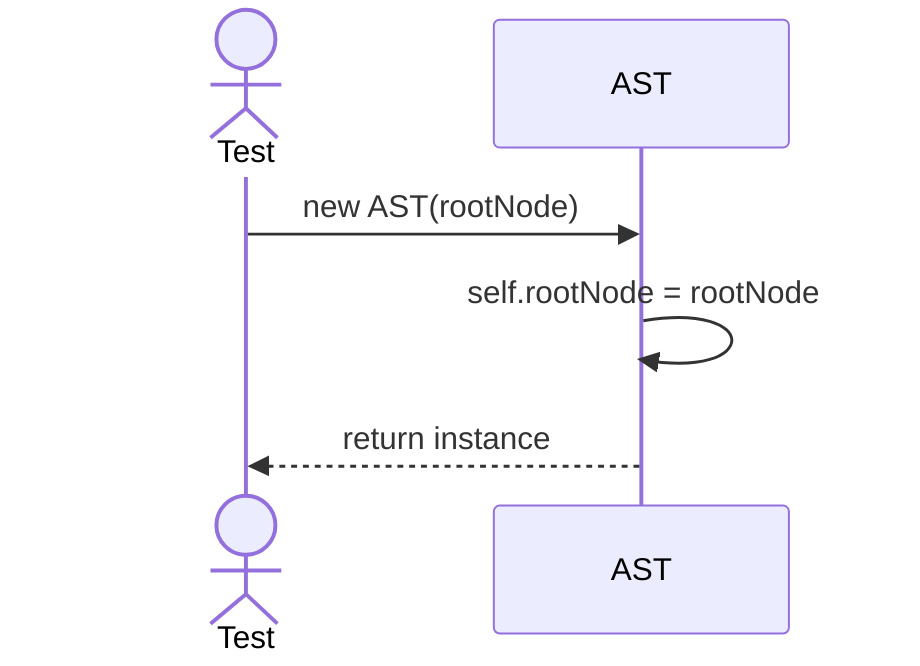
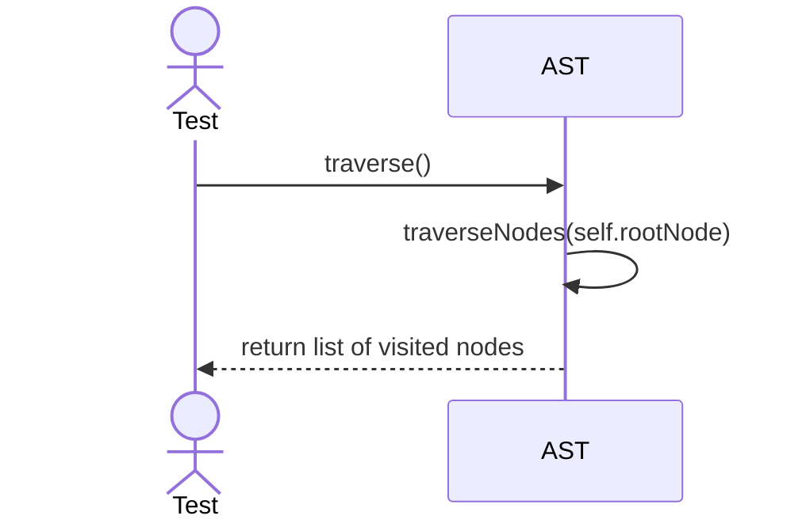

# Sequence Diagrams: AST

## 🆕 Added Properties & Methods for `AST`
To support the detailed sequence logic for unit testing, the following missing properties/methods have been introduced. **Please update the `AST` class in your Class Diagram with these:**

- **Property** added to `AST`: `rootNode` (Entry point for abstract syntax tree)
- **Method** added to `AST`: `traverseNodes()` (Depth-first traversal)

---

This file contains the detailed sequence diagrams for all unit tests of the **AST** class in the Query Processor subsystem.

## 1. Init_SetsRootNode

## 2. Traverse_VisitsAllNodesInCorrectOrder

