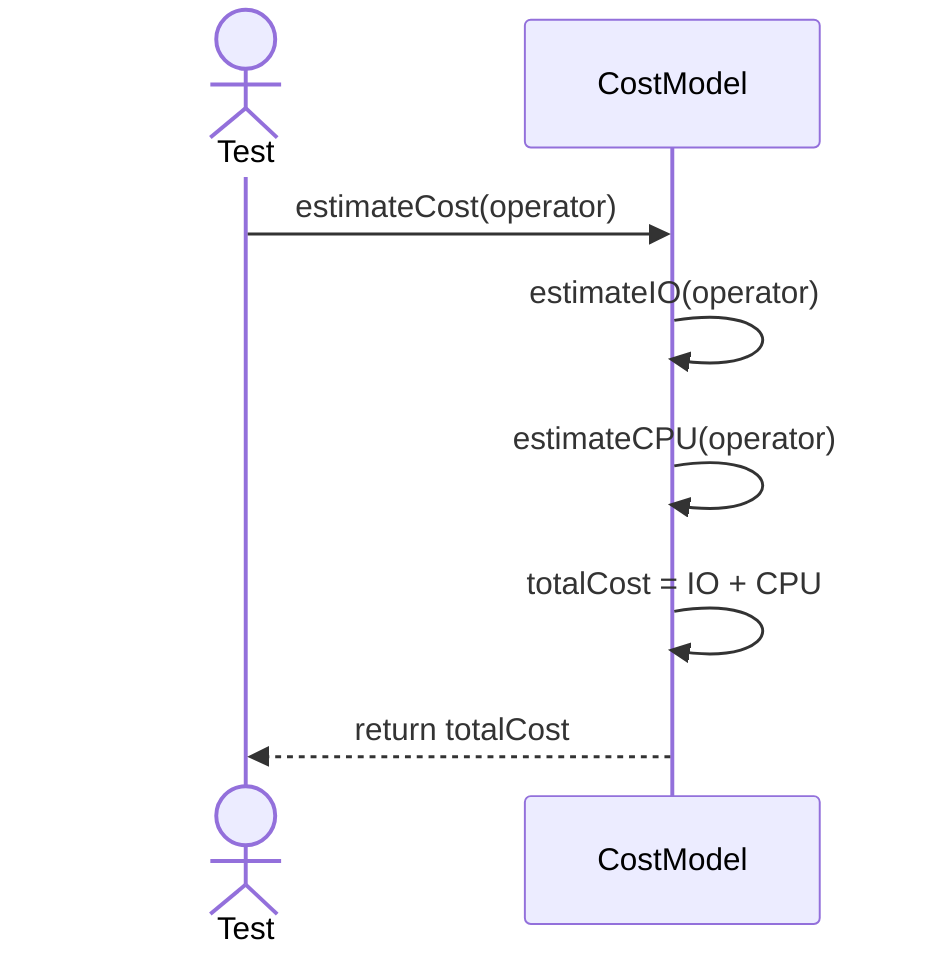
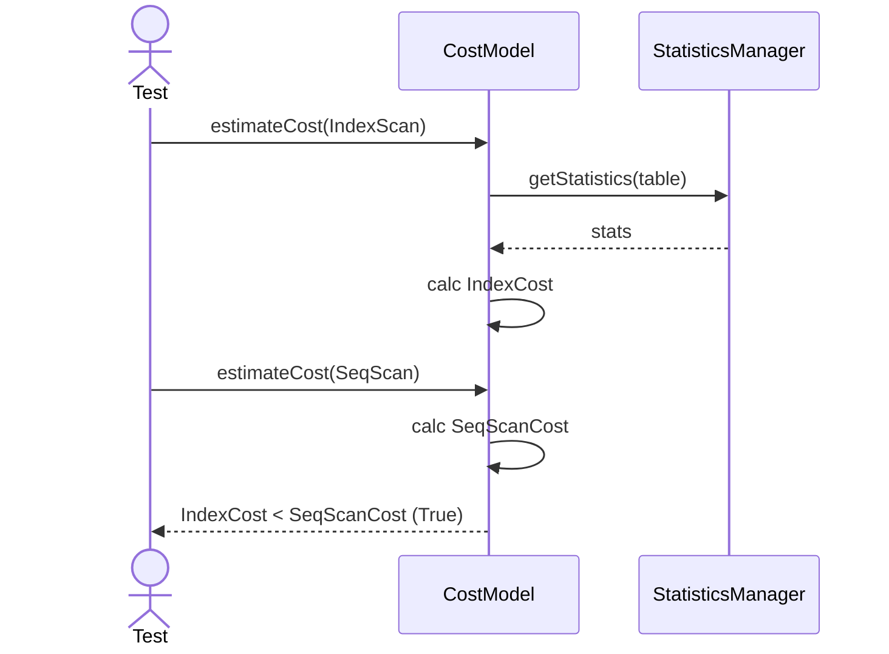

# Sequence Diagrams: CostModel

## 🆕 Added Properties & Methods for `CostModel`
To support the detailed sequence logic for unit testing, the following missing properties/methods have been introduced. **Please update the `CostModel` class in your Class Diagram with these:**

- **Method** added to `CostModel`: `estimateIO(operator)`, `estimateCPU(operator)` (Internal cost heuristics)

---

This file contains the detailed sequence diagrams for all unit tests of the **CostModel** class in the Query Processor subsystem.

## 1. EstimateCost_CalculatesIOAndCPUCost

## 2. EstimateCost_WhenUsingIndex_ReturnsLowerCostThanSeqScan

