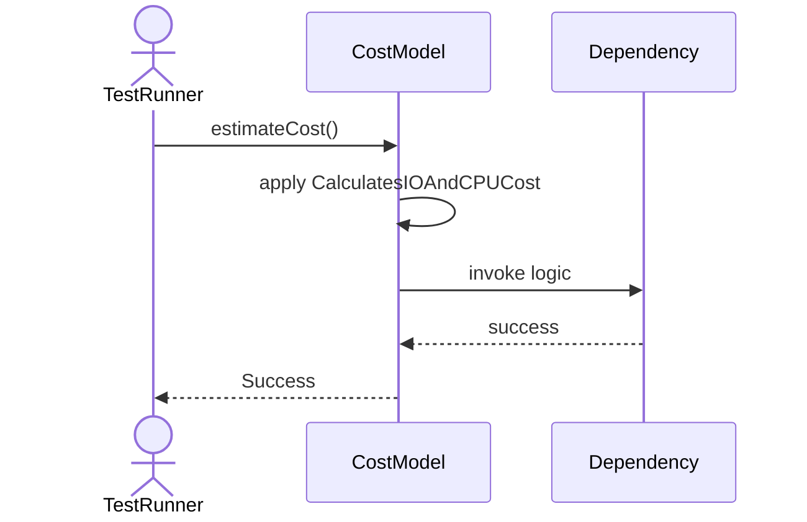
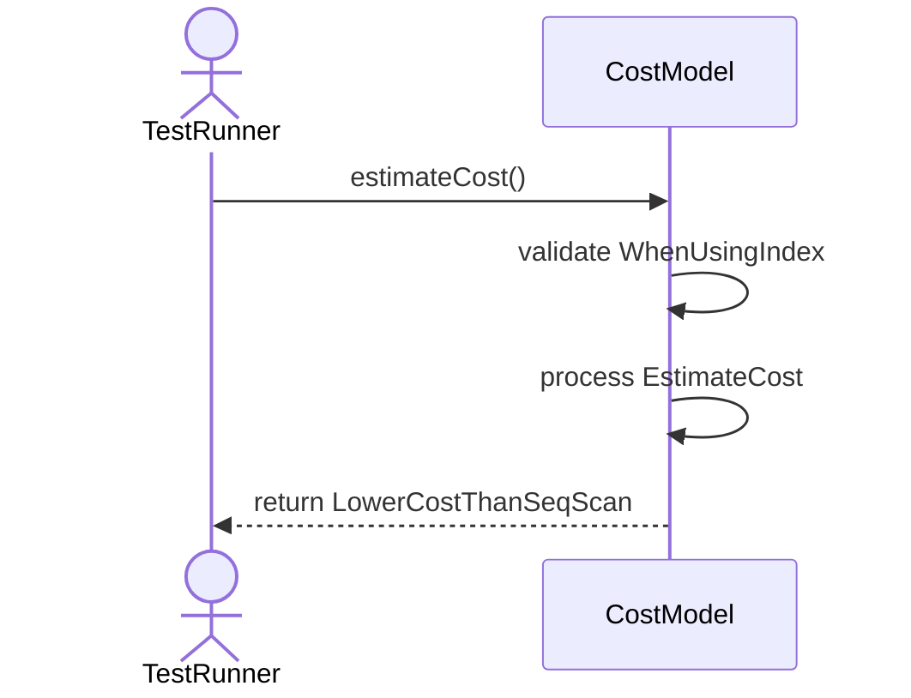
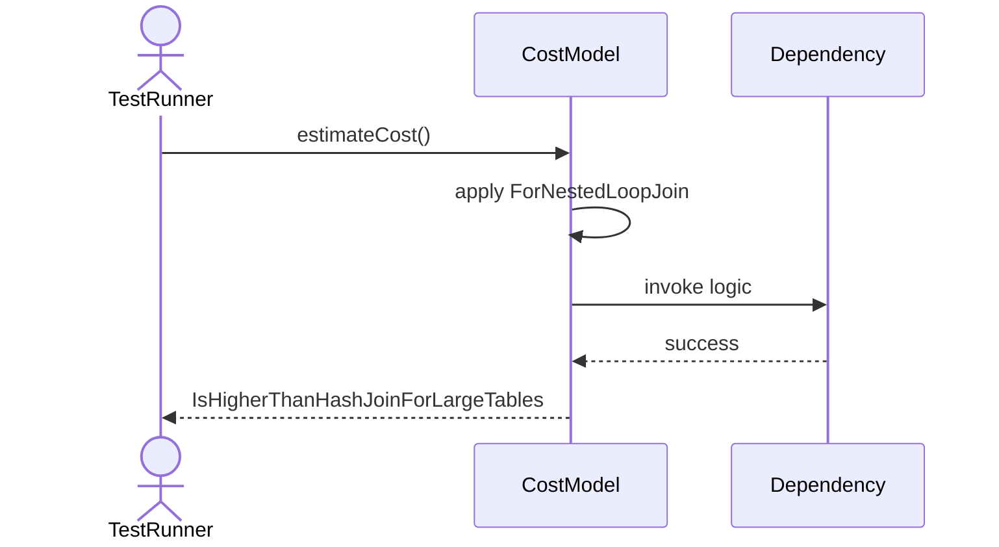
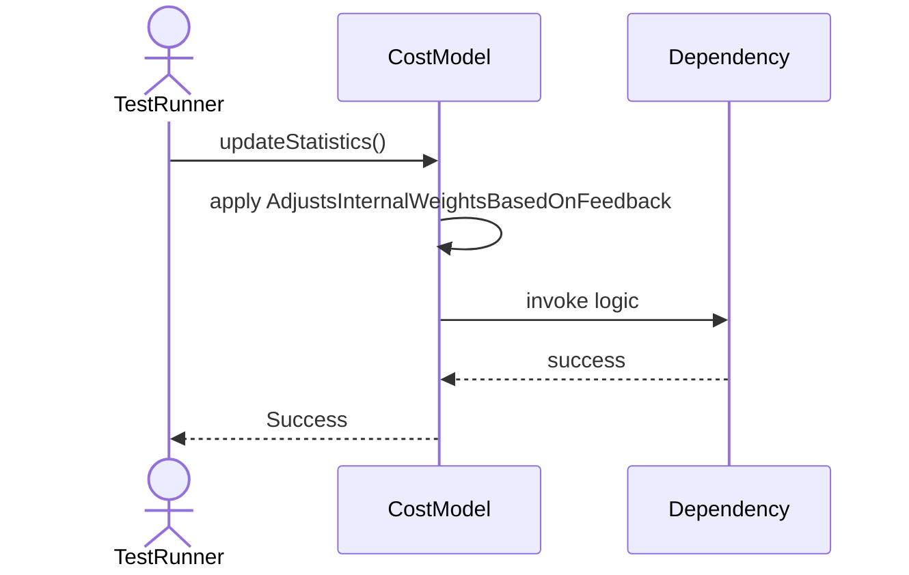
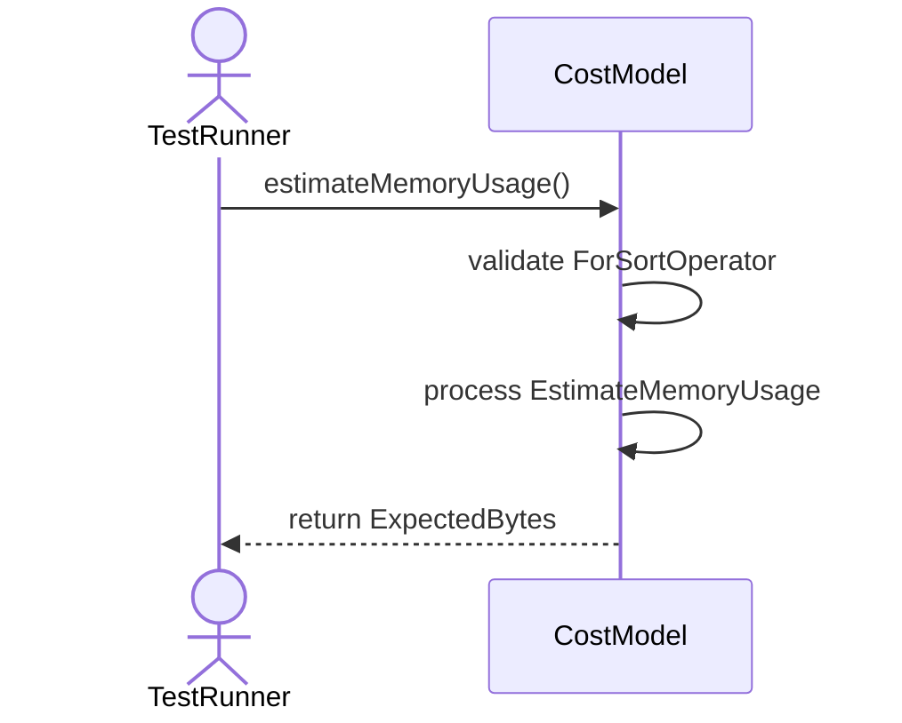

# Sequence Diagrams: CostModel

## 🆕 Added Properties & Methods for `CostModel`
To support the detailed sequence logic for unit testing, please update the `CostModel` class in your Class Diagram with the following properties and methods:

- **Method** added to `CostModel`: `estimateCost()`
- **Method** added to `CostModel`: `estimateMemoryUsage()`
- **Method** added to `CostModel`: `updateStatistics()`

---

This file contains the detailed sequence diagrams for all 5 unit tests of the **CostModel** class.

## 1. EstimateCost_CalculatesIOAndCPUCost

## 2. EstimateCost_WhenUsingIndex_ReturnsLowerCostThanSeqScan

## 3. EstimateCost_ForNestedLoopJoin_IsHigherThanHashJoinForLargeTables

## 4. UpdateStatistics_AdjustsInternalWeightsBasedOnFeedback

## 5. EstimateMemoryUsage_ForSortOperator_ReturnsExpectedBytes

