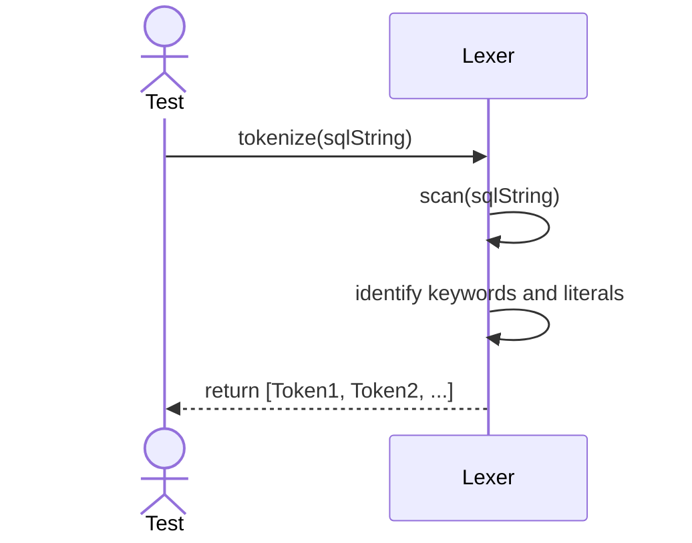
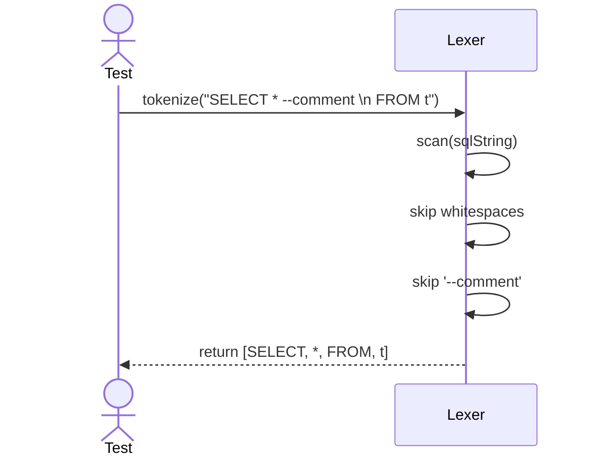

# Sequence Diagrams: Lexer

## 🆕 Added Properties & Methods for `Lexer`
To support the detailed sequence logic for unit testing, the following missing properties/methods have been introduced. **Please update the `Lexer` class in your Class Diagram with these:**

- **Property** added to `Lexer`: `tokens` (List of generated string tokens)
- **Method** added to `Lexer`: `scan(sqlString)` (Internal parsing loop ignoring whitespaces/comments)

---

This file contains the detailed sequence diagrams for all unit tests of the **Lexer** class in the Query Processor subsystem.

## 1. Tokenize_WhenValidString_ReturnsListOfTokens

## 2. Tokenize_IgnoresWhitespaceAndComments

