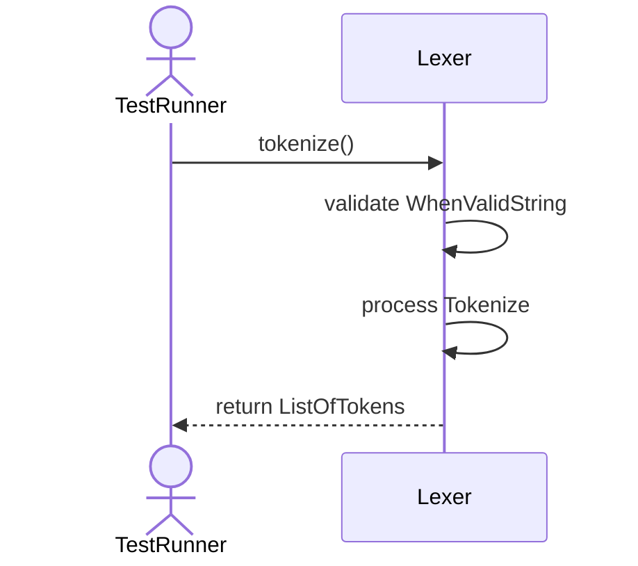
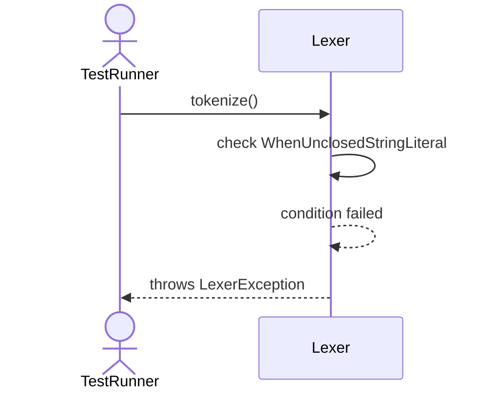
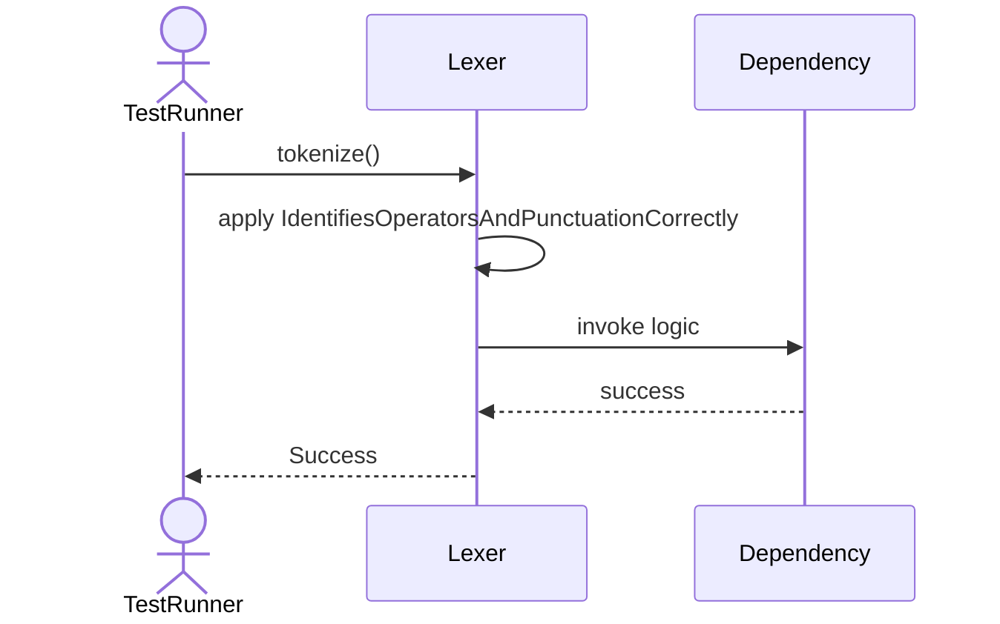
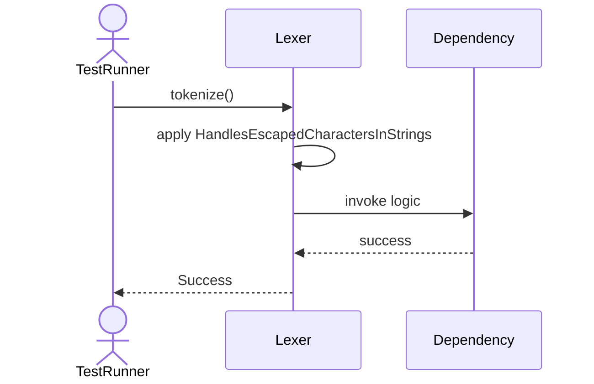

# Sequence Diagrams: Lexer

## 🆕 Added Properties & Methods for `Lexer`
To support the detailed sequence logic for unit testing, please update the `Lexer` class in your Class Diagram with the following properties and methods:

- **Method** added to `Lexer`: `tokenize()`

---

This file contains the detailed sequence diagrams for all 5 unit tests of the **Lexer** class.

## 1. Tokenize_WhenValidString_ReturnsListOfTokens

## 2. Tokenize_IgnoresWhitespaceAndComments

## 3. Tokenize_WhenUnclosedStringLiteral_ThrowsLexerException

## 4. Tokenize_IdentifiesOperatorsAndPunctuationCorrectly

## 5. Tokenize_HandlesEscapedCharactersInStrings

