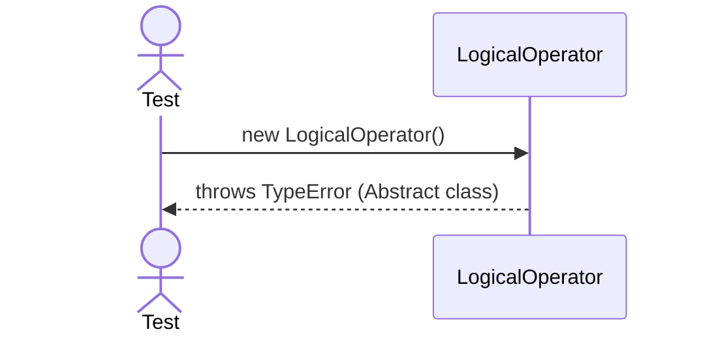

# Sequence Diagrams: LogicalOperator

This file contains the detailed sequence diagrams for all unit tests of the **LogicalOperator** class in the Query Processor subsystem.

## 1. Instantiation_OfAbstractClass_FailsWithTypeError

