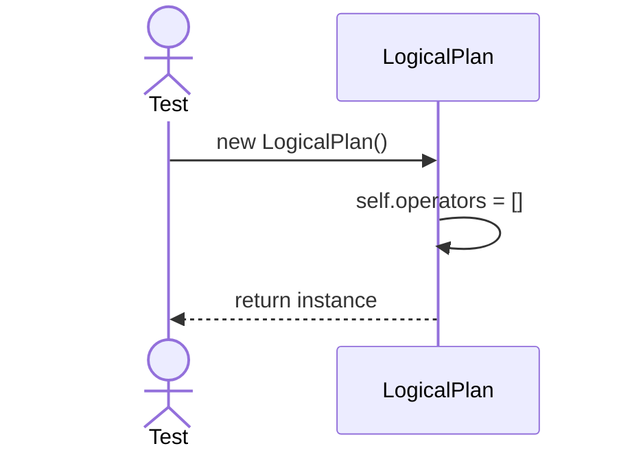
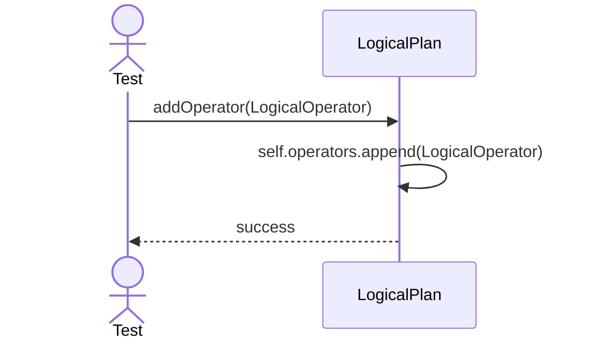

# Sequence Diagrams: LogicalPlan

## 🆕 Added Properties & Methods for `LogicalPlan`
To support the detailed sequence logic for unit testing, the following missing properties/methods have been introduced. **Please update the `LogicalPlan` class in your Class Diagram with these:**

- **Property** added to `LogicalPlan`: `operators` (Tree/List of logical operations)
- **Method** added to `LogicalPlan`: `addOperator(op)` (Appends node to plan)

---

This file contains the detailed sequence diagrams for all unit tests of the **LogicalPlan** class in the Query Processor subsystem.

## 1. Init_CreatesEmptyOperatorTree

## 2. AddOperator_AppendsToPlan

