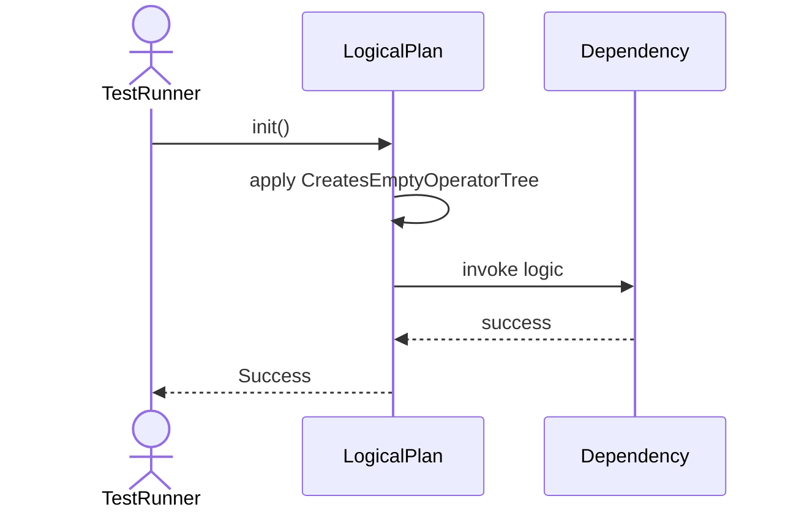
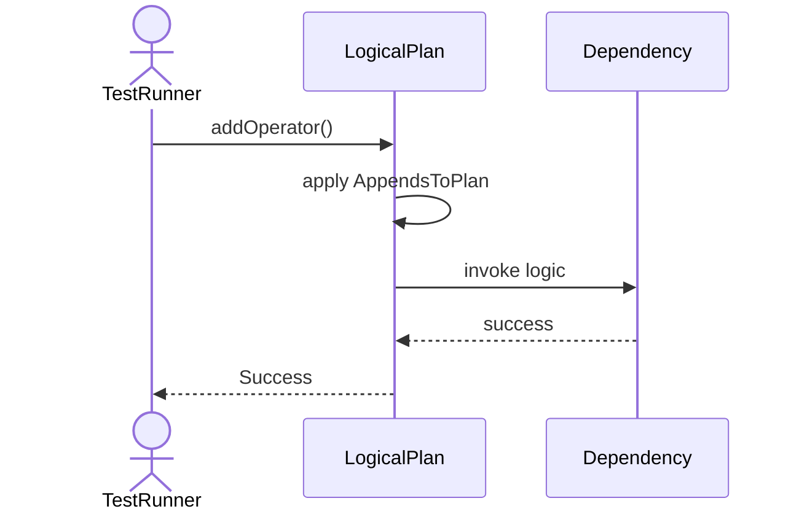
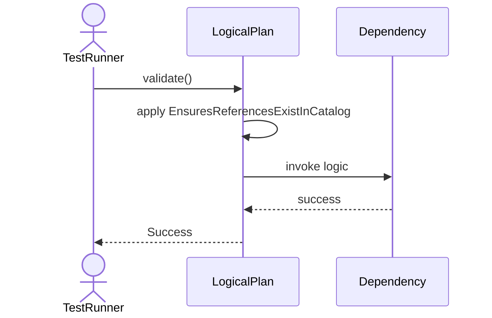
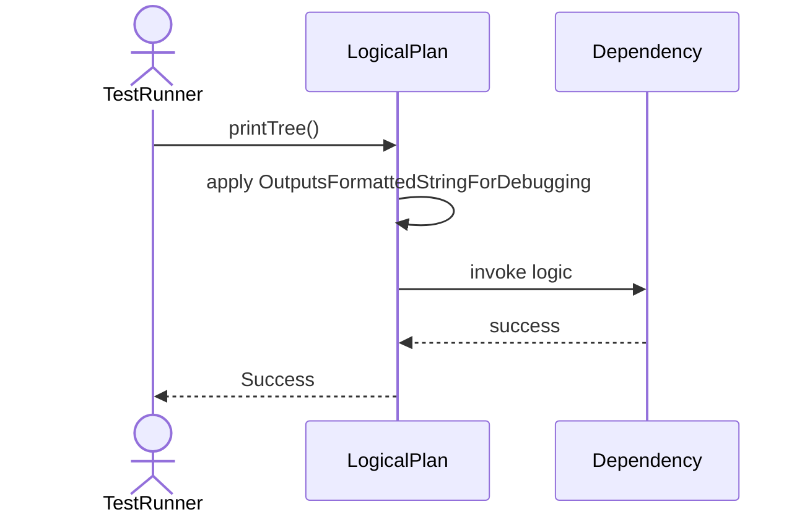
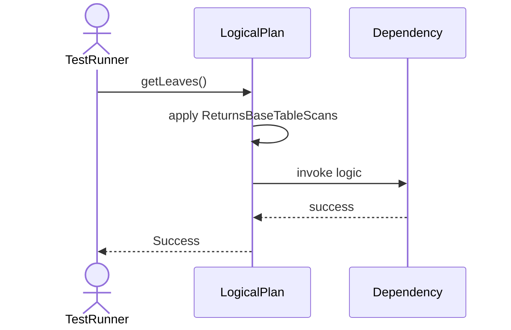

# Sequence Diagrams: LogicalPlan

## 🆕 Added Properties & Methods for `LogicalPlan`
To support the detailed sequence logic for unit testing, please update the `LogicalPlan` class in your Class Diagram with the following properties and methods:

- **Property** added to `LogicalPlan`: `operators (List)`
- **Method** added to `LogicalPlan`: `addOperator()`
- **Method** added to `LogicalPlan`: `getLeaves()`
- **Method** added to `LogicalPlan`: `printTree()`
- **Method** added to `LogicalPlan`: `validate()`

---

This file contains the detailed sequence diagrams for all 5 unit tests of the **LogicalPlan** class.

## 1. Init_CreatesEmptyOperatorTree

## 2. AddOperator_AppendsToPlan

## 3. Validate_EnsuresReferencesExistInCatalog

## 4. PrintTree_OutputsFormattedStringForDebugging

## 5. GetLeaves_ReturnsBaseTableScans

