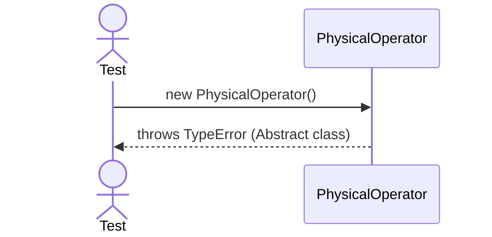

# Sequence Diagrams: PhysicalOperator

This file contains the detailed sequence diagrams for all unit tests of the **PhysicalOperator** class in the Query Processor subsystem.

## 1. Instantiation_OfAbstractClass_FailsWithTypeError

