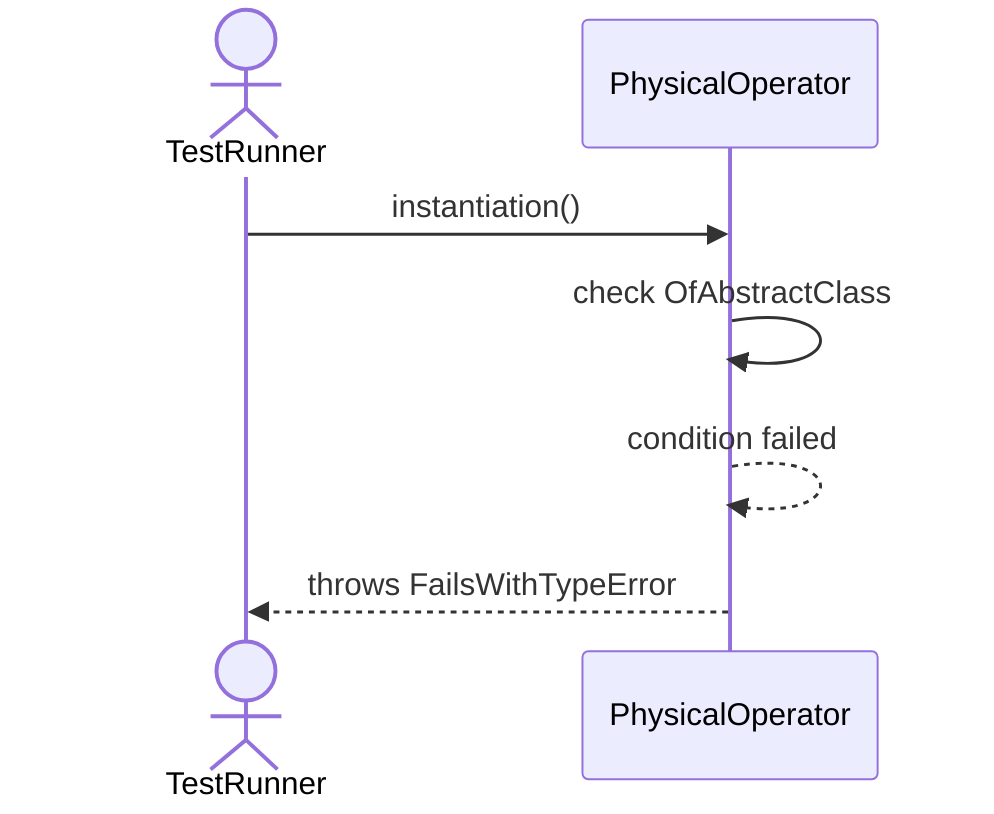

# Sequence Diagrams: PhysicalOperator

## 🆕 Added Properties & Methods for `PhysicalOperator`
To support the detailed sequence logic for unit testing, please update the `PhysicalOperator` class in your Class Diagram with the following properties and methods:

- *(No major new structural properties required, logic handled internally)*

---

This file contains the detailed sequence diagrams for all 1 unit tests of the **PhysicalOperator** class.

## 1. Instantiation_OfAbstractClass_FailsWithTypeError

