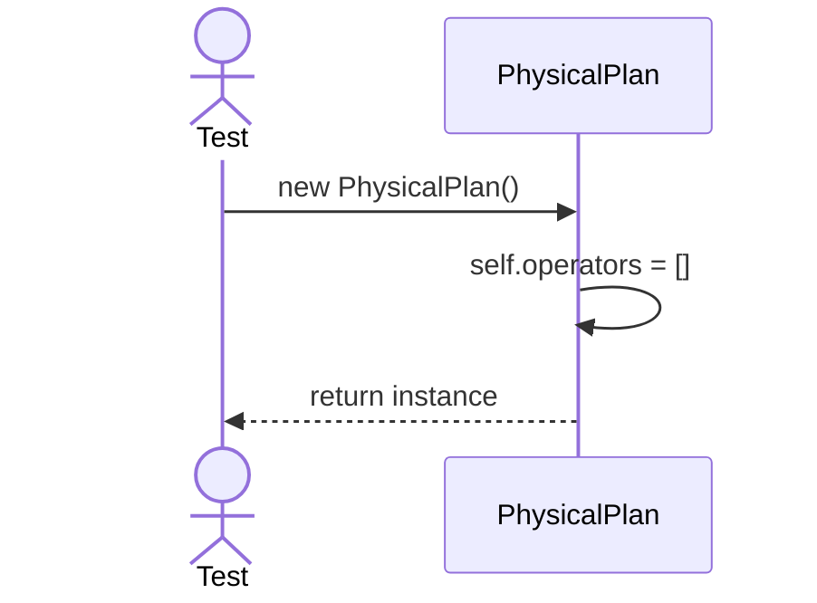
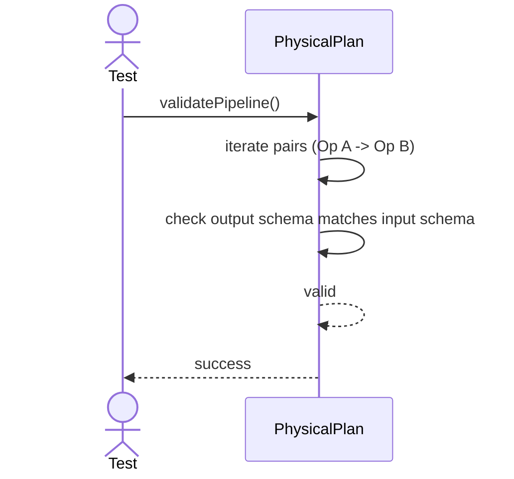

# Sequence Diagrams: PhysicalPlan

## 🆕 Added Properties & Methods for `PhysicalPlan`
To support the detailed sequence logic for unit testing, the following missing properties/methods have been introduced. **Please update the `PhysicalPlan` class in your Class Diagram with these:**

- **Property** added to `PhysicalPlan`: `operators` (Tree/List of executable operations)
- **Method** added to `PhysicalPlan`: `validatePipeline()` (Checks if output of Op A matches input of Op B)

---

This file contains the detailed sequence diagrams for all unit tests of the **PhysicalPlan** class in the Query Processor subsystem.

## 1. Init_CreatesEmptyOperatorTree

## 2. ValidatePipeline_EnsuresOperatorCompatibility

