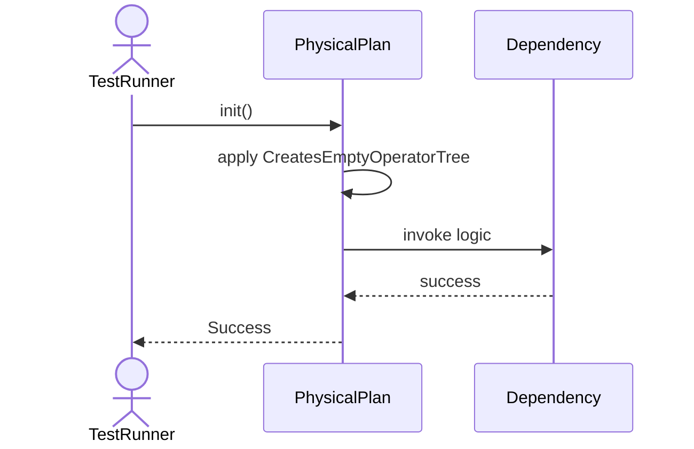
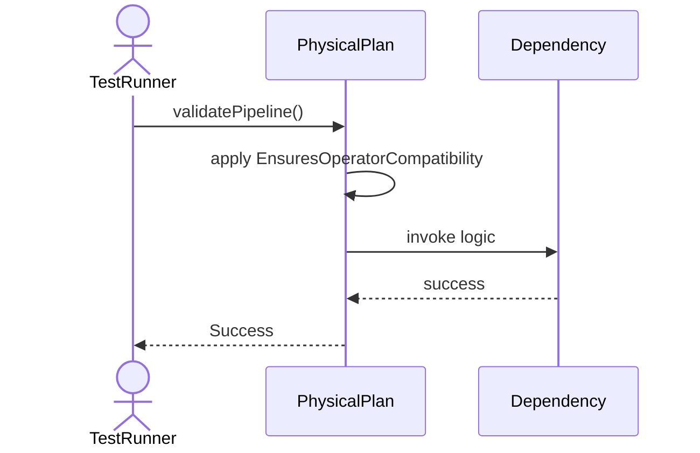
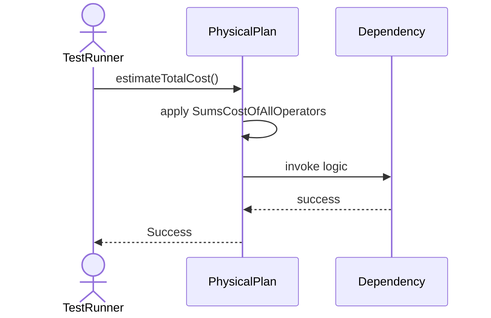
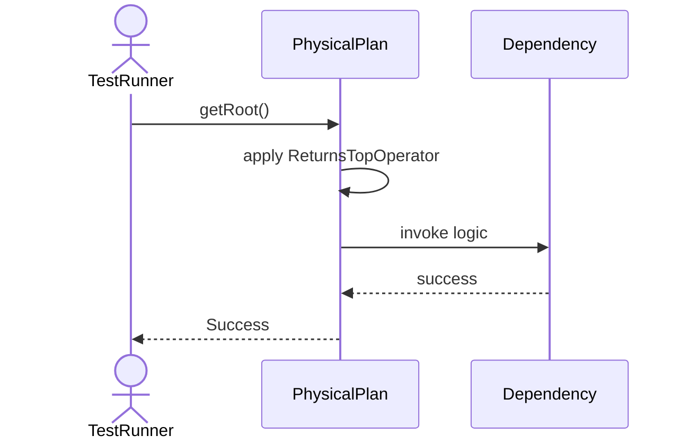
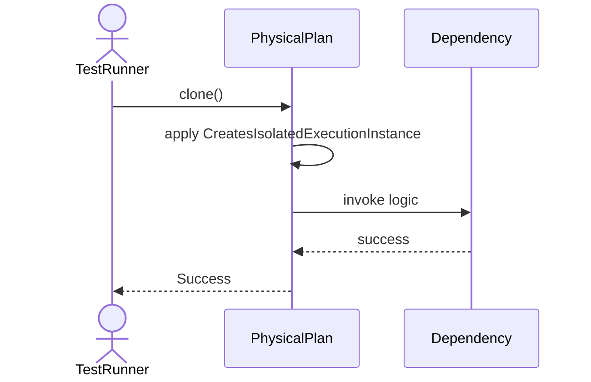

# Sequence Diagrams: PhysicalPlan

## 🆕 Added Properties & Methods for `PhysicalPlan`
To support the detailed sequence logic for unit testing, please update the `PhysicalPlan` class in your Class Diagram with the following properties and methods:

- **Property** added to `PhysicalPlan`: `operators (List)`
- **Method** added to `PhysicalPlan`: `clone()`
- **Method** added to `PhysicalPlan`: `estimateTotalCost()`
- **Method** added to `PhysicalPlan`: `getRoot()`
- **Method** added to `PhysicalPlan`: `validatePipeline()`

---

This file contains the detailed sequence diagrams for all 5 unit tests of the **PhysicalPlan** class.

## 1. Init_CreatesEmptyOperatorTree

## 2. ValidatePipeline_EnsuresOperatorCompatibility

## 3. EstimateTotalCost_SumsCostOfAllOperators

## 4. GetRoot_ReturnsTopOperator

## 5. Clone_CreatesIsolatedExecutionInstance

