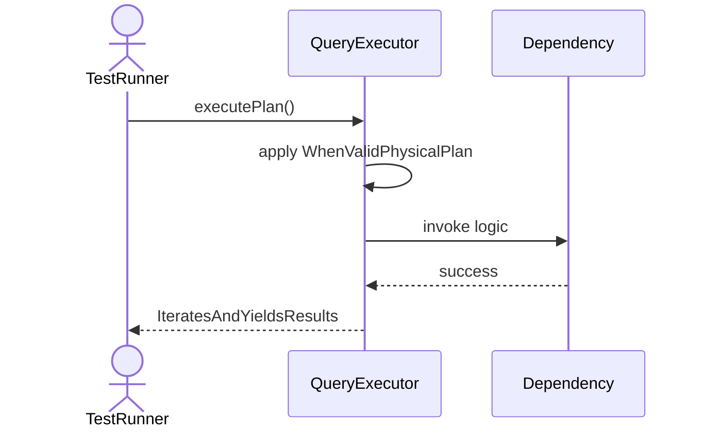
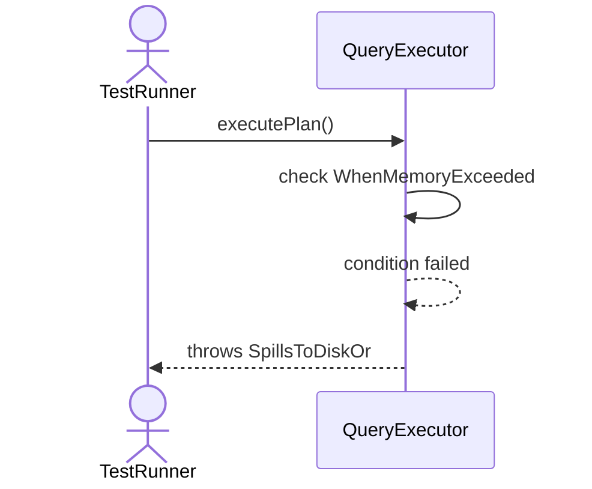
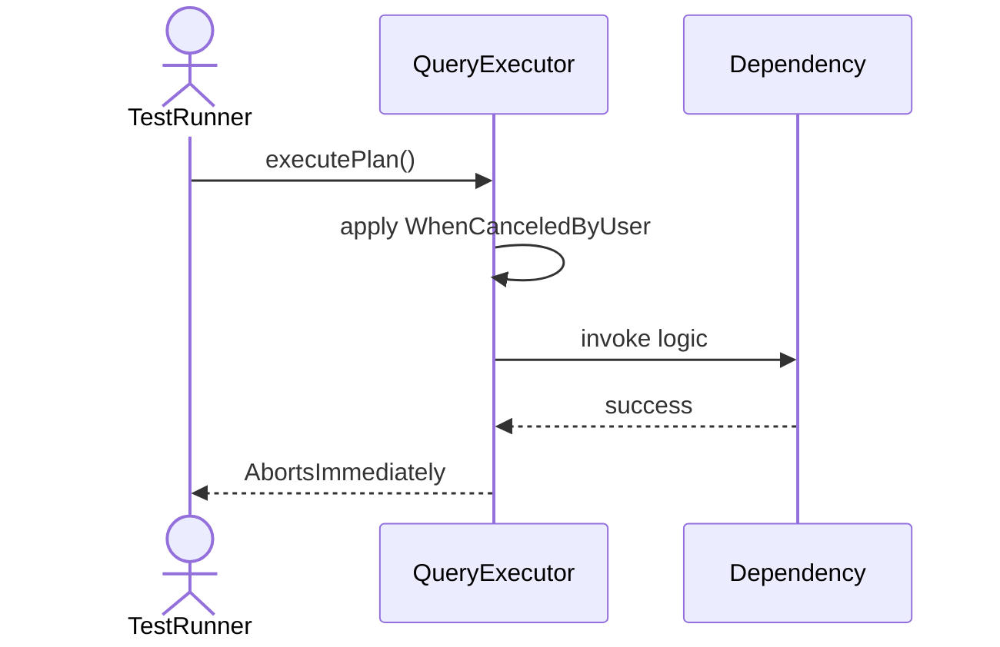
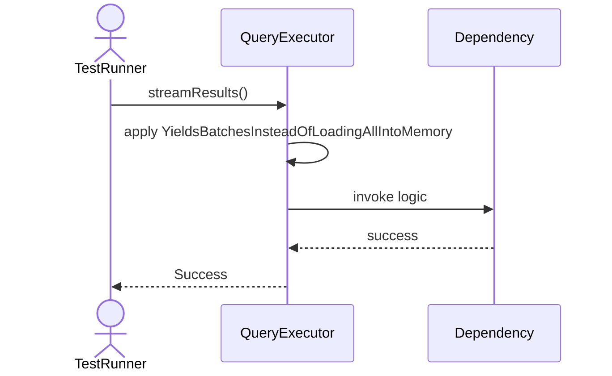
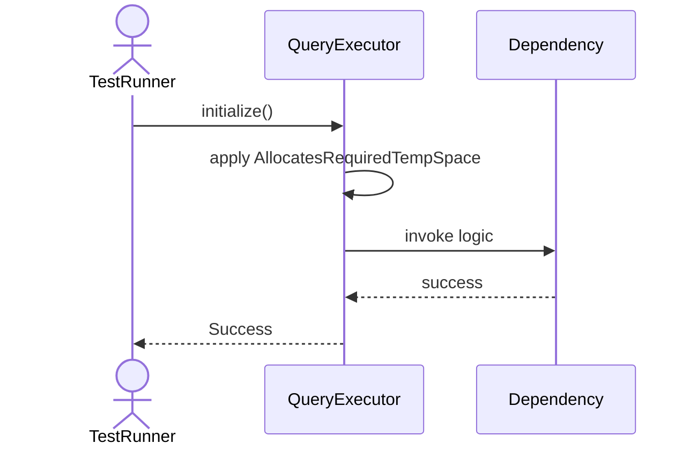

# Sequence Diagrams: QueryExecutor

## 🆕 Added Properties & Methods for `QueryExecutor`
To support the detailed sequence logic for unit testing, please update the `QueryExecutor` class in your Class Diagram with the following properties and methods:

- **Property** added to `QueryExecutor`: `memoryLimit (Int)`
- **Method** added to `QueryExecutor`: `close()`
- **Method** added to `QueryExecutor`: `executePlan()`
- **Method** added to `QueryExecutor`: `initialize()`
- **Method** added to `QueryExecutor`: `streamResults()`

---

This file contains the detailed sequence diagrams for all 6 unit tests of the **QueryExecutor** class.

## 1. ExecutePlan_WhenValidPhysicalPlan_IteratesAndYieldsResults

## 2. ExecutePlan_WhenMemoryExceeded_SpillsToDiskOrThrows

## 3. ExecutePlan_WhenCanceledByUser_AbortsImmediately

## 4. StreamResults_YieldsBatchesInsteadOfLoadingAllIntoMemory

## 5. Initialize_AllocatesRequiredTempSpace

## 6. Close_ReleasesAllInternalIterators

