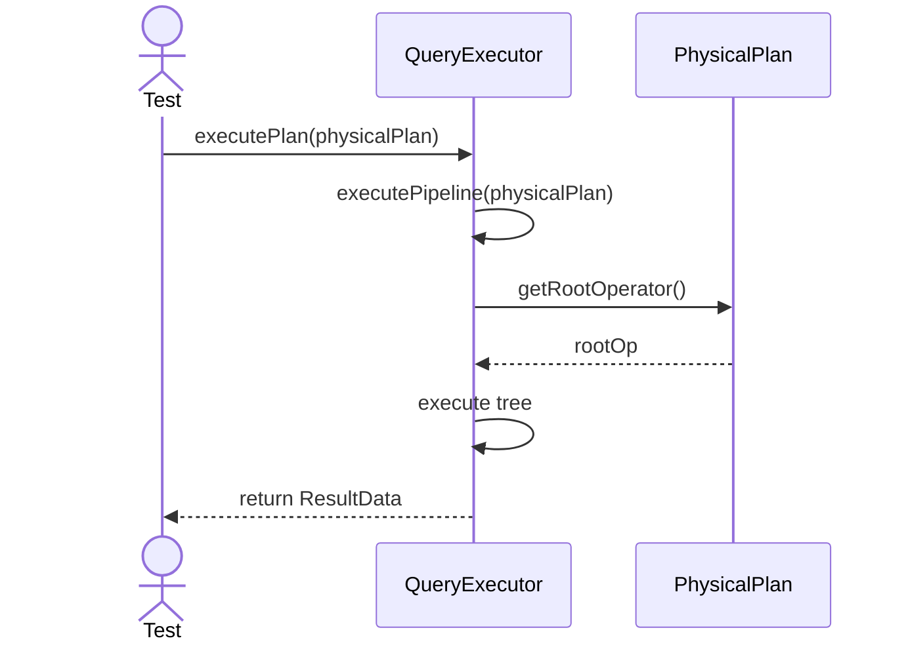
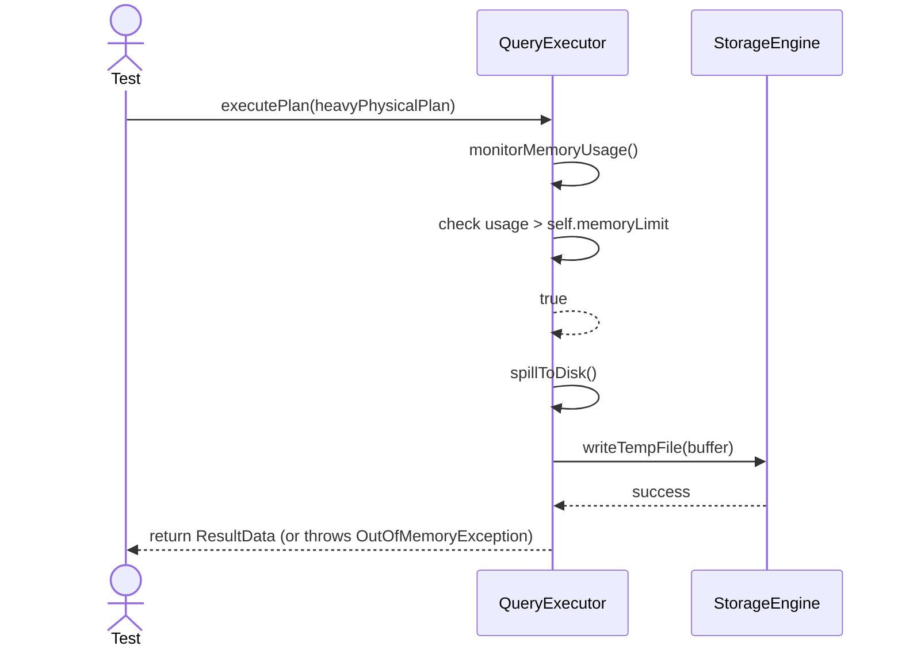

# Sequence Diagrams: QueryExecutor

## 🆕 Added Properties & Methods for `QueryExecutor`
To support the detailed sequence logic for unit testing, the following missing properties/methods have been introduced. **Please update the `QueryExecutor` class in your Class Diagram with these:**

- **Property** added to `QueryExecutor`: `memoryLimit` (Threshold for memory usage)
- **Method** added to `QueryExecutor`: `executePipeline(physicalPlan)` (Runs operators)
- **Method** added to `QueryExecutor`: `spillToDisk()` (Called when memory exceeded)

---

This file contains the detailed sequence diagrams for all unit tests of the **QueryExecutor** class in the Query Processor subsystem.

## 1. ExecutePlan_WhenValidPhysicalPlan_IteratesAndYieldsResults

## 2. ExecutePlan_WhenMemoryExceeded_SpillsToDiskOrThrows

