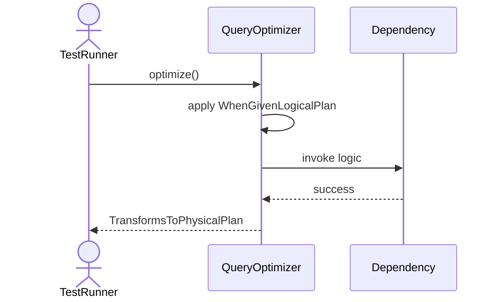
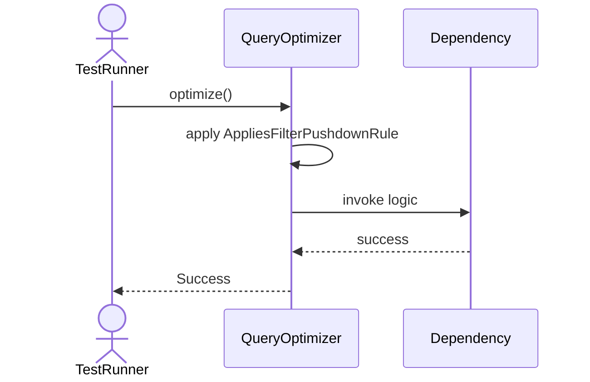
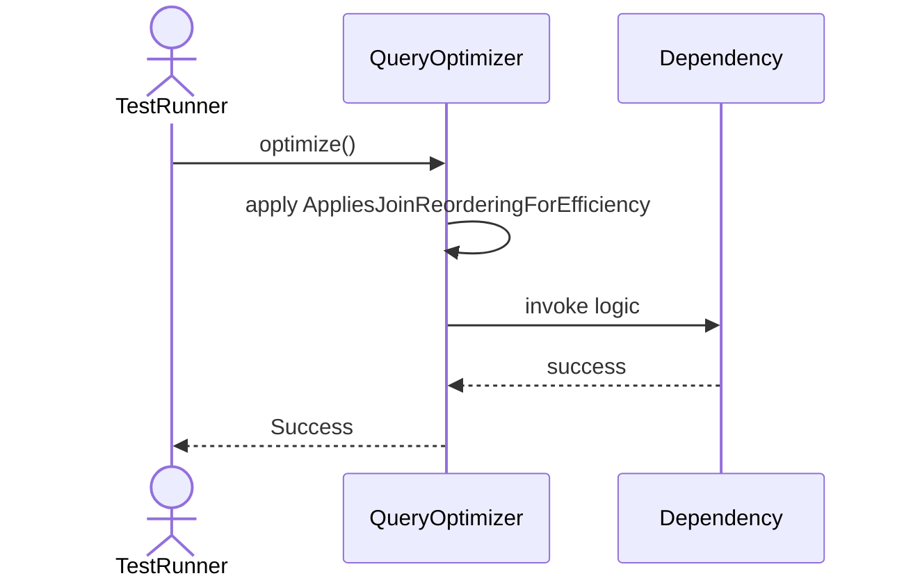
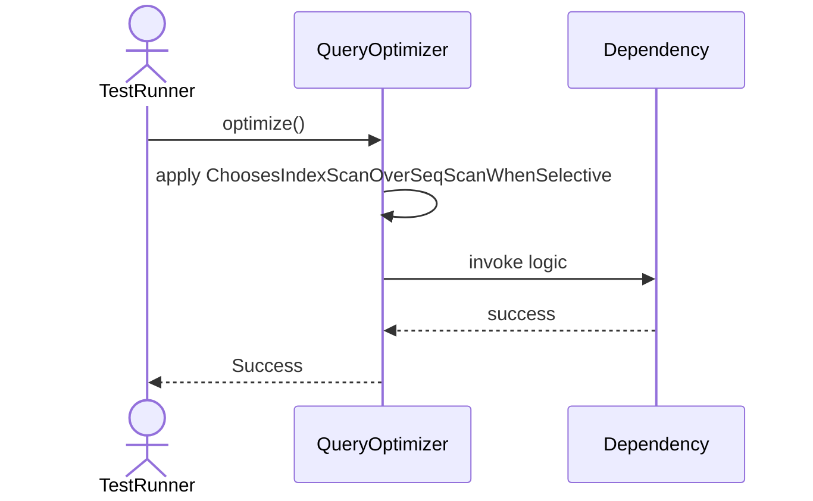
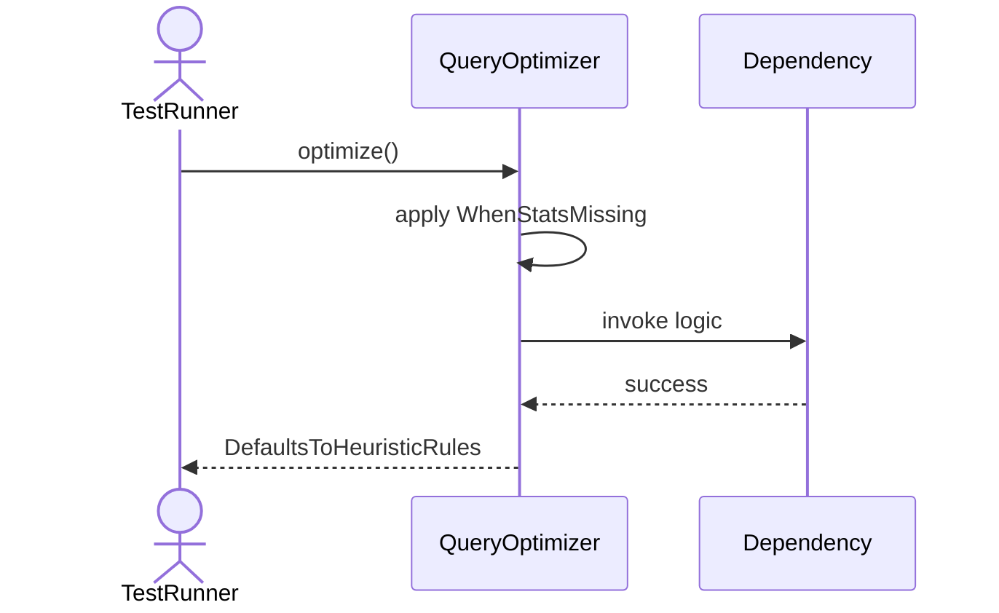

# Sequence Diagrams: QueryOptimizer

## 🆕 Added Properties & Methods for `QueryOptimizer`
To support the detailed sequence logic for unit testing, please update the `QueryOptimizer` class in your Class Diagram with the following properties and methods:

- **Method** added to `QueryOptimizer`: `optimize()`

---

This file contains the detailed sequence diagrams for all 7 unit tests of the **QueryOptimizer** class.

## 1. Optimize_WhenGivenLogicalPlan_TransformsToPhysicalPlan

## 2. Optimize_AppliesFilterPushdownRule

## 3. Optimize_AppliesJoinReorderingForEfficiency

## 4. Optimize_ChoosesIndexScanOverSeqScanWhenSelective

## 5. Optimize_EliminatesDeadCodeOrAlwaysFalseConditions

## 6. Optimize_FlattensUnnecessarySubqueries

## 7. Optimize_WhenStatsMissing_DefaultsToHeuristicRules

