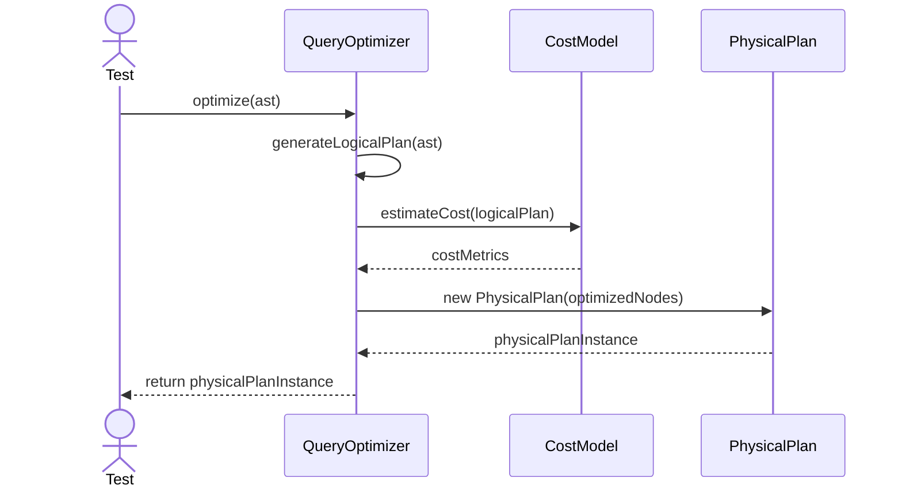
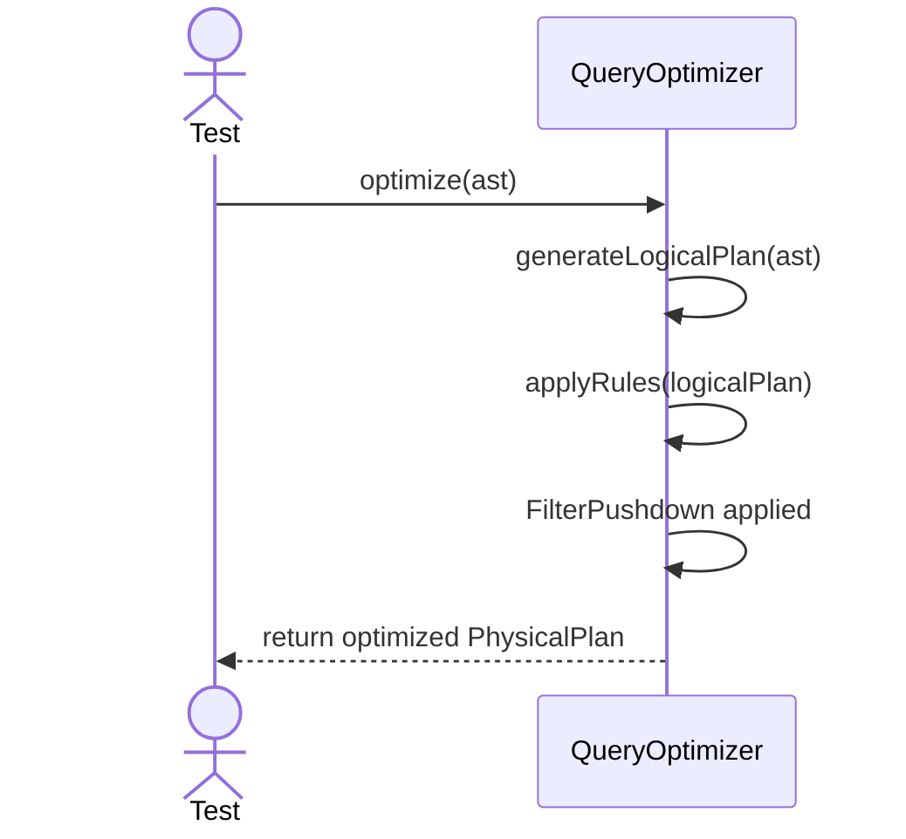

# Sequence Diagrams: QueryOptimizer

## 🆕 Added Properties & Methods for `QueryOptimizer`
To support the detailed sequence logic for unit testing, the following missing properties/methods have been introduced. **Please update the `QueryOptimizer` class in your Class Diagram with these:**

- **Method** added to `QueryOptimizer`: `generateLogicalPlan(ast)` (Translates AST to relational algebra)
- **Method** added to `QueryOptimizer`: `applyRules(logicalPlan)` (E.g. filter pushdown)
- **Method** added to `QueryOptimizer`: `generatePhysicalPlan(logicalPlan)` (Chooses algorithms based on CostModel)

---

This file contains the detailed sequence diagrams for all unit tests of the **QueryOptimizer** class in the Query Processor subsystem.

## 1. Optimize_WhenGivenLogicalPlan_TransformsToPhysicalPlan

## 2. Optimize_AppliesFilterPushdownRule

