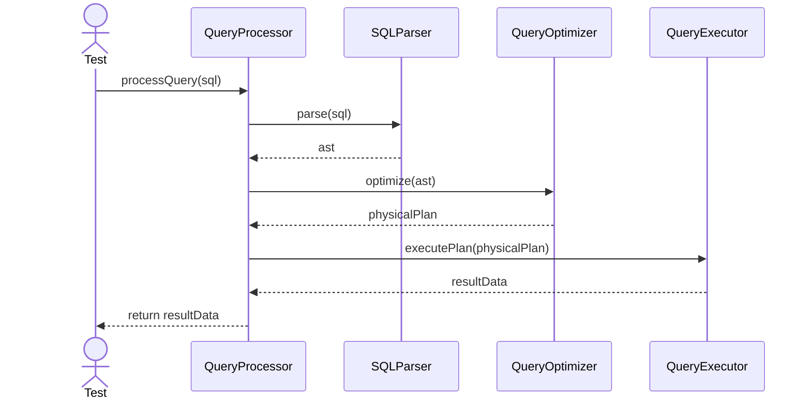
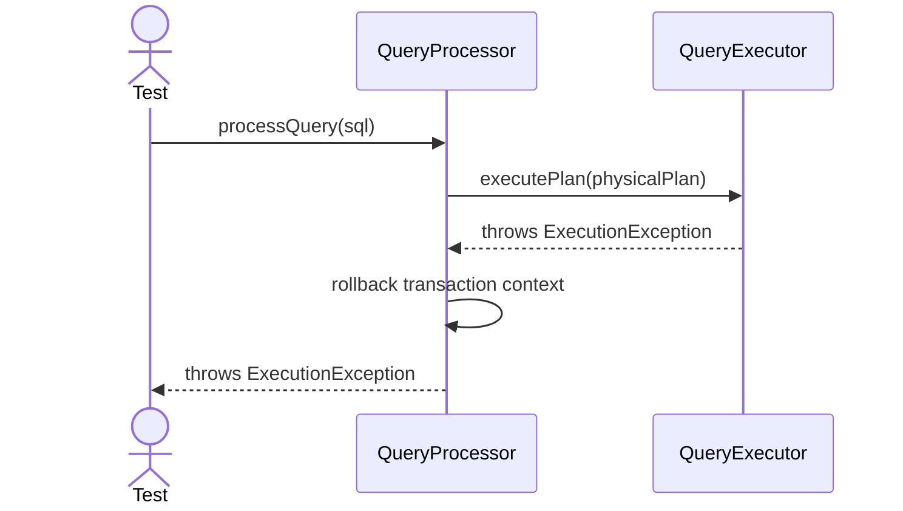

# Sequence Diagrams: QueryProcessor

## 🆕 Added Properties & Methods for `QueryProcessor`
To support the detailed sequence logic for unit testing, the following missing properties/methods have been introduced. **Please update the `QueryProcessor` class in your Class Diagram with these:**

- **Method** added to `QueryProcessor`: `parseQuery()`, `optimizeQuery()`, `executeQuery()` (Internal pipeline orchestration)

---

This file contains the detailed sequence diagrams for all unit tests of the **QueryProcessor** class in the Query Processor subsystem.

## 1. ProcessQuery_WhenValidSQL_ReturnsQueryResult

## 2. ProcessQuery_WhenExecutionFails_RollsBackAndThrows

