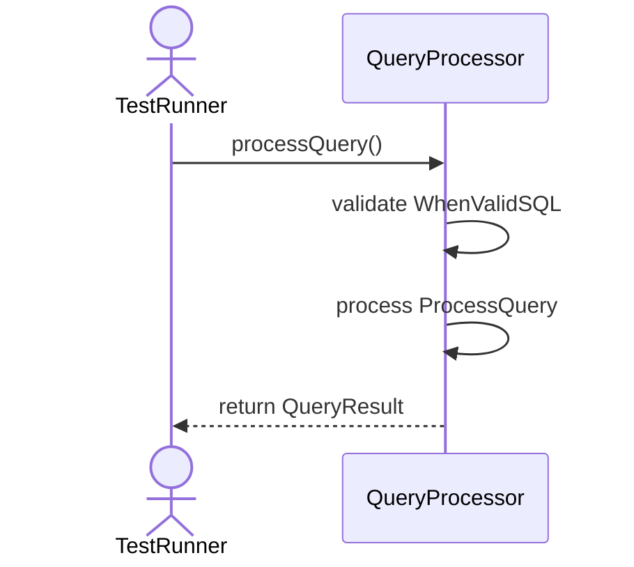
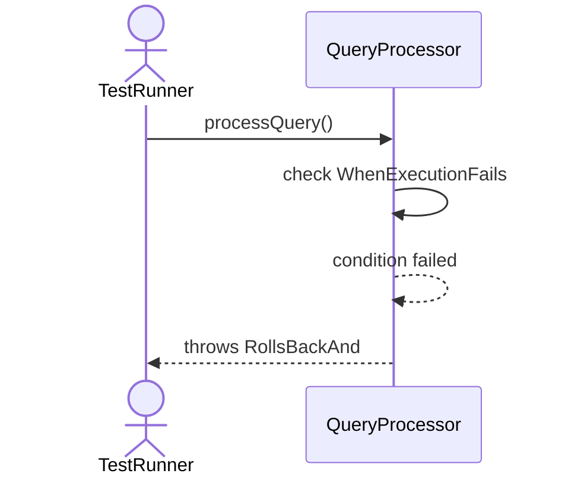
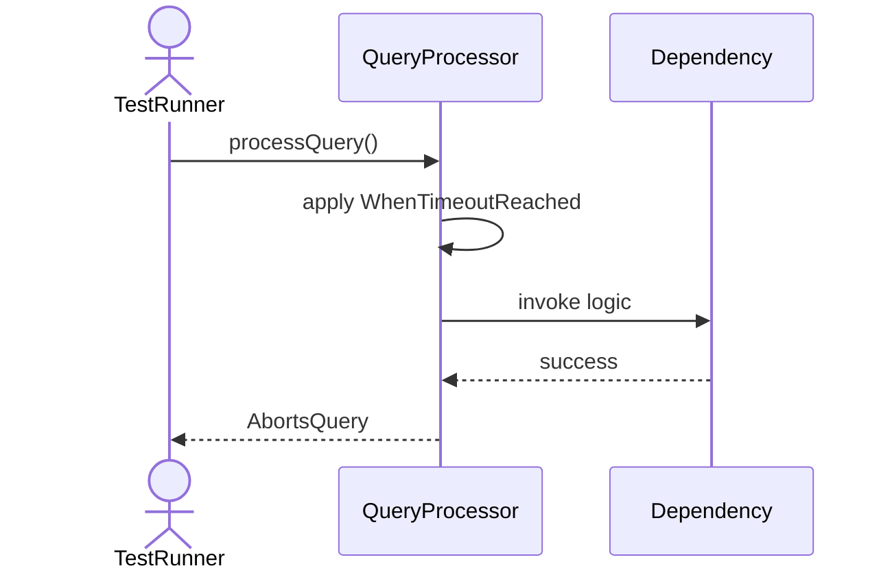
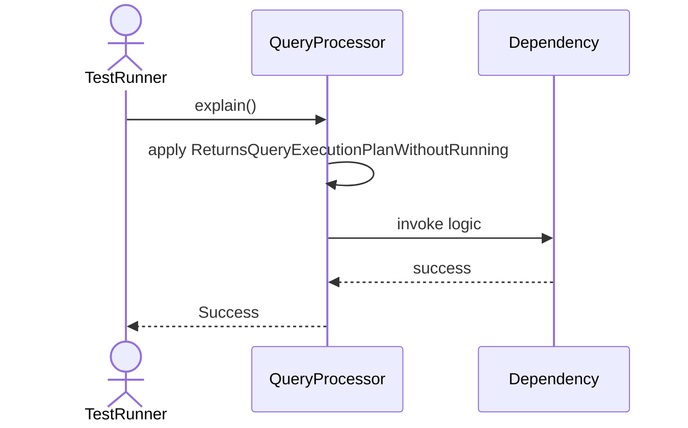
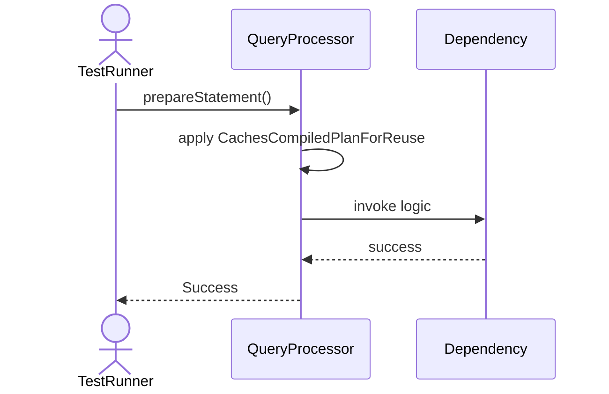

# Sequence Diagrams: QueryProcessor

## 🆕 Added Properties & Methods for `QueryProcessor`
To support the detailed sequence logic for unit testing, please update the `QueryProcessor` class in your Class Diagram with the following properties and methods:

- **Method** added to `QueryProcessor`: `explain()`
- **Method** added to `QueryProcessor`: `prepareStatement()`
- **Method** added to `QueryProcessor`: `processQuery()`

---

This file contains the detailed sequence diagrams for all 5 unit tests of the **QueryProcessor** class.

## 1. ProcessQuery_WhenValidSQL_ReturnsQueryResult

## 2. ProcessQuery_WhenExecutionFails_RollsBackAndThrows

## 3. ProcessQuery_WhenTimeoutReached_AbortsQuery

## 4. Explain_ReturnsQueryExecutionPlanWithoutRunning

## 5. PrepareStatement_CachesCompiledPlanForReuse

