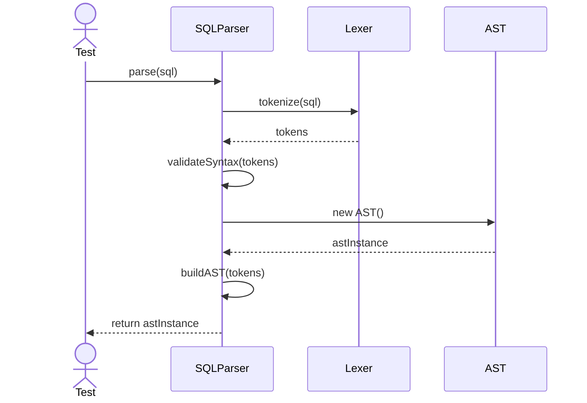
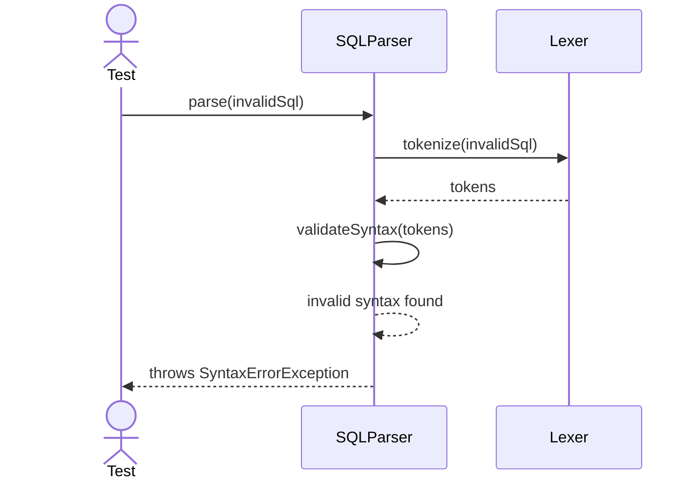
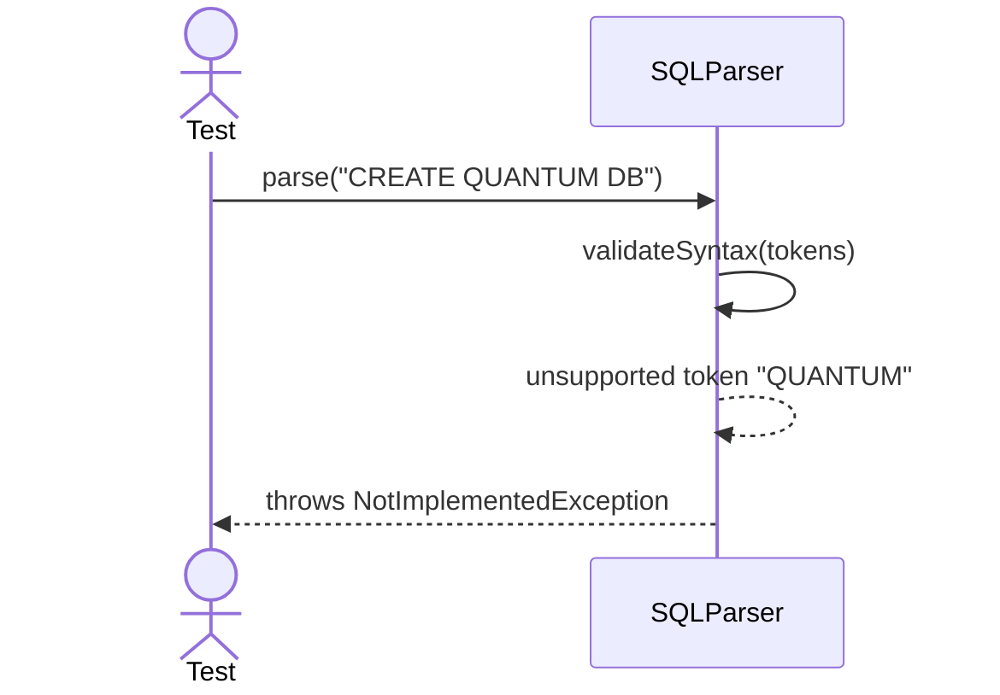

# Sequence Diagrams: SQLParser

## 🆕 Added Properties & Methods for `SQLParser`
To support the detailed sequence logic for unit testing, the following missing properties/methods have been introduced. **Please update the `SQLParser` class in your Class Diagram with these:**

- **Method** added to `SQLParser`: `buildAST(tokens)` (Constructs tree from tokens)

---

This file contains the detailed sequence diagrams for all unit tests of the **SQLParser** class in the Query Processor subsystem.

## 1. Parse_WhenValidSelectStatement_GeneratesAST

## 2. Parse_WhenInvalidSyntax_ThrowsSyntaxErrorException

## 3. Parse_WhenUnsupportedCommand_ThrowsNotImplementedException

