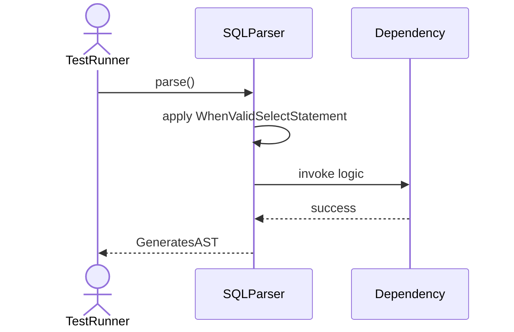
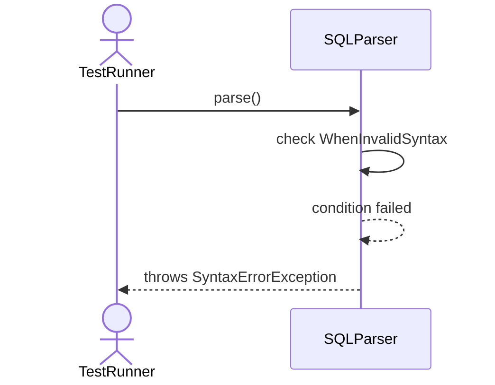
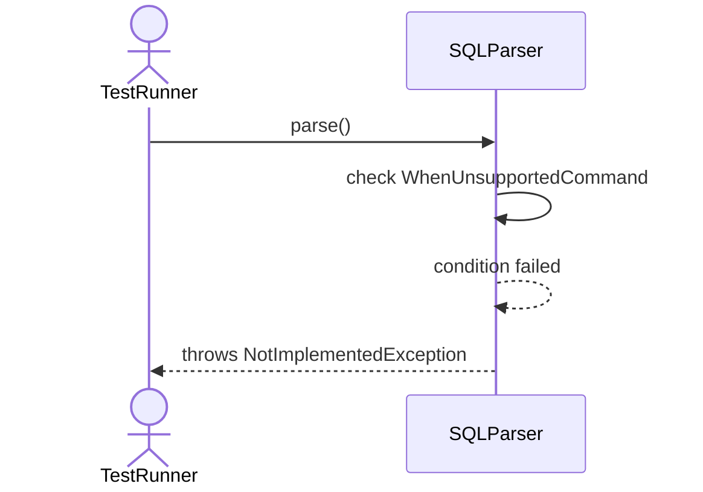
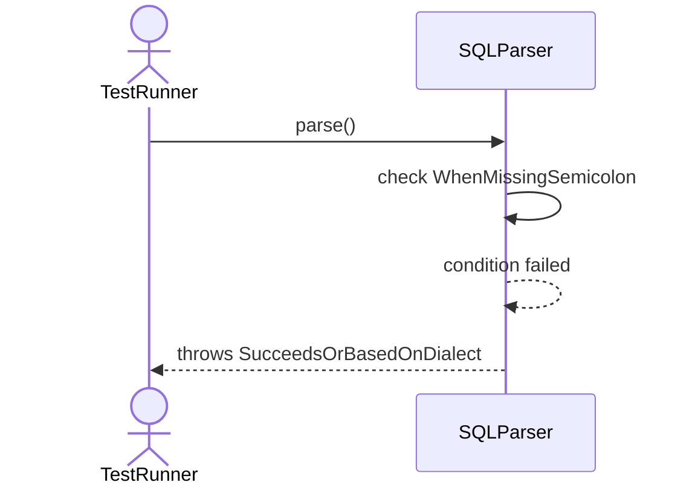
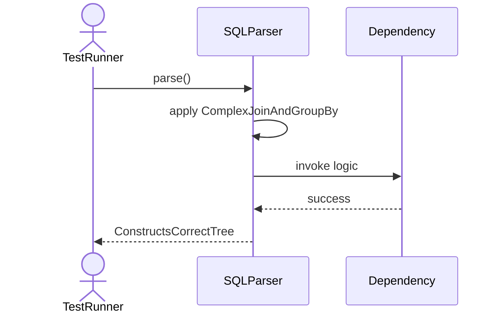
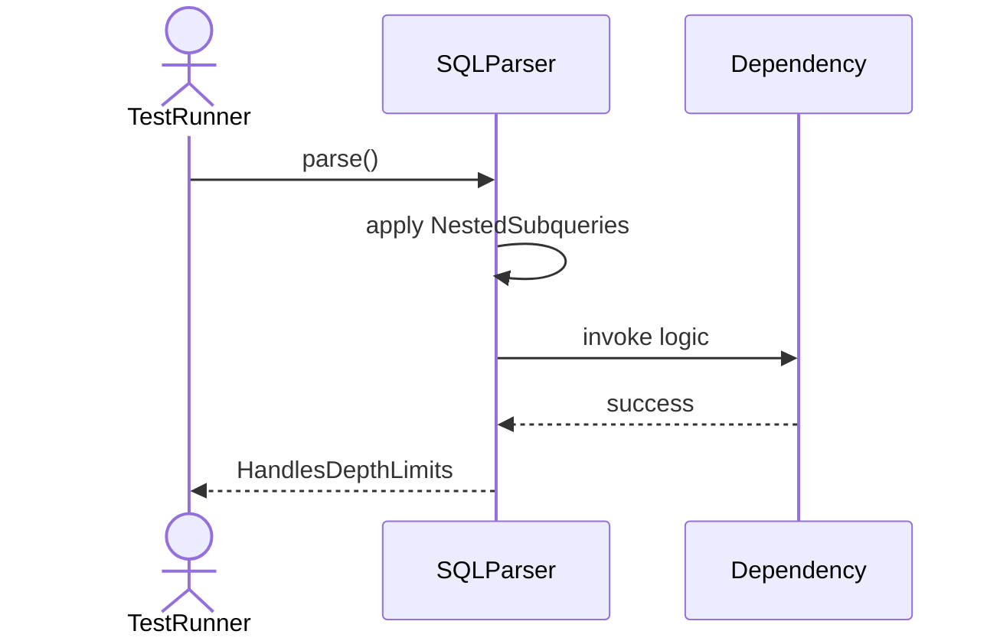
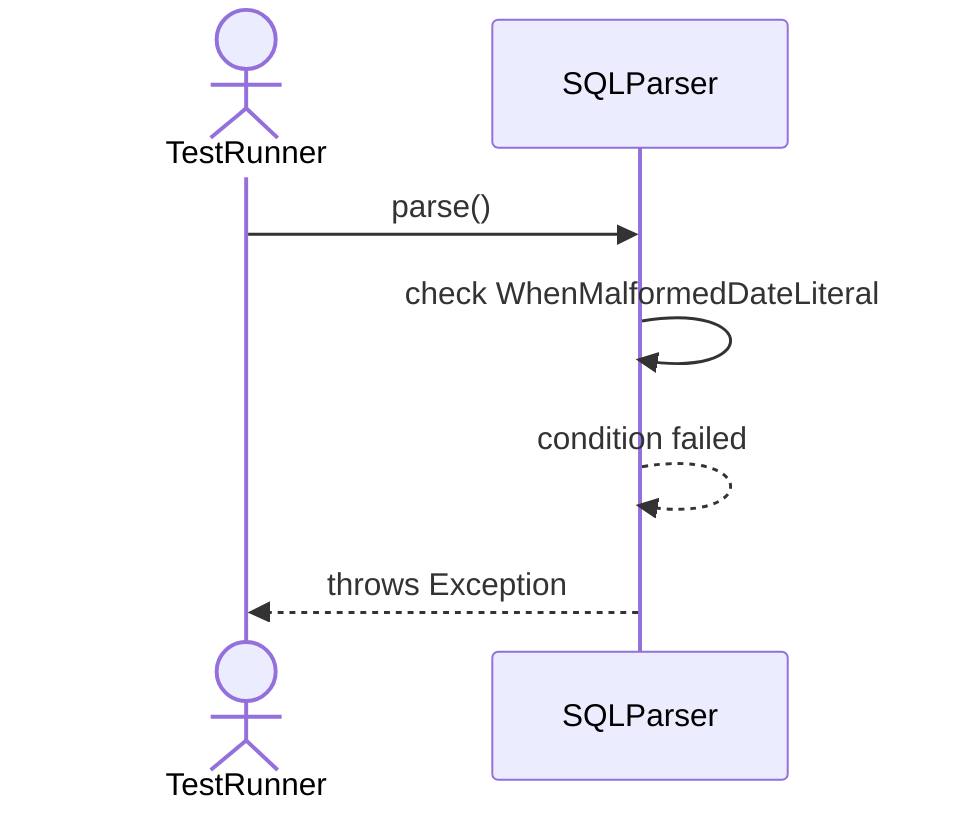

# Sequence Diagrams: SQLParser

## 🆕 Added Properties & Methods for `SQLParser`
To support the detailed sequence logic for unit testing, please update the `SQLParser` class in your Class Diagram with the following properties and methods:

- **Method** added to `SQLParser`: `parse()`

---

This file contains the detailed sequence diagrams for all 7 unit tests of the **SQLParser** class.

## 1. Parse_WhenValidSelectStatement_GeneratesAST

## 2. Parse_WhenInvalidSyntax_ThrowsSyntaxErrorException

## 3. Parse_WhenUnsupportedCommand_ThrowsNotImplementedException

## 4. Parse_WhenMissingSemicolon_SucceedsOrThrowsBasedOnDialect

## 5. Parse_ComplexJoinAndGroupBy_ConstructsCorrectTree

## 6. Parse_NestedSubqueries_HandlesDepthLimits

## 7. Parse_WhenMalformedDateLiteral_ThrowsException

