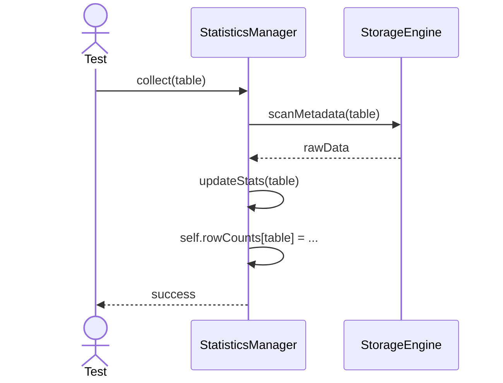
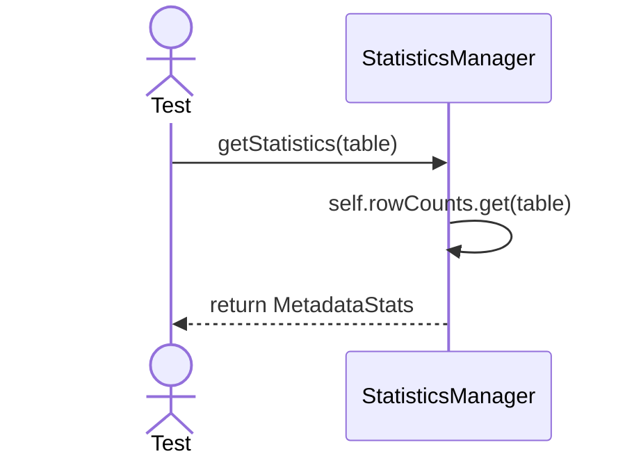

# Sequence Diagrams: StatisticsManager

## 🆕 Added Properties & Methods for `StatisticsManager`
To support the detailed sequence logic for unit testing, the following missing properties/methods have been introduced. **Please update the `StatisticsManager` class in your Class Diagram with these:**

- **Property** added to `StatisticsManager`: `rowCounts`, `cardinalities` (HashMaps for tables/columns)
- **Method** added to `StatisticsManager`: `updateStats(tableName)` (Recalculates metrics)

---

This file contains the detailed sequence diagrams for all unit tests of the **StatisticsManager** class in the Query Processor subsystem.

## 1. Collect_UpdatesRowCountsAndCardinality

## 2. GetStatistics_WhenCalled_ReturnsAccurateMetadata

