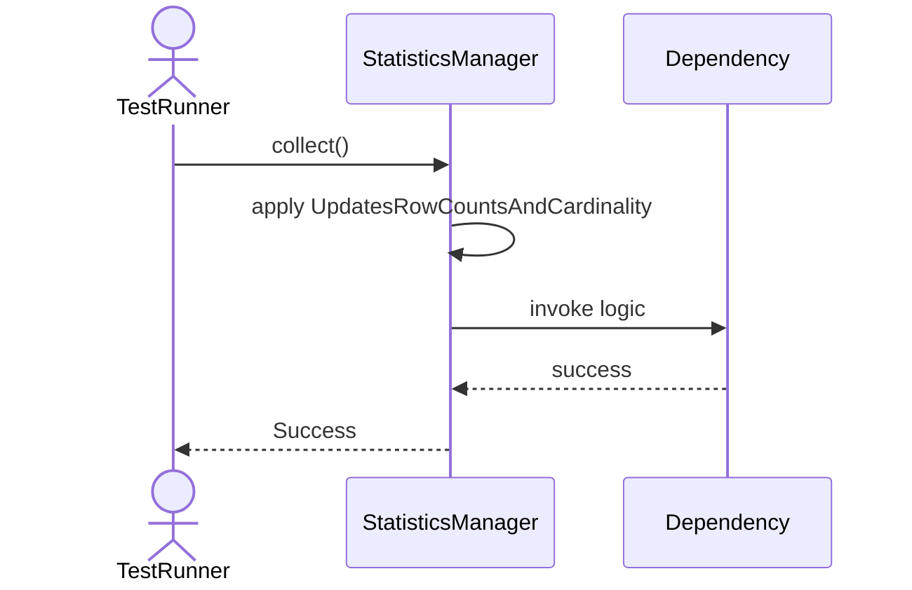
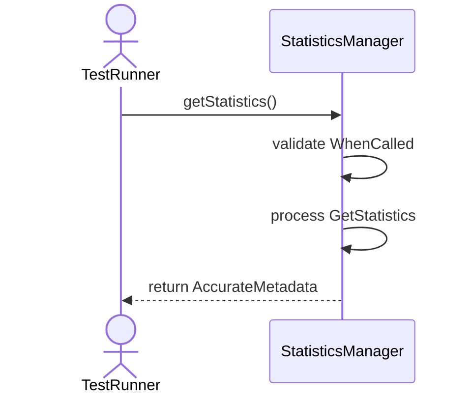
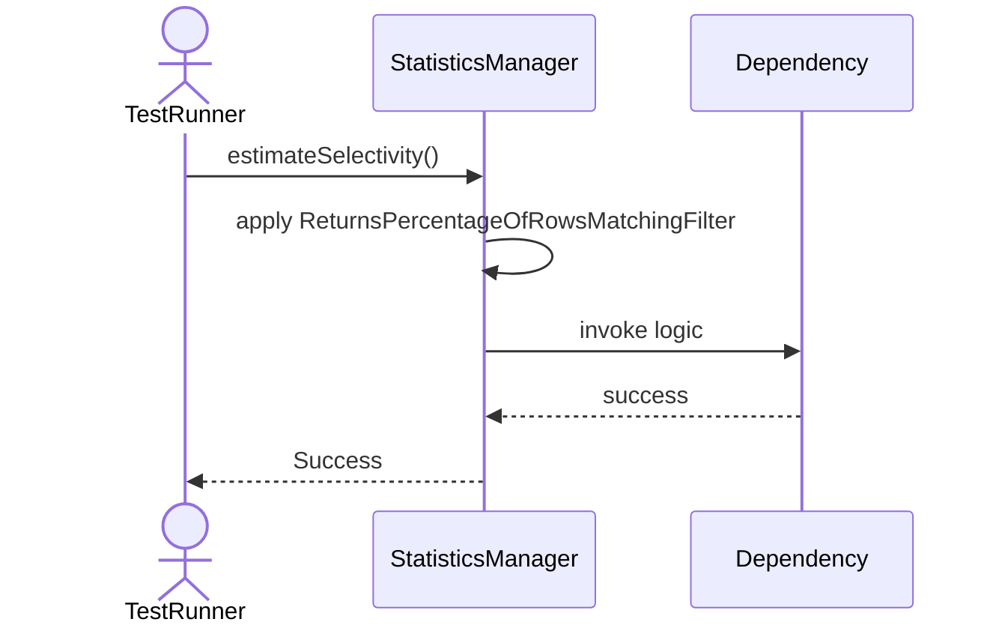
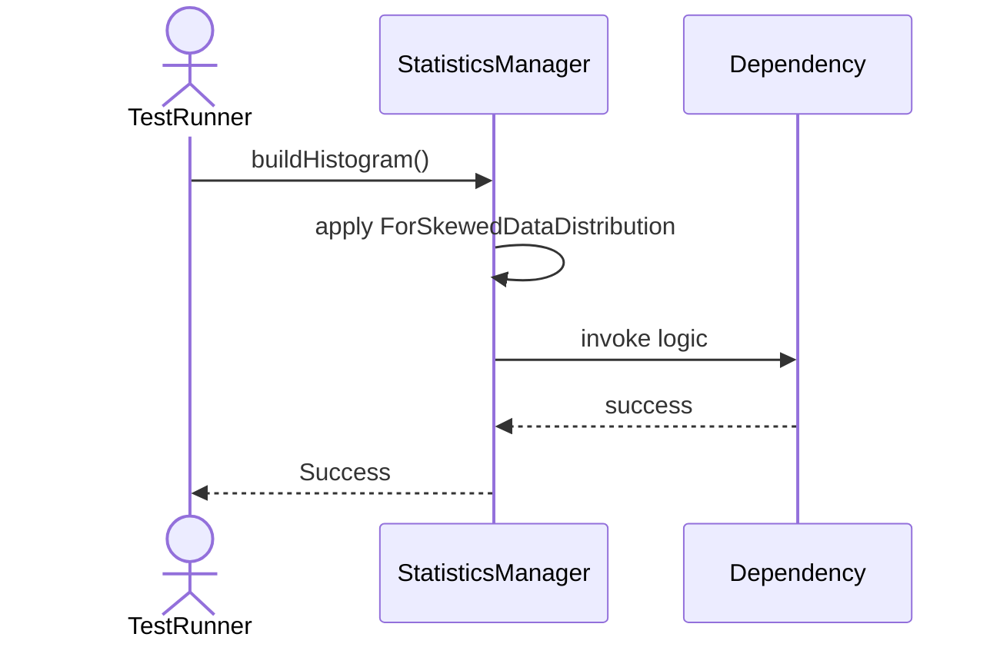

# Sequence Diagrams: StatisticsManager

## 🆕 Added Properties & Methods for `StatisticsManager`
To support the detailed sequence logic for unit testing, please update the `StatisticsManager` class in your Class Diagram with the following properties and methods:

- **Property** added to `StatisticsManager`: `rowCounts (Dict)`
- **Property** added to `StatisticsManager`: `cardinalities (Dict)`
- **Method** added to `StatisticsManager`: `buildHistogram()`
- **Method** added to `StatisticsManager`: `collect()`
- **Method** added to `StatisticsManager`: `estimateSelectivity()`
- **Method** added to `StatisticsManager`: `getStatistics()`
- **Method** added to `StatisticsManager`: `invalidateStats()`

---

This file contains the detailed sequence diagrams for all 5 unit tests of the **StatisticsManager** class.

## 1. Collect_UpdatesRowCountsAndCardinality

## 2. GetStatistics_WhenCalled_ReturnsAccurateMetadata

## 3. EstimateSelectivity_ReturnsPercentageOfRowsMatchingFilter

## 4. BuildHistogram_ForSkewedDataDistribution

## 5. InvalidateStats_WhenTableModifiedSignificantly

