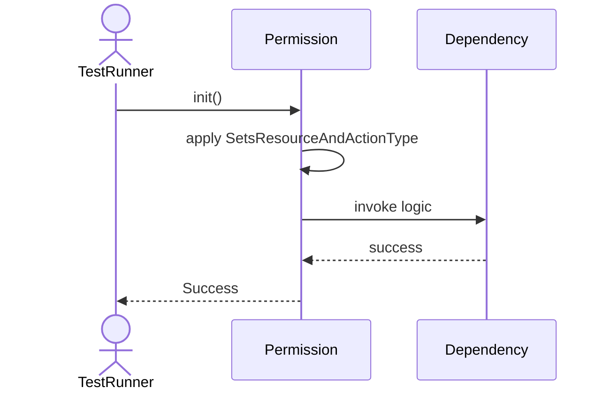
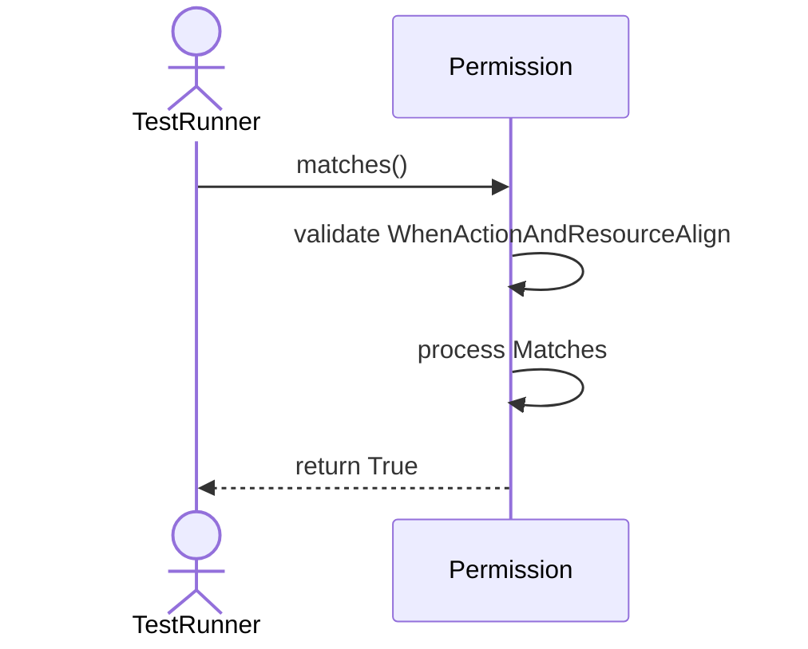
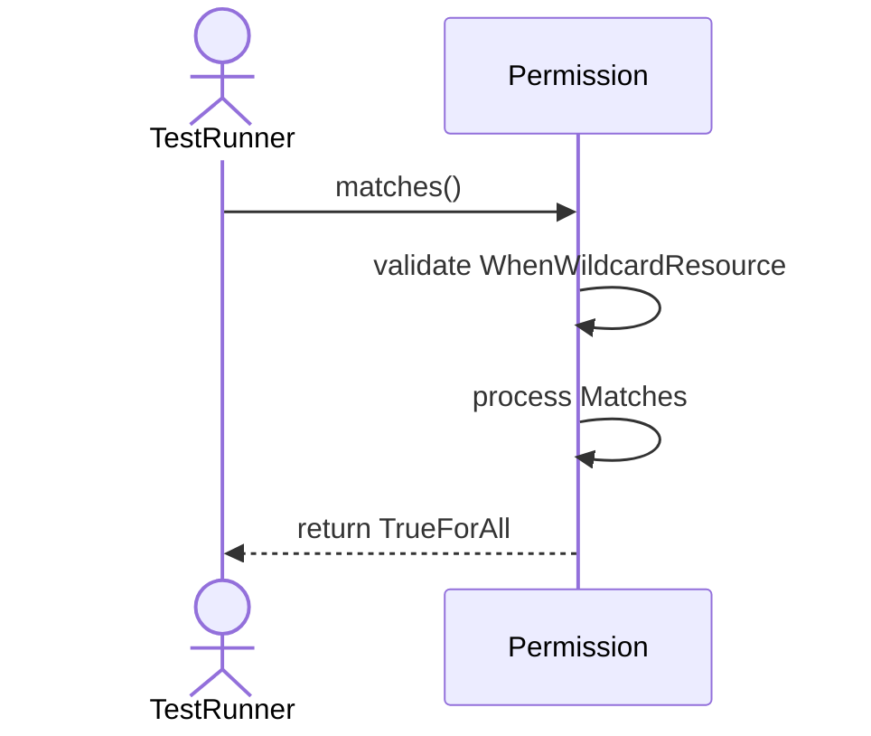
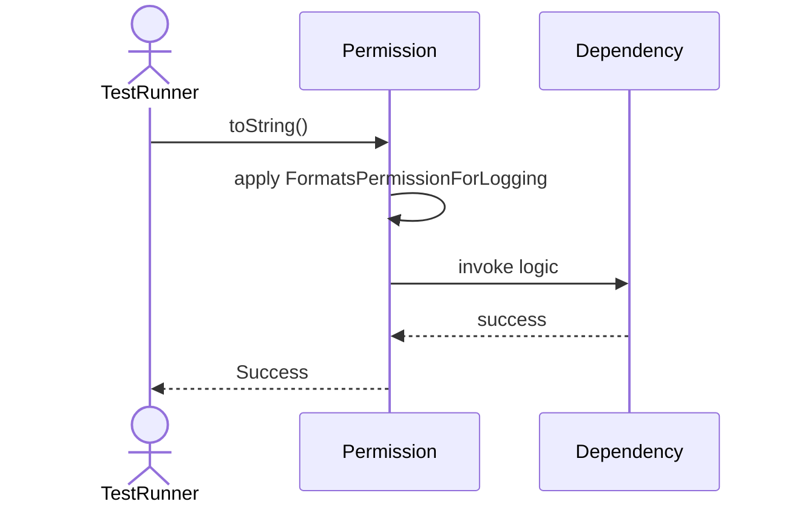
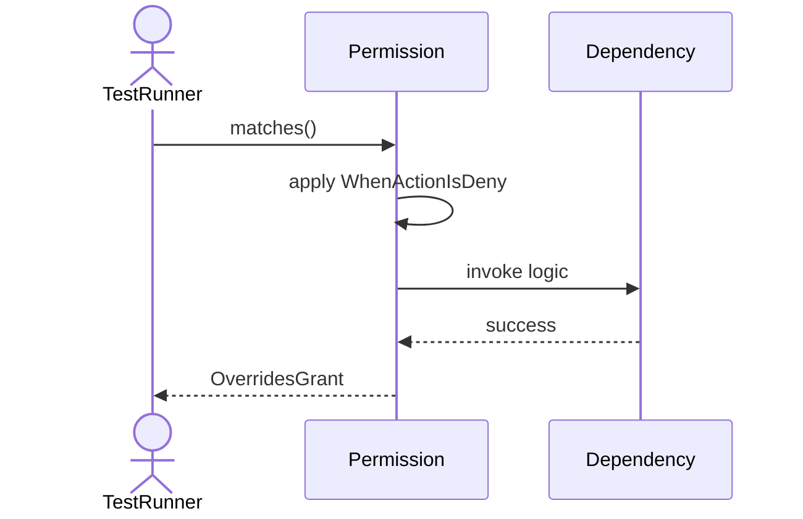

# Sequence Diagrams: Permission

## 🆕 Added Properties & Methods for `Permission`
To support the detailed sequence logic for unit testing, please update the `Permission` class in your Class Diagram with the following properties and methods:

- **Property** added to `Permission`: `resource`
- **Property** added to `Permission`: `actionType`
- **Method** added to `Permission`: `matches()`
- **Method** added to `Permission`: `toString()`

---

This file contains the detailed sequence diagrams for all 5 unit tests of the **Permission** class.

## 1. Init_SetsResourceAndActionType

## 2. Matches_WhenActionAndResourceAlign_ReturnsTrue

## 3. Matches_WhenWildcardResource_ReturnsTrueForAll

## 4. ToString_FormatsPermissionForLogging

## 5. Matches_WhenActionIsDeny_OverridesGrant

